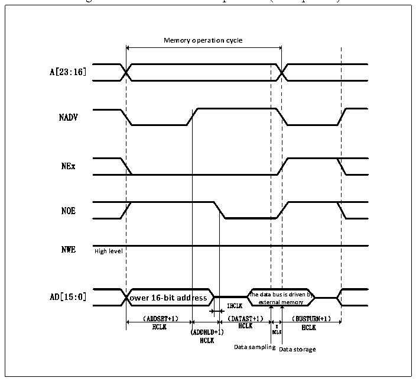
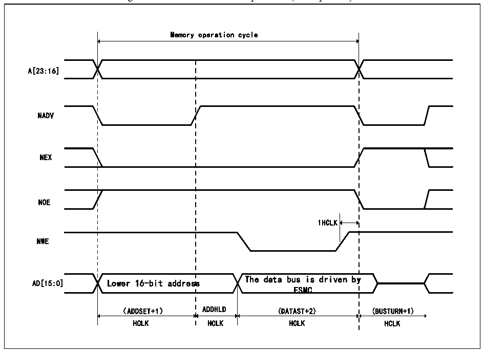

<!-- source-page: 473 -->

[← p.472](0472.md) · [index](../README.md) · [PDF p.473](https://ch32-riscv-ug.github.io/CH32V20x/datasheet_en/CH32FV2x_V3xRM.PDF#page=473) · [p.474 →](0474.md)

<!-- header: CH32F/V20x_V30x_V31x Series Reference Manual https://wch-ic.com -->

Figure 26-11 Mode D read operation (Multiplexed)  
 <!-- rendered from the PDF; verify at https://ch32-riscv-ug.github.io/CH32V20x/datasheet_en/CH32FV2x_V3xRM.PDF#page=473 -->

🖼 Text parsed from the figure above

<strong>Memory operation cycle</strong>  
Lower 16-bit addr （ADDSET+1）  ress  
A[23:16]  
NADV  
NEx  
NOE  
<strong>NWE High level</strong>  
HCLK HCLK 2 HCLK  
(ADDHLD+1) HCLK  
HCLK  
<strong>Data samplingData storage</strong>  

Figure 26-12 Mode D write operation (Multiplexed)  
 <!-- rendered from the PDF; verify at https://ch32-riscv-ug.github.io/CH32V20x/datasheet_en/CH32FV2x_V3xRM.PDF#page=473 -->

🖼 Text parsed from the figure above

Memory operation cycle  
A[23:16]  
NADV  
NEX  
NOE  
1HCLK  
NWE  
The data bus is driven by  
AD[15:0] Lower 16-bit address  
FSMC  
（ADDSET+1） ADDHLD (DATAST+2) (BUSTURN+1)  
HCLK HCLK HCLK HCLK  

Figure 26-19 Mode D FSMC_BCR1 bit field  
 <!-- rendered from the PDF; verify at https://ch32-riscv-ug.github.io/CH32V20x/datasheet_en/CH32FV2x_V3xRM.PDF#page=473 -->

🖼 Text parsed from the figure above

<!-- p473-table-002 (table-26-18@1) pages 473-474 -->
<table><tr><th>Bitx</th><th>Name</th><th>Configuration Value</th></tr><tr><td>[31:20]</td><td>Reserved</td><td>0x000</td></tr><tr><td>19</td><td>CBURSTRW</td><td>0x0</td></tr><tr><td>[18:16]</td><td>Reserved</td><td>0x0</td></tr><tr><td>15</td><td>ASYNCWAIT</td><td style="text-align:left">It is 1 if the memory supports this function, otherwise it is 0.</td></tr><tr><td>14</td><td>EXTMOD</td><td>0x1</td></tr><tr><td>13</td><td>WAITEN</td><td>0x0</td></tr><tr><td>12</td><td>WREN</td><td>Set as needed</td></tr><tr><td>11</td><td>WAITCFG</td><td>No effect</td></tr><tr><td>10</td><td>Reserved</td><td>0x0</td></tr><tr><td>9</td><td>WAITPOL</td><td>When bit15 is 1, it is meaningful.</td></tr><tr><td>8</td><td>BURSTEN</td><td>0x0</td></tr><tr><td>7</td><td>Reserved</td><td>0x1</td></tr><tr><td>6</td><td>FACCEN</td><td>Set as needed</td></tr><tr><td>[5:4]</td><td>MWID</td><td>Set as needed</td></tr><tr><td>[3:2]</td><td>MTYP</td><td>Set as needed</td></tr><tr><td>1</td><td>MUXEN</td><td>0x1</td></tr><tr><td>0</td><td>MBKEN</td><td>0x1</td></tr></table>

<!-- image: p473-draw-image-00001 bbox=[508.2, 795.0, 527.28, 805.2] -->
<!-- footer: V2.5 468 -->
