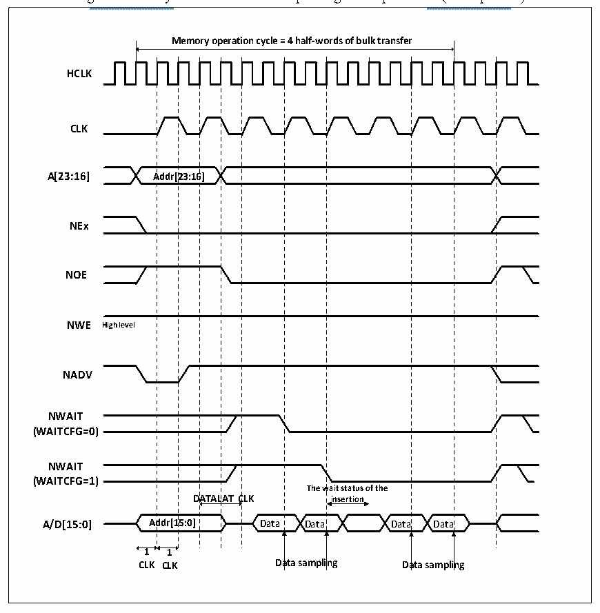

<!-- source-page: 476 -->

[← p.475](0475.md) · [index](../README.md) · [PDF p.476](https://ch32-riscv-ug.github.io/CH32V20x/datasheet_en/CH32FV2x_V3xRM.PDF#page=476) · [p.477 →](0477.md)

<!-- header: CH32F/V20x_V30x_V31x Series Reference Manual https://wch-ic.com -->

Figure 26-13 Synchronous bus multiplexing read operations (Multiplexed)  
 <!-- rendered from the PDF; verify at https://ch32-riscv-ug.github.io/CH32V20x/datasheet_en/CH32FV2x_V3xRM.PDF#page=476 -->

🖼 Text parsed from the figure above

<!-- image: p476-draw-image-00002 inside the figure -->
<!-- image: p476-draw-image-00003 inside the figure -->
<!-- image: p476-draw-image-00004 inside the figure -->
<strong>Memory operation cycle = 4 half-words of bulk transfer</strong>  
Addr[23:16]  A  Addr[2  23:16  wait status o insertion  AT C  Ad 1  D  DATAL  DATAL  ddr[1  5:0]  1  
<!-- image: p476-draw-image-00005 inside the figure -->
<!-- image: p476-draw-image-00006 inside the figure -->
<strong>HCLK</strong>  
<!-- image: p476-draw-image-00007 inside the figure -->
<!-- image: p476-draw-image-00008 inside the figure -->
<!-- image: p476-draw-image-00009 inside the figure -->
<!-- image: p476-draw-image-00010 inside the figure -->
<strong>CLK</strong>  
<!-- image: p476-draw-image-00011 inside the figure -->
<!-- image: p476-draw-image-00012 inside the figure -->
<!-- image: p476-draw-image-00013 inside the figure -->
<strong>A[23:16] Addr[23:16]</strong>  
<!-- image: p476-draw-image-00014 inside the figure -->
<!-- image: p476-draw-image-00015 inside the figure -->
<!-- image: p476-draw-image-00016 inside the figure -->
<strong>NEx</strong>  
<!-- image: p476-draw-image-00017 inside the figure -->
<!-- image: p476-draw-image-00018 inside the figure -->
<!-- image: p476-draw-image-00019 inside the figure -->
<!-- image: p476-draw-image-00020 inside the figure -->
<strong>NOE</strong>  
<!-- image: p476-draw-image-00021 inside the figure -->
<!-- image: p476-draw-image-00022 inside the figure -->
<!-- image: p476-draw-image-00023 inside the figure -->
<strong>NWE High level</strong>  
<!-- image: p476-draw-image-00024 inside the figure -->
<!-- image: p476-draw-image-00025 inside the figure -->
<!-- image: p476-draw-image-00026 inside the figure -->
<!-- image: p476-draw-image-00027 inside the figure -->
<strong>NADV</strong>  
<!-- image: p476-draw-image-00028 inside the figure -->
<!-- image: p476-draw-image-00029 inside the figure -->
<strong>NWAIT</strong>  
<!-- image: p476-draw-image-00030 inside the figure -->
<!-- image: p476-draw-image-00031 inside the figure -->
<strong>(WAITCFG=0)</strong>  
<!-- image: p476-draw-image-00032 inside the figure -->
<!-- image: p476-draw-image-00033 inside the figure -->
<strong>NWAIT</strong>  
<!-- image: p476-draw-image-00034 inside the figure -->
<strong>(WAITCFG=1)</strong>  
<!-- image: p476-draw-image-00035 inside the figure -->
<!-- image: p476-draw-image-00036 inside the figure -->
<!-- image: p476-draw-image-00037 inside the figure -->
<!-- image: p476-draw-image-00038 inside the figure -->
<!-- image: p476-draw-image-00039 inside the figure -->
<strong>1 1</strong>  
<!-- image: p476-draw-image-00040 inside the figure -->
<strong>CLK CLK Data sampling Data sampling</strong>  
<!-- image: p476-draw-image-00041 inside the figure -->
<!-- image: p476-draw-image-00042 inside the figure -->
<!-- image: p476-draw-image-00043 inside the figure -->

<!-- p476-table-002 (table-26-22@1) pages 476-477 -->
<table><caption>Table 26-22 FSMC_BCR1 bit field (Synchronous read mode)</caption><tr><th>Bitx</th><th>Name</th><th>Configuration Value</th></tr><tr><td>[31:20]</td><td>Reserved</td><td>0x000</td></tr><tr><td>19</td><td>CBURSTRW</td><td>No effect</td></tr><tr><td>[18:16]</td><td>Reserved</td><td>0x0</td></tr><tr><td>15</td><td>ASYNCWAIT</td><td>0x0</td></tr><tr><td>14</td><td>EXTMOD</td><td>0x0</td></tr><tr><td>13</td><td>WAITEN</td><td>0x0</td></tr><tr><td>12</td><td>WREN</td><td>No effect</td></tr><tr><td>11</td><td>WAITCFG</td><td>Set as needed</td></tr><tr><td>10</td><td>Reserved</td><td>0x0</td></tr><tr><td>9</td><td>WAITPOL</td><td>Set as needed</td></tr><tr><td>8</td><td>BURSTEN</td><td>0x1</td></tr><tr><td>7</td><td>Reserved</td><td>0x1</td></tr><tr><td>6</td><td>FACCEN</td><td>Set as needed</td></tr><tr><td>[5:4]</td><td>MWID</td><td>Set as needed</td></tr><tr><td>[3:2]</td><td>MTYP</td><td>0x1or 0x2</td></tr><tr><td>1</td><td>MUXEN</td><td>0x1</td></tr><tr><td>0</td><td>MBKEN</td><td>0x1</td></tr></table>

<!-- image: p476-draw-image-00001 bbox=[508.2, 795.0, 527.28, 805.2] -->
<!-- footer: V2.5 471 -->
