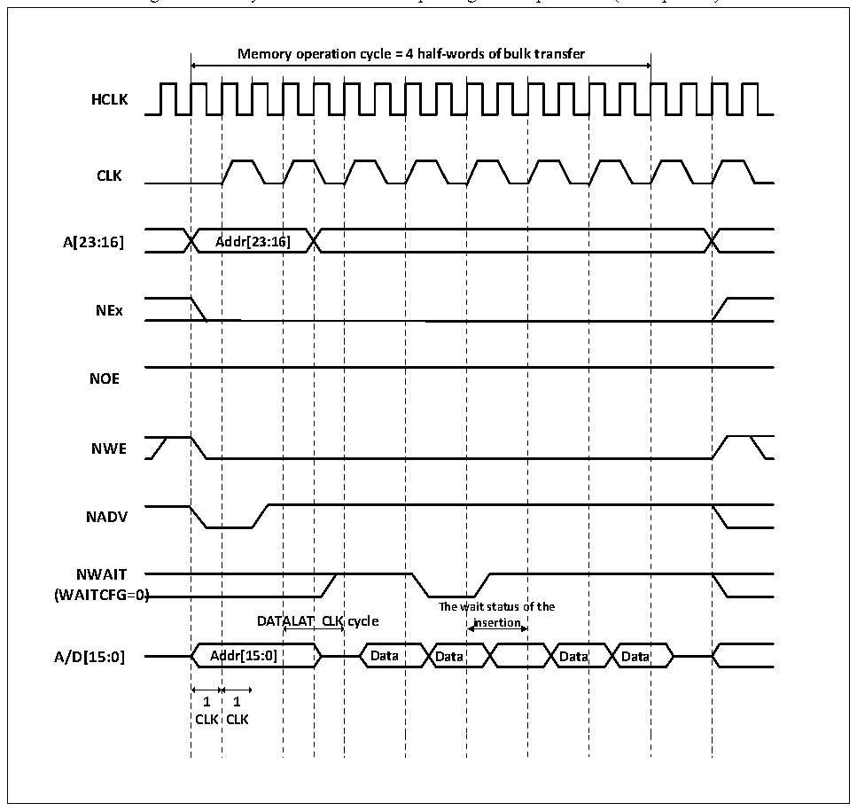

<!-- source-page: 477 -->

[← p.476](0476.md) · [index](../README.md) · [PDF p.477](https://ch32-riscv-ug.github.io/CH32V20x/datasheet_en/CH32FV2x_V3xRM.PDF#page=477) · [p.478 →](0478.md)

<!-- header: CH32F/V20x_V30x_V31x Series Reference Manual https://wch-ic.com -->

> ⬆ **Table continued** — rendered in full at [page 476](0476.md). <!-- p477-table-001 -->

<!-- p477-table-002 (table-26-23@1) -->
<table><caption>Table 26-23 FSMC_BTR1 bit field (Synchronous read mode)</caption><tr><th>Bitx</th><th>Name</th><th>Configuration Value</th></tr><tr><td>[31:30]</td><td>Reserved</td><td>0x0</td></tr><tr><td>[29:28]</td><td>ACCMOD</td><td>0x0</td></tr><tr><td>[27:24]</td><td>DATLAT</td><td>Data latch time</td></tr><tr><td>[23:20]</td><td>CLKDIV</td><td style="text-align:left">0x0: Reserved 0x1: CLK=2 HCLK</td></tr><tr><td>[19:16]</td><td>BUSTURN</td><td>No effect</td></tr><tr><td>[15:8]</td><td>DATAST</td><td>No effect</td></tr><tr><td>[7:4]</td><td>ADDHLD</td><td>No effect</td></tr><tr><td>[3:0]</td><td>ADDSET</td><td>No effect</td></tr></table>

Figure 26-14 Synchronous bus multiplexing write operations (Multiplexed)  
 <!-- rendered from the PDF; verify at https://ch32-riscv-ug.github.io/CH32V20x/datasheet_en/CH32FV2x_V3xRM.PDF#page=477 -->

🖼 Text parsed from the figure above

<strong>Memory operation cycle = 4 half-words of bulk transfer</strong>  
Addr[23:16]  A  Addr[2  23:16  CLK  Ad  DAT  ALAT  ALAT  ddr[1  5:0]  
<strong>HCLK</strong>  
<strong>CLK</strong>  
<strong>A[23:16] Addr[23:16]</strong>  
<strong>NEx</strong>  
<strong>NOE</strong>  
<strong>NWE</strong>  
<strong>NADV</strong>  
<strong>NWAIT</strong>  
<strong>(WAITCFG=0)</strong>  
<strong>1 1</strong>  
<strong>CLK CLK</strong>  

<!-- image: p477-draw-image-00001 bbox=[508.2, 795.0, 527.28, 805.2] -->
<!-- footer: V2.5 472 -->
