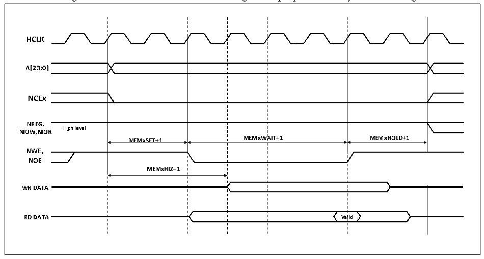

<!-- source-page: 480 -->

[← p.479](0479.md) · [index](../README.md) · [PDF p.480](https://ch32-riscv-ug.github.io/CH32V20x/datasheet_en/CH32FV2x_V3xRM.PDF#page=480) · [p.481 →](0481.md)

<!-- header: CH32F/V20x_V30x_V31x Series Reference Manual https://wch-ic.com -->

> ⬆ **Table continued** — rendered in full at [page 479](0479.md). <!-- p480-table-001 -->

#### 26.2.4.3 NAND FLASH Timing Diagram (Including pre-wait function)

NAND FLASH operation timing control, involving FSMC_PMEM2 and FSMC_PATT2 timing registers,  
each register contains 4 parameters. The 3 parameters MEMHOLD, MEMWAIT and ATTSET correspond to  
the number of HCLK cycles in the 3 stages of operating the NAND FLASH, and the MEMHIZ parameter  
corresponds to the timing when the FSMC starts to drive the data bus. NAND FLASH controller general  
memory space access timing, see Figure 26-15.  

Figure 26-15 NAND FLASH controller general purpose memory access timing  
 <!-- rendered from the PDF; verify at https://ch32-riscv-ug.github.io/CH32V20x/datasheet_en/CH32FV2x_V3xRM.PDF#page=480 -->

🖼 Text parsed from the figure above

<strong>HCLK</strong>  
igh level  MEMxS  SET+1  MEMxWA  AIT+1  MEMx  xHOLD+1  MEMxS  SET+1  M  MEMxHIZ+1  Va  alid  
<strong>A[23:0]</strong>  
<strong>NCEx</strong>  
<strong>NREG,</strong>  
<strong>NIOW,NIOR</strong>  
<strong>MEMxSET+1 MEMxWAIT+1 MEMxHOLD+1</strong>  
<strong>NWE,</strong>  
<strong>NOE</strong>  
<strong>WR DATA</strong>  

#### 26.2.4.4 NAND FLASH Operating Procedure

The command latch enables signal (CLE) and address latch enable signal (ALE) of NAND FLASH are  
driven by FSMC address lines A16 and A17 respectively. Therefore, when sending commands or addresses  
to NAND FLASH operations, it is necessary to perform a write operation on the specified address of the  
storage space. The read operation process of NAND FLASH is as follows:  
1） Configure the PWID, PTYP, PWAITEN and PBKEN of the FSMC_PCR2, FSMC_PMEM2 and  
FSMC_PATT2 registers according to the NAND FLASH characteristics to be operated.  
2） Write a command byte in the general storage space. During the period when NWE is low, CLE outputs  
a high level. At this time, the command byte is recognized as a command by NAND FLASH, and the  
command is latched. The subsequent page read operation does not need to send the command  
repeatedly.  
3） Then, by writing 4 bytes to the memory space, it is used as the starting address of the read operation.  
During the period when NWE is low, ALE outputs high level, and 4 bytes are recognized by NAND  
<!-- image: p480-draw-image-00001 bbox=[508.2, 795.0, 527.28, 805.2] -->
<!-- footer: V2.5 475 -->
