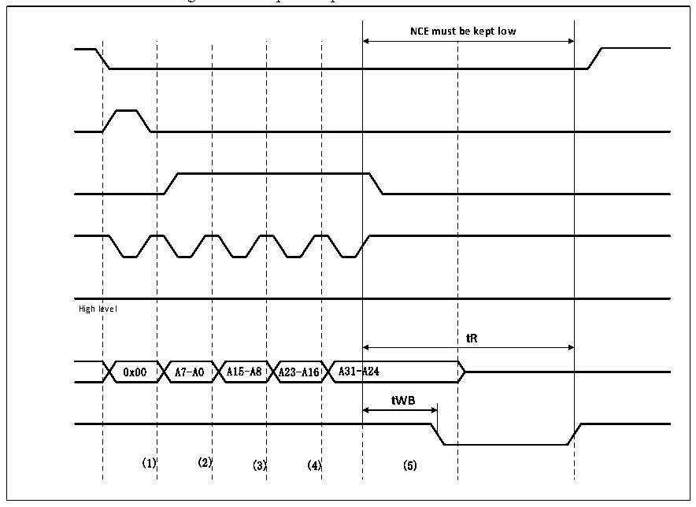

<!-- source-page: 481 -->

[← p.480](0480.md) · [index](../README.md) · [PDF p.481](https://ch32-riscv-ug.github.io/CH32V20x/datasheet_en/CH32FV2x_V3xRM.PDF#page=481) · [p.482 →](0482.md)

<!-- header: CH32F/V20x_V30x_V31x Series Reference Manual https://wch-ic.com -->
FLASH as the starting address of the read operation at this time. When operating the attribute storage  
space, the FSMC can be made to generate different timings and realize some NAND FLASH pre-wait  
functions.  
4） Before the FSMC controller starts a new operation, it needs to wait for the R/NB signal of the NAND  
FLASH to become a high level. During the wait period, the FSMC controller needs to keep the NCE  
signal at a low level.  
5） The FSMC controller can read the memory page byte by byte from the NAND FLASH by operating the  
general memory space.  

#### 26.2.4.5 NAND FLASH Pre-wait Function

For some special NAND FLASHs, after the last address byte is input, the R/NB signal changes to a low level,  
see Figure 26-16. In the figure (1) is the CPU write byte command 0x00 to 0x70010000; in the figure (2) the  
CPU writes the NAND FLASH address A7-A0 to 0x70020000; in the figure (3) the CPU writes the NAND  
FLASH address A15-A8 to 0x70020000; (4) in the figure is the address A23-A16 to 0x70020000 of the CPU  
writing NAND FLASH; (5) in the figure is the address A31-A24 to 0x70020000 of the CPU writing NAND  
FLASH;  

Figure 26-16 Special operation on NAND FLASH  
 <!-- rendered from the PDF; verify at https://ch32-riscv-ug.github.io/CH32V20x/datasheet_en/CH32FV2x_V3xRM.PDF#page=481 -->

🖼 Text parsed from the figure above

<strong>NCE must be kept low</strong>  
evel 0x00  A7-A0  A15-A8  A23-A16  A31-A  A24  
High level  
<strong>tR</strong>  
(1) (2) (3) (4) (5)  

When using this function, the timing of tWB is guaranteed by configuring the MEMHOLD bit in the  
FSMC_PMEM2 register. After reading and writing operations to NAND FLASH, the FSMC controller will  
insert (MEMHOLD+1) HCLK between the rising edge of the NEW signal and the next operation. Keep the  
delay. In order to solve this problem, the attribute space is used to configure the ATTHOLD value so that it  
conforms to the timing of tWB, and at the same time, it is necessary to keep MEMHOLD at a minimum  
value. At this time, only when writing the last byte of the NAND FLASH address, the FSMC controller  
needs to write the attribute storage space, and the rest of the NAND FLASH read and write operations use  
<!-- image: p481-draw-image-00001 bbox=[508.2, 795.0, 527.28, 805.2] -->
<!-- footer: V2.5 476 -->
