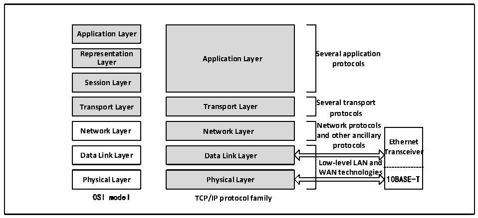

<!-- source-page: 493 -->

[← p.492](0492.md) · [index](../README.md) · [PDF p.493](https://ch32-riscv-ug.github.io/CH32V20x/datasheet_en/CH32FV2x_V3xRM.PDF#page=493) · [p.494 →](0494.md)

<!-- header: CH32F/V20x_V30x_V31x Series Reference Manual https://wch-ic.com -->
● Support half-duplex, full-duplex  
● Two network status LEDs  

### 27.1.2 Overview

Ethernet transceivers work at the data link layer and physical layer in the OSI seven-layer model. If a data  
transmission rate greater than 10Mbps needs to be achieved, an external 100M or 1000M physical layer chip  
(PHY) is required to achieve physical connection. In order to establish the communication of protocols such  
as IP, TCP and UDP in the widely used Ethernet, the user also needs to implement the TCP/IP protocol stack  
in software. The Ethernet transceiver is composed of a media access control layer (MAC), a matching DMA  
and their control registers, and a 10M physical layer.  

Figure 27-1 Position of Ethernet Transceivers in OSI Model and TCP/IP Model  
 <!-- rendered from the PDF; verify at https://ch32-riscv-ug.github.io/CH32V20x/datasheet_en/CH32FV2x_V3xRM.PDF#page=493 -->

🖼 Text parsed from the figure above

<strong>Application Layer</strong>  
<strong>Representation Several application</strong>  
<strong>Application Layer</strong>  
<strong>Layer protocols</strong>  
<strong>Session Layer</strong>  
<strong>Several transport</strong>  
<strong>Transport Layer Transport Layer</strong>  
<strong>protocols</strong>  
<strong>Network protocols</strong>  
Ethernet Transceiver  10BASE-T  
<strong>Network Layer Network Layer</strong>  
<strong>and other ancillary</strong>  
<strong>protocols</strong>  
Data Link Layer  Physical Layer  
Data Link Layer  Physical Layer  
<strong>Low-level LAN and</strong>  
<strong>WAN technologies</strong>  
<strong>OSI model TCP/IP protocol family</strong>  

The MAC of the Ethernet transceiver is designed according to the specifications of the IEEE802.3 protocol,  
and is equipped with a 32-bit wide DMA to ensure that the data can be quickly forwarded from the network  
cable to the memory of the microcontroller. The Ethernet transceiver has powerful and complete DMA  
control registers, MAC control registers and mode control registers. The microcontroller&#x27;s CPU operates the  
registers of the Ethernet transceiver through the HB bus. The Ethernet transceiver is connected to the gigabit  
Ethernet physical layer through the RGMII interface. If only the speed of 100M Ethernet is required, it can  
be connected to the 100M Ethernet physical layer through the MII or RMII interface. The pins of the MII,  
RMII and RGMII interfaces of the Ethernet transceiver are multiplexed, see section 27.3 for details. The  
Ethernet transceiver manages the Ethernet physical layer through the SMI interface. When using an Ethernet  
transceiver, the clock of the HB bus cannot be lower than 50MHz.  
<!-- image: p493-draw-image-00001 bbox=[508.2, 795.0, 527.28, 805.2] -->
<!-- footer: V2.5 488 -->
