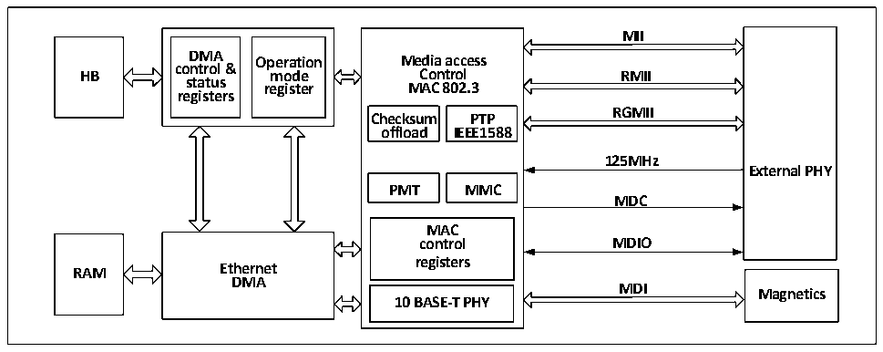

<!-- source-page: 494 -->

[← p.493](0493.md) · [index](../README.md) · [PDF p.494](https://ch32-riscv-ug.github.io/CH32V20x/datasheet_en/CH32FV2x_V3xRM.PDF#page=494) · [p.495 →](0495.md)

<!-- header: CH32F/V20x_V30x_V31x Series Reference Manual https://wch-ic.com -->

Figure 27-2 Block diagram of Ethernet Transceiver  
 <!-- rendered from the PDF; verify at https://ch32-riscv-ug.github.io/CH32V20x/datasheet_en/CH32FV2x_V3xRM.PDF#page=494 -->

🖼 Text parsed from the figure above

<strong>MII</strong>  
<strong>DMA Operation Media access</strong>  
<strong>HB control &amp; mode Control RMII</strong>  
<strong>status register MAC 802.3</strong>  
<strong>registers</strong>  
<strong>RGMII</strong>  
<strong>Checksum PTP</strong>  
<strong>offload IEEE1588</strong>  
<strong>125MHz</strong>  
<strong>External PHY</strong>  
<strong>PMT MMC</strong>  
<strong>MDC</strong>  
MAC control registers  10 BASE-T PHY  
<strong>control MDIO</strong>  
<strong>RAM Ethernet</strong>  
<strong>DMA</strong>  
<strong>MDI</strong>  
<strong>Magnetics</strong>  

In addition, the Ethernet transceiver also supports the IEEE1588 Precision Time Protocol (PTP) to provide  
precise time data for microcontroller systems or off-chip.  

### 27.1.3 Ethernet transceiver pinouts and configuration

The microcontroller supports 3 MII interfaces, namely Standard MII, RMII and RGMII. The MII/RMII  
interface is dedicated to 10M and 100M Ethernet physical layers, and the RGMII interface can be used for  
10M, 100M and Gigabit Ethernet. The following table shows the distribution of standard MII, RMII and  
RGMII interfaces and internal physical layers on package pins.  
layer and other related pinouts and required configuration  

<!-- p494-table-002 (table-27-1@1) pages 494-495 -->
<table><caption>Table 27-1 Media independent interface of microcontroller, media dependent interface with built-in physical</caption><tr><th>Pinout</th><th>RGMII</th><th style="text-align:left">RGMII pin configuration</th><th>MII</th><th>RMII</th><th style="text-align:left">MII/RMII pin configuration</th></tr><tr><td>PA2</td><td>GTXC</td><td></td><td colspan="2">MDIO</td><td style="text-align:left">Push-pull multiplexed output</td></tr><tr><td>PC1</td><td>RXCTL</td><td>Floating input</td><td colspan="2">MDC</td><td style="text-align:left">Push-pull multiplexed output</td></tr><tr><td>PC0</td><td>GRXC</td><td>Floating input</td><td></td><td></td><td></td></tr><tr><td>PA1</td><td>RXD3</td><td>Floating input</td><td>RX_CLK</td><td>REF_CLK</td><td>Floating input</td></tr><tr><td>PA7</td><td>TXD0</td><td style="text-align:left">Push-pull multiplexed output</td><td>RX_DV</td><td>CRS_DV</td><td>Floating input</td></tr><tr><td>PC4</td><td>TXD1</td><td style="text-align:left">Push-pull multiplexed output</td><td>RXD0</td><td>RXD0</td><td>Floating input</td></tr><tr><td>PC5</td><td>TXD2</td><td style="text-align:left">Push-pull multiplexed output</td><td>RXD1</td><td>RXD1</td><td>Floating input</td></tr><tr><td>PB0</td><td>TXD3</td><td style="text-align:left">Push-pull multiplexed output</td><td>RXD2</td><td></td><td>Floating input</td></tr><tr><td>PB1</td><td>125MHz_IN</td><td>Floating input</td><td>RXD3</td><td></td><td>Floating input</td></tr><tr><td>PB10</td><td></td><td></td><td>RXER</td><td></td><td>Floating input</td></tr><tr><td>PC3</td><td>RXD1</td><td>Floating input</td><td>TX_CLK</td><td></td><td>Floating input</td></tr><tr><td>PB11</td><td></td><td></td><td>TX_EN</td><td>TX_EN</td><td style="text-align:left">Push-pull multiplexed output</td></tr><tr><td>PB12</td><td>MDC</td><td style="text-align:left">Push-pull multiplexed output</td><td>TXD0</td><td>TXD0</td><td style="text-align:left">Push-pull multiplexed output</td></tr><tr><td>PB13</td><td>MDIO</td><td style="text-align:left">Push-pull multiplexed output</td><td>TXD1</td><td>TXD1</td><td style="text-align:left">Push-pull multiplexed output</td></tr><tr><td>PC2</td><td>RXD0</td><td>Floating input</td><td>TXD2</td><td></td><td style="text-align:left">Push-pull multiplexed output</td></tr><tr><td>PB8</td><td></td><td></td><td>TXD3</td><td></td><td style="text-align:left">Push-pull multiplexed output</td></tr><tr><td>PA0</td><td>RXD2</td><td>Floating input</td><td>CRS</td><td></td><td>Floating input</td></tr><tr><td>PA3</td><td>TXCTL</td><td style="text-align:left">Push-pull multiplexed output</td><td>COL</td><td></td><td>Floating input</td></tr><tr><td>PB5</td><td colspan="5">PPS_OUT (Push-pull multiplexed output)</td></tr><tr><td>PC6</td><td colspan="5" style="text-align:left">10BASE-T_RX_p (no IO configuration required)</td></tr><tr><td>PC7</td><td colspan="5" style="text-align:left">10BASE-T_RX_n (no IO configuration required)</td></tr><tr><td>PC8</td><td colspan="5" style="text-align:left">10BASE-T_TX_p (no IO configuration required)</td></tr><tr><td>PC9</td><td colspan="5" style="text-align:left">10BASE-T_TX_n (no IO configuration required)</td></tr></table>

<!-- image: p494-draw-image-00001 bbox=[508.2, 795.0, 527.28, 805.2] -->
<!-- footer: V2.5 489 -->
