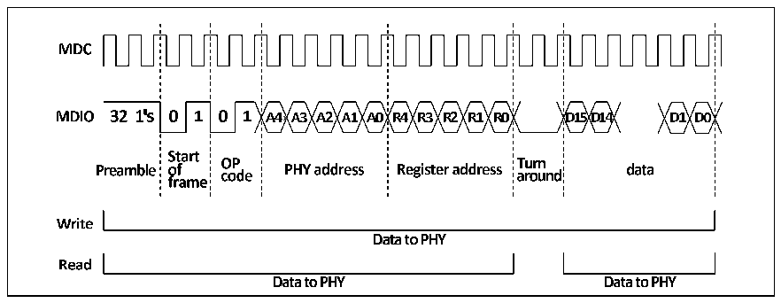

<!-- source-page: 497 -->

[← p.496](0496.md) · [index](../README.md) · [PDF p.497](https://ch32-riscv-ug.github.io/CH32V20x/datasheet_en/CH32FV2x_V3xRM.PDF#page=497) · [p.498 →](0498.md)

<!-- header: CH32F/V20x_V30x_V31x Series Reference Manual https://wch-ic.com -->

Figure 27-3 SMI interface read and write time diagram  
 <!-- rendered from the PDF; verify at https://ch32-riscv-ug.github.io/CH32V20x/datasheet_en/CH32FV2x_V3xRM.PDF#page=497 -->

🖼 Text parsed from the figure above

<!-- image: p497-draw-image-00002 inside the figure -->
<!-- image: p497-draw-image-00005 inside the figure -->
<!-- image: p497-draw-image-00004 inside the figure -->
<!-- image: p497-draw-image-00007 inside the figure -->
<!-- image: p497-draw-image-00009 inside the figure -->
<!-- image: p497-draw-image-00008 inside the figure -->
<!-- image: p497-draw-image-00010 inside the figure -->
<!-- image: p497-draw-image-00003 inside the figure -->
<!-- image: p497-draw-image-00014 inside the figure -->
<!-- image: p497-draw-image-00016 inside the figure -->
<!-- image: p497-draw-image-00020 inside the figure -->
<!-- image: p497-draw-image-00024 inside the figure -->
<!-- image: p497-draw-image-00026 inside the figure -->
<!-- image: p497-draw-image-00030 inside the figure -->
<!-- image: p497-draw-image-00036 inside the figure -->
<!-- image: p497-draw-image-00011 inside the figure -->
<!-- image: p497-draw-image-00012 inside the figure -->
<!-- image: p497-draw-image-00013 inside the figure -->
<!-- image: p497-draw-image-00015 inside the figure -->
<!-- image: p497-draw-image-00017 inside the figure -->
<!-- image: p497-draw-image-00018 inside the figure -->
<!-- image: p497-draw-image-00019 inside the figure -->
<!-- image: p497-draw-image-00021 inside the figure -->
<!-- image: p497-draw-image-00022 inside the figure -->
<!-- image: p497-draw-image-00023 inside the figure -->
<!-- image: p497-draw-image-00025 inside the figure -->
<!-- image: p497-draw-image-00027 inside the figure -->
<!-- image: p497-draw-image-00028 inside the figure -->
<!-- image: p497-draw-image-00029 inside the figure -->
<!-- image: p497-draw-image-00031 inside the figure -->
<!-- image: p497-draw-image-00032 inside the figure -->
<!-- image: p497-draw-image-00033 inside the figure -->
<!-- image: p497-draw-image-00034 inside the figure -->
<!-- image: p497-draw-image-00037 inside the figure -->
<!-- image: p497-draw-image-00038 inside the figure -->
<!-- image: p497-draw-image-00035 inside the figure -->
<!-- image: p497-draw-image-00006 inside the figure -->
<!-- image: p497-draw-image-00040 inside the figure -->
<!-- image: p497-draw-image-00043 inside the figure -->
<!-- image: p497-draw-image-00047 inside the figure -->
<!-- image: p497-draw-image-00041 inside the figure -->
<!-- image: p497-draw-image-00045 inside the figure -->
<!-- image: p497-draw-image-00046 inside the figure -->
<!-- image: p497-draw-image-00049 inside the figure -->
<!-- image: p497-draw-image-00039 inside the figure -->
<!-- image: p497-draw-image-00044 inside the figure -->
<!-- image: p497-draw-image-00048 inside the figure -->
<!-- image: p497-draw-image-00042 inside the figure -->
<!-- image: p497-draw-image-00054 inside the figure -->
<!-- image: p497-draw-image-00050 inside the figure -->
<!-- image: p497-draw-image-00053 inside the figure -->
<!-- image: p497-draw-image-00051 inside the figure -->
<!-- image: p497-draw-image-00052 inside the figure -->

##### 27.1.4.1.3 SMI Clock

Generally speaking, the SMI clock needs to be kept in a fixed range to ensure that the SMI clock actually  
needs to be received by the PHY. For details, refer to the manual of the PHY chip selected by the user.  
The SMI clock frequency is divided from the HB clock by the CR field of the MII address register  
(ETH_MACMIIAR). The following table shows the frequency division relationship between SMI clock and  
HB clock. By default, divide by 42 is selected.  

<!-- p497-table-001 (table-27-3@1) -->
<table><caption>Table 27-3 Frequency division relationship between SMI clock and HB clock</caption><tr><th></th><th style="text-align:left">Range of AHB clocks suitable for matching</th><th>SMI clock</th></tr><tr><td>0000b</td><td>Above 60MHz</td><td>HB clock/42</td></tr><tr><td>0010b</td><td>20-35MHz</td><td>HB clock/16</td></tr><tr><td>0011b</td><td>35-60MHz</td><td>HB clock/26</td></tr><tr><td>other values</td><td colspan="2">meaningless</td></tr></table>

#### 27.1.4.2 MII/RMII Interface

##### 27.1.4.2.1 Overview

Media Independent Interface (MII) is the interface for data communication between MAC and PHY.  
According to the speed and the number of leads, there are standard MII, RMII, GMII, RGMII and SGMII.  
The media independent interface generally has a group of receiving and transmitting, and each group is  
composed of a clock line, a number of data lines and auxiliary lines. The supported MII interfaces are:  
standard MII/RMII supports 10M and 100M physical layers, and RGMII supports 10M, 100M and 100M  
physical layers. Since the physical layers commonly used in the market are generally 10M/100M  
auto-negotiation physical layer, 10M/100M/1000M auto-negotiation physical layer, users should use  
standard MII/RMII interface when using 10M/100M auto-negotiation physical layer, and when using  
10M/100M auto-negotiation physical layer /100M/1000M physical layer, users should use RGMII interface.  
In general, the clock and data in the transmit direction (At the beginning of TX) of the media independent  
interface are sent by the MAC, and the clock and data in the receive direction (At the beginning of RX) are  
sent by the PHY, but the RMII clock is common. For the pin wiring in the same direction, pay attention to  
the equal-length wiring. For specific wiring points, please refer to the Layout manual of the physical layer  
chip selected by the user or Section 27.1.4.2.2 in this manual.  
<!-- image: p497-draw-image-00001 bbox=[508.2, 795.0, 527.28, 805.2] -->
<!-- footer: V2.5 492 -->
