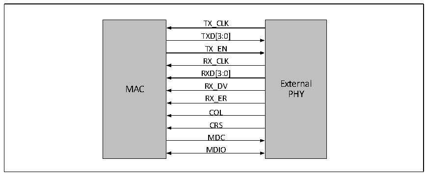

<!-- source-page: 498 -->

[← p.497](0497.md) · [index](../README.md) · [PDF p.498](https://ch32-riscv-ug.github.io/CH32V20x/datasheet_en/CH32FV2x_V3xRM.PDF#page=498) · [p.499 →](0499.md)

<!-- header: CH32F/V20x_V30x_V31x Series Reference Manual https://wch-ic.com -->

##### 27.1.4.2.2 Pins

MII Pins and functions of the interface are as follows:  

<!-- p498-table-001 (table-27-4@1) -->
<table><caption>Table 27-4 MII Interface pins and functions</caption><tr><th>Pins</th><th>Features</th></tr><tr><td>GTXC</td><td>Transmit clock (2.5MHz or 25MHz)</td></tr><tr><td>TXEN</td><td>Transmit data enable</td></tr><tr><td>TXD0</td><td rowspan="4">Transmit data lines [0:3]</td></tr><tr><td>TXD1</td></tr><tr><td>TXD2</td></tr><tr><td>TXD3</td></tr><tr><td>GRXC</td><td>Receive clock (2.5MHz or 25MHz)</td></tr><tr><td>RXDV</td><td>Received data valid</td></tr><tr><td>RXER</td><td>Received data error</td></tr><tr><td>RXD0</td><td rowspan="4">Receive data lines [0:3]</td></tr><tr><td>RXD1</td></tr><tr><td>RXD2</td></tr><tr><td>RXD3</td></tr><tr><td>COL</td><td>Collision detection</td></tr><tr><td>CRS</td><td>Carrier detect</td></tr></table>

Figure 27-4 shows how the MAC and PHY are connected using the definition of the MII interface.  

Figure 27-4 Ethernet transceiver using MII interface, how to wire MAC and PHY  
 <!-- rendered from the PDF; verify at https://ch32-riscv-ug.github.io/CH32V20x/datasheet_en/CH32FV2x_V3xRM.PDF#page=498 -->

🖼 Text parsed from the figure above

TX_CLK  
TXD[3:0]  
TX_EN  
RX_CLK  
RXD[3:0]  
MAC RX_DV External  
PHY  
RX_ER  
COL  
CRS  
MDC  
MDIO  

The pins and functions of the RMII interface are as follows:  

<!-- p498-table-002 (table-27-5@1) pages 498-499 -->
<table><caption>Table 27-5 Pins and functions of the RMII interface</caption><tr><th>Pins</th><th>Features</th></tr><tr><td>CLK_REF</td><td>Receive/transmit clock (50MHz)</td></tr><tr><td>TXEN</td><td>Transmit data enable</td></tr><tr><td>TXD0</td><td rowspan="2">Transmit data lines [0:1]</td></tr><tr><td>TXD1</td></tr><tr><td>CRSDV</td><td>Received data valid</td></tr><tr><td style="text-align:left">RXD0RXD1</td><td>Receive data lines [0:1]</td></tr></table>

<!-- image: p498-draw-image-00001 bbox=[508.2, 795.0, 527.28, 805.2] -->
<!-- footer: V2.5 493 -->
