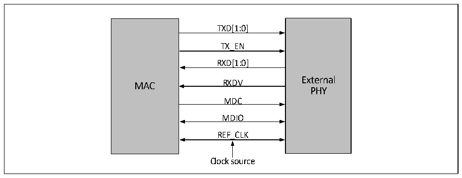
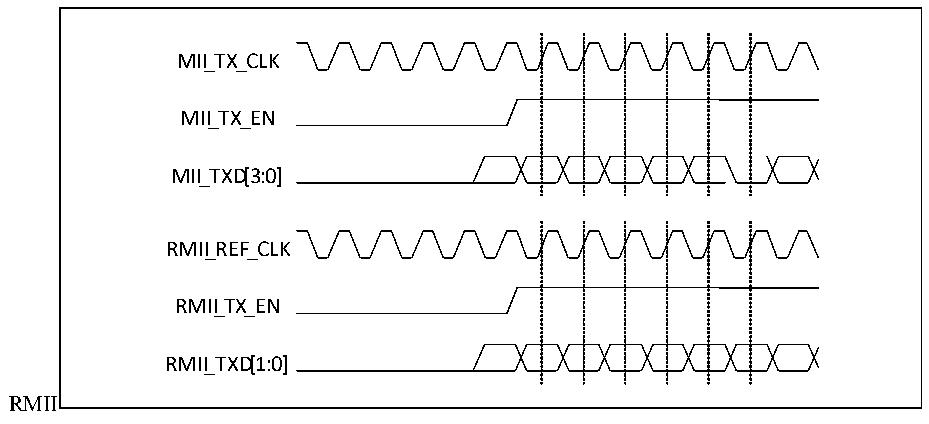

<!-- source-page: 499 -->

[← p.498](0498.md) · [index](../README.md) · [PDF p.499](https://ch32-riscv-ug.github.io/CH32V20x/datasheet_en/CH32FV2x_V3xRM.PDF#page=499) · [p.500 →](0500.md)

<!-- header: CH32F/V20x_V30x_V31x Series Reference Manual https://wch-ic.com -->

> ⬆ **Table continued** — rendered in full at [page 498](0498.md). <!-- p499-table-001 -->

When using the RMII interface, the transceiver clocks share the same line for transmission, and the clock  
frequency is fixed at 50MHz. When RMII is used at a rate of 10Mbps, RX and TX sample data every 10  
cycles, and the data line needs to retain data for 10 cycles; MAC and PHY need to use the same clock source.  
The MCO output of the MAC can be connected to the external clock source input pin of the PHY. Figure  
27-5 shows how the MAC and PHY are wired when using the RMII interface.  

Figure 27-5 Wiring diagram of MAC and PHY when using RMII interface  
 <!-- rendered from the PDF; verify at https://ch32-riscv-ug.github.io/CH32V20x/datasheet_en/CH32FV2x_V3xRM.PDF#page=499 -->

🖼 Text parsed from the figure above

TXD[1:0]  
TX_EN  
RXD[1:0]  
External  
MAC RXDV  
PHY  
MDC  
MDIO  
REF_CLK  
Clock source  

<em>Note: The Ethernet transceiver needs to input the externally provided REF_CLK 50MHz clock frequency</em>  
<em>from the RXC pin.</em>  

##### 27.1.4.2.3 Timing

Difference in timing between RMII and MII:  
● The clock of RMII is fixed at 50MHz, while the transceiver clock of MII works at 2.5MHz or 25MHz  
depending on the actual connection speed;  
● RMII transceivers share the same clock line;  
● RMII is a 2-bit data line, while MII is a 4-bit data line.  
Figure 27-6 shows the timing of RMII and MII.  

Figure 27-6 Timing diagram of MII and  
 <!-- rendered from the PDF; verify at https://ch32-riscv-ug.github.io/CH32V20x/datasheet_en/CH32FV2x_V3xRM.PDF#page=499 -->

🖼 Text parsed from the figure above

MII_TX_ CLK  
MII_TX_EN  
MII_TXD[3: 0]  
RMII_REF_CLK  
RMII_TX_ EN  
RMII_TXD[1: 0]  
RMII  

<!-- image: p499-draw-image-00001 bbox=[508.2, 795.0, 527.28, 805.2] -->
<!-- footer: V2.5 494 -->
