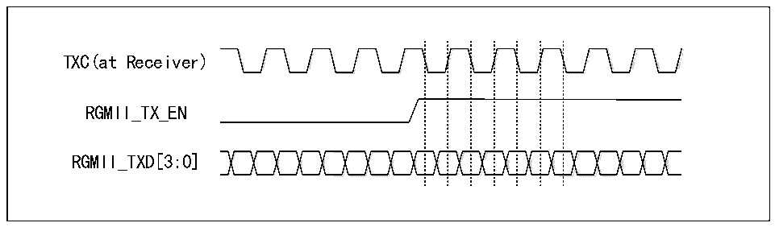

<!-- source-page: 500 -->

[← p.499](0499.md) · [index](../README.md) · [PDF p.500](https://ch32-riscv-ug.github.io/CH32V20x/datasheet_en/CH32FV2x_V3xRM.PDF#page=500) · [p.501 →](0501.md)

<!-- header: CH32F/V20x_V30x_V31x Series Reference Manual https://wch-ic.com -->

#### 27.1.4.3 RGMII interface

##### 27.1.4.3.1 Pins

The pins and functions of the RGMII are as follows  

<!-- p500-table-001 (table-27-6@1) -->
<table><caption>Table 27-6 RGMII pins and functions</caption><tr><th>Pins</th><th>Features</th></tr><tr><td>GTXC</td><td>Transmit clock</td></tr><tr><td>TXCTL</td><td>Transmit data control</td></tr><tr><td>TXD0</td><td rowspan="4">Transmit data lines [0:3]</td></tr><tr><td>TXD1</td></tr><tr><td>TXD2</td></tr><tr><td>TXD3</td></tr><tr><td>GRXC</td><td>Receive clock</td></tr><tr><td>RXCTL</td><td>Receive data control</td></tr><tr><td>RXD0</td><td rowspan="4">Receive data lines[0:3]</td></tr><tr><td>RXD1</td></tr><tr><td>RXD2</td></tr><tr><td>RXD3</td></tr></table>

<em>Note: 1. TXCTL/RXCTL is used in the Ethernet transceiver of this microcontroller as a valid signal for</em>  
<em>sending and receiving data;</em>  
<em>2. RGMII has an independent SMI interface.</em>  

##### 27.1.4.3.2 Timing

RGMII works in 10M and 100M rate modes, and the timing is similar to MII; when working in gigabit, the  
clock of RGMII is 125MHz, and the double-edge sampling method is adopted. RGMII does not support  
half-duplex.  
Since RGMII uses double-edge sampling and operates at a clock frequency of 125MHz, circuit designers  
should be aware of signal integrity issues.  
The clock received by the receiver of the RGMII should lag the data by 90° to ensure correct sampling.  
Ethernet transceivers are designed to transmit clock delay output and phase inversion.  

Figure 27-7 RGMII timing diagram  
 <!-- rendered from the PDF; verify at https://ch32-riscv-ug.github.io/CH32V20x/datasheet_en/CH32FV2x_V3xRM.PDF#page=500 -->

🖼 Text parsed from the figure above

<!-- image: p500-draw-image-00002 inside the figure -->
TXC(at Receiver)  
<!-- image: p500-draw-image-00003 inside the figure -->
RGMII_TX_EN  
RGMII_TXD[3:0]  
<!-- image: p500-draw-image-00004 inside the figure -->

<!-- image: p500-draw-image-00001 bbox=[508.2, 795.0, 527.28, 805.2] -->
<!-- footer: V2.5 495 -->
