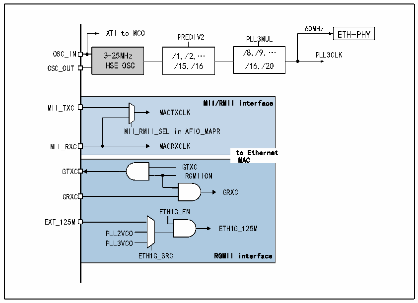

<!-- source-page: 502 -->

[← p.501](0501.md) · [index](../README.md) · [PDF p.502](https://ch32-riscv-ug.github.io/CH32V20x/datasheet_en/CH32FV2x_V3xRM.PDF#page=502) · [p.503 →](0503.md)

<!-- header: CH32F/V20x_V30x_V31x Series Reference Manual https://wch-ic.com -->

Figure 27-8 Ethernet peripheral clock tree  
 <!-- rendered from the PDF; verify at https://ch32-riscv-ug.github.io/CH32V20x/datasheet_en/CH32FV2x_V3xRM.PDF#page=502 -->

🖼 Text parsed from the figure above

60MHz  
XTI to MCO ETH-PHY  
PREDIV2 PLL3MUL  
OSC_IN 3-25MHz /1,/2,… /8,/9,… PLL3CLK  
OSC_OUT HSE OSC /15,/16 /16,/20  
MII/RMII interface MACTXCLK MII__RMII_SEL in AFIO_MAPRMACRXCLK to Ethernet  to Ethernet  MACGTXCRGMIIONGRXCETH1G_ENETH1G_125MPLL2VCOPLL3VCO ETH1G_SRC RGMII interface  MAC  
MII_TXC  
GTXC  
GRXC  
EXT_125M  

The clock of the internal 10M Ethernet physical layer is provided by PLL3 and must be 60MHz. When using  
the internal physical layer, the second bit of the extension register needs to be set. After setting, the settings  
related to MII/RMII/RGMII are invalid.  
When using MII, the transceiver clock is provided by the external physical layer, which is 2.5MHz or  
25MHz. When using RMII, REF_CLK is the only clock, which is input to the microcontroller from the RXC  
pin, and is fixed at 50MHz. When using RMII, the 23rd bit in the AFIO remapping register needs to be set.  
When using RGMII, the MAC needs a clock with a frequency of 125MHz, which is generated by the VCO  
of the internal PLL2/PLL3 (The VCO output is twice the output frequency of the PLL) or an external input,  
and the 125MHz clock is input through the EXT_125M pin. The transmit clock of RGMII is generated by  
the MAC, and the receive clock is generated by the PHY. To turn on RGMII, you need to set bit 3 in the  
extension registers, set bit 22 in the second configuration register of RCC, and select the appropriate  
125MHz clock source in [21:20]. For details, see EVT routines on the official website.  

##### 27.1.4.5.2 MCO Output

It is known that MCO supports output of 8 clocks, namely HSE, HSI, system clock frequency, PLLCLK/2,  
PLL2CLK, PLL3CLK, PLL3CLK/2 and XTI. Users can use MCO to output the frequency required in the  
application, such as 25MHz clock required by common physical layer chips to save a crystal. The output  
frequency of the MCO should not be greater than 100MHz.  

### 27.1.5 IEEE802.3 and IEEE1588

The IEEE802.3 protocol and its supplementary protocols constitute the official standard of the current  
Ethernet, which defines all aspects of the currently used Ethernet in detail. We can think of Ethernet as part  
of the physical layer and data link layer in the OSI model. This section discusses the parts that users need to  
use in the IEEE802.3 protocol from the application point of view, that is, the frame format and the content  
related to the MAC address. At the same time, the Ethernet transceiver of the microcontroller also supports  
the IEEE1588 Precision Time Protocol, which will also be discussed in part in this article.  
<!-- image: p502-draw-image-00001 bbox=[508.2, 795.0, 527.28, 805.2] -->
<!-- footer: V2.5 497 -->
