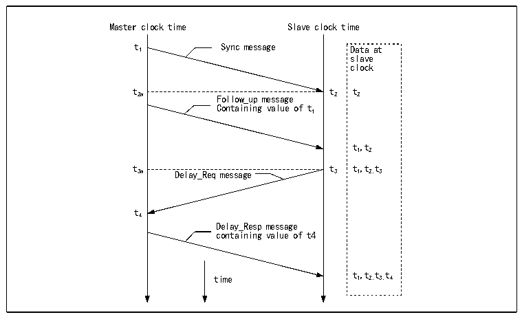

<!-- source-page: 508 -->

[← p.507](0507.md) · [index](../README.md) · [PDF p.508](https://ch32-riscv-ug.github.io/CH32V20x/datasheet_en/CH32FV2x_V3xRM.PDF#page=508) · [p.509 →](0509.md)

<!-- header: CH32F/V20x_V30x_V31x Series Reference Manual https://wch-ic.com -->
requirements in the field of industrial automation, so the Network Precision Clock Synchronization  
Committee drafted the PTP protocol, which was approved by the IEEE Standards Committee at the end of  
2002 as the IEEE1588 standard.  
The implementation of the PTP protocol requires both the host and the slave to accurately record the time  
when the MAC receives and sends Ethernet frames, which requires both the host and the slave to have their  
own set of high-precision time counters. Then, the master and slave supporting PTP perform time  
synchronization through a set of procedures, and the slave can obtain the time difference between itself and  
the master and correct it. The following figure shows the process of master-slave time synchronization:  

Figure 27-9 IEEE1588 PTP protocol synchronization message timing diagram  
 <!-- rendered from the PDF; verify at https://ch32-riscv-ug.github.io/CH32V20x/datasheet_en/CH32FV2x_V3xRM.PDF#page=508 -->

🖼 Text parsed from the figure above

Master clock time Slave clock time  
t 1 Sync message Data at  
slave  
clock  
t t t  
2m Follow_up message 2 2  
Containing value of t  
1  
t,t  
1 2  
t t t,t t  
3m Delay_Req message 3 1 2, 3  
t  
4  
Delay_Resp message  
containing value of t4  
t,t t t  
time 1 2, 3, 4  

Step-by-step description:  
● The master sends a syn message to the slave, and the slave receives this message and records the local  
time t2 when the syn message is received;  
● The master sends a follow_up message to the slave, including the master time t1 when the master sends  
the syn message;  
● The slave sends a delay_req message to the master, and the slave records the sending time t3;  
● The master sends a delay_resq message to the slave, including the reception time t4 of the delay_req  
message;  
In actual use, the host sends out a syn message every 2 seconds, and every other syn message can be  
regarded as the follow_up message of the previous syn message, and they will all be accompanied by the  
sending time of the last syn message. Through this process, the slave can know the delay time Tdelay from  
the master network to the slave network, and then calculate the time offset between the master time and the  
slave time.  
(t21-t ) + (t43-t )  
Tdelay =  
2  
The time sent by either host minus the offset is the host&#x27;s time.  
The synchronization process of PTP is generally implemented through the UDP protocol, of course, the user  
can also implement a custom protocol. PTP is highly dependent on the latency stability of the intranet.  
<!-- image: p508-draw-image-00001 bbox=[508.2, 795.0, 527.28, 805.2] -->
<!-- footer: V2.5 503 -->
