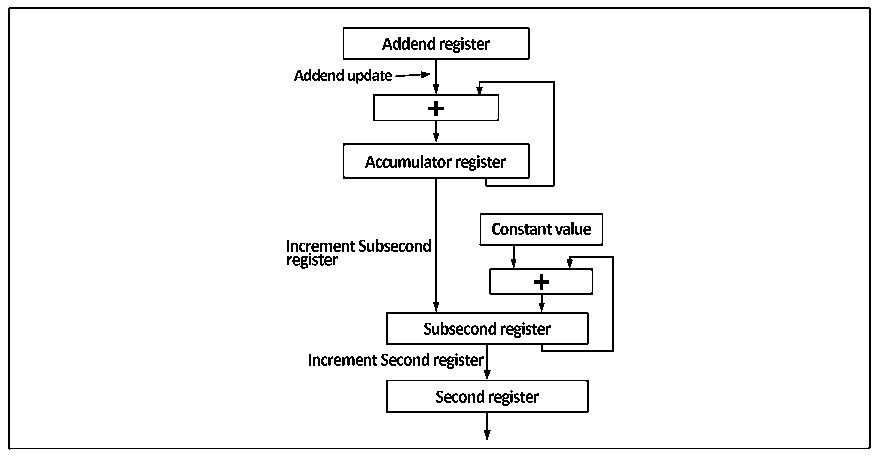

<!-- source-page: 509 -->

[← p.508](0508.md) · [index](../README.md) · [PDF p.509](https://ch32-riscv-ug.github.io/CH32V20x/datasheet_en/CH32FV2x_V3xRM.PDF#page=509) · [p.510 →](0510.md)

<!-- header: CH32F/V20x_V30x_V31x Series Reference Manual https://wch-ic.com -->

##### 27.1.5.7.2 Local Time Update and Correction

In order to implement the PTP host, the device needs to have a high-precision time counter locally, at least to  
the nanosecond level. The PTP module of the microcontroller&#x27;s Gigabit Ethernet counter has a 32-bit counter  
in seconds, and a 31-bit sub-second counter. When the sub-second counter overflows, it will cause the  
second counter to increment automatically, so the resolution of the local time. The rate can be done around  

## 0.46 nanoseconds.

There are 2 ways to update the local time, namely coarse correction and fine correction. The update timing  
of the coarse correction mode is determined externally. When the time update is required, the time update bit  
(PTPTSCR: TSSTU) of the time stamp control register is set, and the PTP module of the microcontroller  
subtracts or adds the value of the timestamp update registers (TSHUR, TSLUR) to the second counter and  
sub-second counter. Coarse correction is a simpler and more convenient time update mechanism, but less  
precise.  
The fine correction time update method is more commonly used. The update process is as follows:  

Figure 27-10 Process for updating time using fine correction  
 <!-- rendered from the PDF; verify at https://ch32-riscv-ug.github.io/CH32V20x/datasheet_en/CH32FV2x_V3xRM.PDF#page=509 -->

🖼 Text parsed from the figure above

<!-- image: p509-draw-image-00012 inside the figure -->
<!-- image: p509-draw-image-00006 inside the figure -->
<!-- image: p509-draw-image-00002 inside the figure -->
<!-- image: p509-draw-image-00007 inside the figure -->
<!-- image: p509-draw-image-00011 inside the figure -->
<!-- image: p509-draw-image-00003 inside the figure -->
<!-- image: p509-draw-image-00004 inside the figure -->
<!-- image: p509-draw-image-00010 inside the figure -->
<!-- image: p509-draw-image-00009 inside the figure -->
<!-- image: p509-draw-image-00005 inside the figure -->
<!-- image: p509-draw-image-00008 inside the figure -->

The way to use the fine correction mode requires a clear understanding of the system frequency and the fine  
correction process. Different from the coarse correction mode, the timing of the update event in the fine  
correction mode is the overflow of the accumulator (32 bits, not listed in the register list. The Accumulator  
register in the figure) overflows, and the accumulator will automatically increment the number register in  
each system clock cycle. The value of (PTPTSAR, Addend register in the figure) will generate a time update  
event once it overflows, that is, the value of the sub-second auto-increment register (PTPSSIR, Constant  
Value in the figure) will be added to the sub-second counter (Sub-second register), complete time update.  
The second counter is incremented when the sub-second counter overflows. In fact, the time for the  
sub-second counter to increment by one bit is 1/(2^31)=0.46566128730...nanoseconds. The user needs to  
ensure that the time spent on the accumulator overflow is exactly equal to the value of the sub-second  
auto-increment register multiplied by the sub-second the time for the counter to increment by one bit.  
The correction of local time is relatively simple. Set the time correction bit (PTPTSCR: TSSTI) of the time  
stamp control register, and the value of the second counter and sub-second counter will be replaced by the  
value of the time stamp update counter (TSHUR, TSLUR).  
<!-- image: p509-draw-image-00001 bbox=[508.2, 795.0, 527.28, 805.2] -->
<!-- footer: V2.5 504 -->
