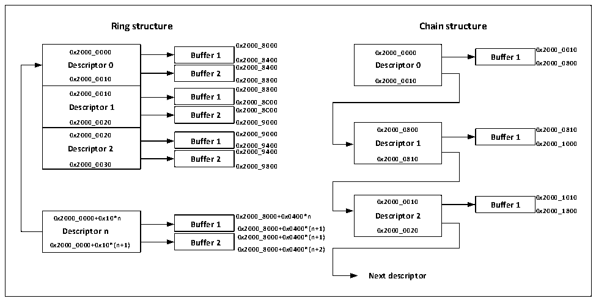

<!-- source-page: 511 -->

[← p.510](0510.md) · [index](../README.md) · [PDF p.511](https://ch32-riscv-ug.github.io/CH32V20x/datasheet_en/CH32FV2x_V3xRM.PDF#page=511) · [p.512 →](0512.md)

<!-- header: CH32F/V20x_V30x_V31x Series Reference Manual https://wch-ic.com -->
from TDes3/RDes3. The other is a ring structure, where all descriptors must be closely arranged, DMA  
control takes a descriptor from the end of the current descriptor, when the DMA controller detects the  
TER/RER bit of TDes4/RDes4, i.e., from the beginning of the descriptor list. The address of the descriptor  
array must be 4-byte aligned, and the size of a single descriptor is 16 bytes.  

Figure 27-11 A buffer allocation scheme which describes the ring structure and the chain structure for  
 <!-- rendered from the PDF; verify at https://ch32-riscv-ug.github.io/CH32V20x/datasheet_en/CH32FV2x_V3xRM.PDF#page=511 -->

reference when users allocate space.  

🖼 Text parsed from the figure above

<strong>Ring structure Chain structure</strong>  
<strong>0x2000_8000</strong>  
0x2000_0000 Descriptor 00x2000_0010  0x2000_0010 Descriptor 10x2000_0020  0x2000_0020 Descriptor 20x2000_0030  
Buffer 1  Buffer 2  
<strong>0x2000_0000 Buffer 1 0x2000_0000 Buffer 1 0x2000_0010</strong>  
<strong>Descriptor 0 0 0 x x 2 2 0 0 0 0 0 0 _ _ 8 8 4 4 0 0 0 0 Descriptor 0 0x2000_0800</strong>  
<strong>0x2000_0010 0x2000_8800 0x2000_0010</strong>  
Buffer 1  Buffer 2  
<strong>0x2000_8800</strong>  
<strong>0x2000_0010 Buffer 1</strong>  
<strong>0x2000_8C00</strong>  
<strong>Descriptor 1 0x2000_8C00</strong>  
<strong>0x2000_0020 0x2000_9000</strong>  
<strong>0x2000_0800 0x2000_0810</strong>  
Buffer 1  Buffer 2  
<strong>0x2000_0020 0x2000_9000 Buffer 1</strong>  
<strong>Descriptor 2 Buffer 1 0x2000_9400 Descriptor 1 0x2000_1000</strong>  
<strong>0x2000_9400</strong>  
<strong>Buffer 2 0x2000_0810</strong>  
<strong>0x2000_0030 0x2000_9800</strong>  
<strong>0x2000_1010</strong>  
<strong>0x2000_0010 Buffer 1</strong>  
<strong>0x2000_1800</strong>  
Buffer 1  Buffer 2  
<strong>0x2000_0000+0x10*n 0x2000_8000+0x0400*n Descriptor 2</strong>  
<strong>Descriptor n 0x2000_8000+0x0400*(n+1) 0x2000_0020</strong>  
<strong>0x2000_8000+0x0400*(n+1)</strong>  
<strong>0x2000_0000+0x10*(n+1) Buffer 2</strong>  
<strong>0x2000_8000+0x0400*(n+2)</strong>  
<strong>Next descriptor</strong>  

##### 27.1.6.2.1 Transmit DMA Descriptor

Figure 27-11 shows the structure of the transmit descriptor.  
31 0  

<!-- p511-table-006 (table-27-11@1) -->
<table><caption>Table 27-11 Structure of the transmit descriptor</caption><tr><th style="text-align:left">OWM (31)</th><th colspan="2" style="text-align:left">CTRL (30:26)</th><th style="text-align:left">TTSE (25)</th><th>Reserved</th><th colspan="2" style="text-align:left">Control （23:20）</th><th colspan="2" style="text-align:left">Reserved (19:18)</th><th style="text-align:left">TTSS (17)</th><th style="text-align:left">State （16:0）</th></tr><tr><td colspan="2" style="text-align:left">Reserved （31:29）</td><td colspan="4" style="text-align:left">Buffer 2-byte count （28:16）</td><td colspan="2" style="text-align:left">Reserved （15:13）</td><td colspan="3" style="text-align:left">Buffer 1-byte count （12:0）</td></tr><tr><td colspan="11">Buffer 1 address, timestamp low</td></tr><tr><td colspan="11" style="text-align:left">Buffer 2 address, address of next descriptor, timestamp high</td></tr></table>

It can be seen from the above table that the send descriptor is composed of 4 32-bit words, namely TDes0,  
TDes1, TDes2 and TDes3, of which TDes9 is used for control and return transmission status, TDes1 is used  
to indicate the transmission length, and TDes2 is used to indicate the transmission buffer. The position of the  
zone or the low bit of the return transmit timestamp, TDes3 is used to indicate the address for the second  
transmit buffer (When TCH is not set) or the address of the next descriptor (When TCH is set), timestamp is  
enabled When it is sent, the high bit of the IEEE1588 timestamp will be returned. Each 32-bit word is  
described below.  
<!-- image: p511-draw-image-00001 bbox=[508.2, 795.0, 527.28, 805.2] -->
<!-- footer: V2.5 506 -->
