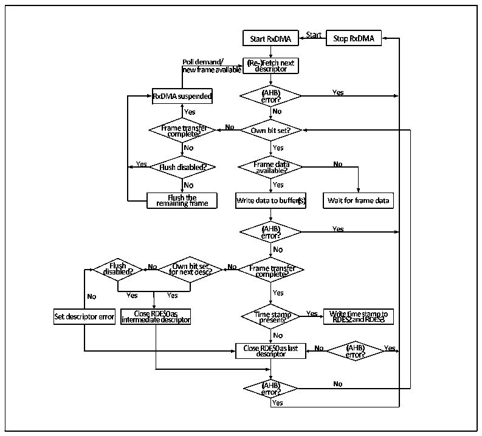

<!-- source-page: 522 -->

[← p.521](0521.md) · [index](../README.md) · [PDF p.522](https://ch32-riscv-ug.github.io/CH32V20x/datasheet_en/CH32FV2x_V3xRM.PDF#page=522) · [p.523 →](0523.md)

<!-- header: CH32F/V20x_V30x_V31x Series Reference Manual https://wch-ic.com -->
descriptor, and the user needs to pay special attention;  
4） The user needs to enable at least one receive completion interrupt, and restore the used receive  
descriptor to the standby state in the Ethernet interrupt function to ensure that the receive process can  
run uninterrupted. The user can pass the address of the data buffer to be processed in the interrupt  
function, or handle some abnormal events that interrupt the receiving process.  
5） If the PTP timestamp is enabled, the DMA controller dumps the data and writes the descriptor status  
field, and also writes the current timestamp into the last 2 words of the descriptor. The user should read  
the timestamp in time and complete the buffer address and the next descriptor address originally written  
in the last 2 words.  
The following figure shows the default flow mechanism of reception:  

Figure 27-12 Process of reception  
 <!-- rendered from the PDF; verify at https://ch32-riscv-ug.github.io/CH32V20x/datasheet_en/CH32FV2x_V3xRM.PDF#page=522 -->

🖼 Text parsed from the figure above

<!-- image: p522-draw-image-00012 inside the figure -->
<!-- image: p522-draw-image-00094 inside the figure -->
<!-- image: p522-draw-image-00005 inside the figure -->
<!-- image: p522-draw-image-00014 inside the figure -->
<!-- image: p522-draw-image-00013 inside the figure -->
<!-- image: p522-draw-image-00006 inside the figure -->
<!-- image: p522-draw-image-00009 inside the figure -->
<!-- image: p522-draw-image-00010 inside the figure -->
<!-- image: p522-draw-image-00007 inside the figure -->
<!-- image: p522-draw-image-00008 inside the figure -->
<!-- image: p522-draw-image-00011 inside the figure -->
<!-- image: p522-draw-image-00015 inside the figure -->
<!-- image: p522-draw-image-00022 inside the figure -->
<!-- image: p522-draw-image-00024 inside the figure -->
<!-- image: p522-draw-image-00033 inside the figure -->
<!-- image: p522-draw-image-00023 inside the figure -->
<!-- image: p522-draw-image-00016 inside the figure -->
<!-- image: p522-draw-image-00026 inside the figure -->
<!-- image: p522-draw-image-00025 inside the figure -->
<!-- image: p522-draw-image-00029 inside the figure -->
<!-- image: p522-draw-image-00017 inside the figure -->
<!-- image: p522-draw-image-00018 inside the figure -->
<!-- image: p522-draw-image-00095 inside the figure -->
<!-- image: p522-draw-image-00048 inside the figure -->
<!-- image: p522-draw-image-00049 inside the figure -->
<!-- image: p522-draw-image-00096 inside the figure -->
<!-- image: p522-draw-image-00097 inside the figure -->
<!-- image: p522-draw-image-00031 inside the figure -->
<!-- image: p522-draw-image-00027 inside the figure -->
<!-- image: p522-draw-image-00050 inside the figure -->
<!-- image: p522-draw-image-00021 inside the figure -->
<!-- image: p522-draw-image-00030 inside the figure -->
<!-- image: p522-draw-image-00019 inside the figure -->
<!-- image: p522-draw-image-00020 inside the figure -->
<!-- image: p522-draw-image-00051 inside the figure -->
<!-- image: p522-draw-image-00052 inside the figure -->
<!-- image: p522-draw-image-00032 inside the figure -->
<!-- image: p522-draw-image-00028 inside the figure -->
<!-- image: p522-draw-image-00057 inside the figure -->
<!-- image: p522-draw-image-00053 inside the figure -->
<!-- image: p522-draw-image-00054 inside the figure -->
<!-- image: p522-draw-image-00056 inside the figure -->
<!-- image: p522-draw-image-00059 inside the figure -->
<!-- image: p522-draw-image-00055 inside the figure -->
<!-- image: p522-draw-image-00058 inside the figure -->
<!-- image: p522-draw-image-00060 inside the figure -->
<!-- image: p522-draw-image-00062 inside the figure -->
<!-- image: p522-draw-image-00061 inside the figure -->
<!-- image: p522-draw-image-00034 inside the figure -->
<!-- image: p522-draw-image-00064 inside the figure -->
<!-- image: p522-draw-image-00063 inside the figure -->
<!-- image: p522-draw-image-00035 inside the figure -->
<!-- image: p522-draw-image-00068 inside the figure -->
<!-- image: p522-draw-image-00065 inside the figure -->
<!-- image: p522-draw-image-00037 inside the figure -->
<!-- image: p522-draw-image-00036 inside the figure -->
<!-- image: p522-draw-image-00098 inside the figure -->
<!-- image: p522-draw-image-00066 inside the figure -->
<!-- image: p522-draw-image-00069 inside the figure -->
<!-- image: p522-draw-image-00070 inside the figure -->
<!-- image: p522-draw-image-00067 inside the figure -->
<!-- image: p522-draw-image-00099 inside the figure -->
<!-- image: p522-draw-image-00100 inside the figure -->
<!-- image: p522-draw-image-00041 inside the figure -->
<!-- image: p522-draw-image-00039 inside the figure -->
<!-- image: p522-draw-image-00040 inside the figure -->
<!-- image: p522-draw-image-00038 inside the figure -->
<!-- image: p522-draw-image-00071 inside the figure -->
<!-- image: p522-draw-image-00072 inside the figure -->
<!-- image: p522-draw-image-00084 inside the figure -->
<!-- image: p522-draw-image-00042 inside the figure -->
<!-- image: p522-draw-image-00002 inside the figure -->
<!-- image: p522-draw-image-00073 inside the figure -->
<!-- image: p522-draw-image-00101 inside the figure -->
<!-- image: p522-draw-image-00074 inside the figure -->
<!-- image: p522-draw-image-00087 inside the figure -->
<!-- image: p522-draw-image-00085 inside the figure -->
<!-- image: p522-draw-image-00086 inside the figure -->
<!-- image: p522-draw-image-00088 inside the figure -->
<!-- image: p522-draw-image-00004 inside the figure -->
<!-- image: p522-draw-image-00003 inside the figure -->
<!-- image: p522-draw-image-00043 inside the figure -->
<!-- image: p522-draw-image-00079 inside the figure -->
<!-- image: p522-draw-image-00081 inside the figure -->
<!-- image: p522-draw-image-00075 inside the figure -->
<!-- image: p522-draw-image-00077 inside the figure -->
<!-- image: p522-draw-image-00080 inside the figure -->
<!-- image: p522-draw-image-00076 inside the figure -->
<!-- image: p522-draw-image-00044 inside the figure -->
<!-- image: p522-draw-image-00045 inside the figure -->
<!-- image: p522-draw-image-00078 inside the figure -->
<!-- image: p522-draw-image-00083 inside the figure -->
<!-- image: p522-draw-image-00082 inside the figure -->
<!-- image: p522-draw-image-00047 inside the figure -->
<!-- image: p522-draw-image-00089 inside the figure -->
<!-- image: p522-draw-image-00091 inside the figure -->
<!-- image: p522-draw-image-00090 inside the figure -->
<!-- image: p522-draw-image-00093 inside the figure -->
<!-- image: p522-draw-image-00092 inside the figure -->
<!-- image: p522-draw-image-00046 inside the figure -->

### 27.1.7 Interrupt

The Ethernet transceiver has 2 interrupt vectors, one is the Ethernet wake-up event and the other is the  
normal transceiver event. When a wake-up frame or magic frame is detected, an Ethernet wake-up event is  
triggered. Common Ethernet transceiver interrupt events include DMA interrupt and ETH interrupt.  

#### 27.1.7.1 DMA Interrupt

DMA interrupts can be roughly divided into 2 groups, namely normal interrupts (NIS) and abnormal  
interrupts (AIS). Abnormal interrupts generally mean abnormal data transmission and reception, which  
requires special attention. When processing interrupts, users need to retrieve all interrupt flag bits and  
process all generated interrupt sources. The following figure is a schematic diagram of the interrupt of the  
Ethernet transceiver.  
<!-- image: p522-draw-image-00001 bbox=[508.2, 795.0, 527.28, 805.2] -->
<!-- footer: V2.5 517 -->
