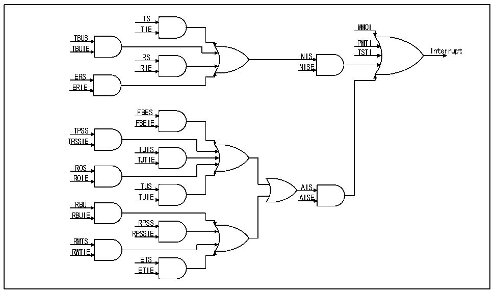

<!-- source-page: 523 -->

[← p.522](0522.md) · [index](../README.md) · [PDF p.523](https://ch32-riscv-ug.github.io/CH32V20x/datasheet_en/CH32FV2x_V3xRM.PDF#page=523) · [p.524 →](0524.md)

<!-- header: CH32F/V20x_V30x_V31x Series Reference Manual https://wch-ic.com -->

Figure 27-13 Interrupt schematic  
 <!-- rendered from the PDF; verify at https://ch32-riscv-ug.github.io/CH32V20x/datasheet_en/CH32FV2x_V3xRM.PDF#page=523 -->

🖼 Text parsed from the figure above

TS  
TIE MMCI  
TBUS  
PMTI  
TBUIE TSTI Interrupt  
RS NIS  
RIE NISE  
ERS  
ERIE  
FBES  
FBEIE  
TPSS  
TPSSIE  
TJTS  
TJTIE  
ROS  
ROIE  
TUS AIS  
TUIE AISE  
RBU  
RBUIE  
RPSS  
RPSSIE  
RWTS  
RWTIE  
ETS  
ETIE  

The DMA interrupt is the most important interrupt in the Ethernet transceiver. Generally, user logic needs to  
rely on interrupts to receive frames, confirm that the frames are sent, or deal with the interrupted transceiver  
logic in time.  

#### 27.1.7.2 ETH Interrupt

The ETH interrupt mainly includes the time alarm trigger of PTP, the sending and receiving count to a  
certain set value of the MMC register, and the PMT. The usefulness of ETH is mainly functional, not very  
complex and important relative to DMA interrupts. Users can use PTP interrupt for alarm clock, MMC  
interrupt for speed measurement, or PMT interrupt for remote wake-up. In addition, ETH also supports  
interrupts when the state of the built-in physical layer connection changes.  

#### 27.1.7.3 PMT Interrupt

The reason why the PMT interrupt is raised separately and reiterated is that this interrupt has an independent  
interrupt vector and needs to be paid attention to when using it.  

### 27.1.8 Register Description

MAC control register address mapping  

<!-- p523-table-001 (table-27-22@1) pages 523-524 -->
<table><caption>Table 27-22 Ethernet registers</caption><tr><th>Name</th><th>Offset Address</th><th>Description</th><th>Reset Value</th></tr><tr><td>R32_ETH_MACCR</td><td>0x40028000</td><td>MAC control register</td><td>0x00000000</td></tr><tr><td>R32_ETH_MACFFR</td><td>0x40028004</td><td>Frame filter register</td><td>0x00000000</td></tr><tr><td>R32_ETH_MACHTHR</td><td>0x40028008</td><td>Hash value list register high</td><td>0x00000000</td></tr><tr><td>R32_ETH_MACHTLR</td><td>0x4002800C</td><td>Hash value list register low</td><td>0x00000000</td></tr><tr><td>R32_ETH_MACMIIAR</td><td>0x40028010</td><td>MII address register</td><td>0x00000000</td></tr><tr><td>R32_ETH_MACMIIDR</td><td>0x40028014</td><td>MII data register</td><td>0x00000000</td></tr><tr><td>R32_ETH_MACFCR</td><td>0x40028018</td><td>MAC flow control register</td><td>0x00000000</td></tr><tr><td>R32_ETH_MACVLAN</td><td>0x4002801C</td><td>VLAN tag register</td><td>0x00000000</td></tr><tr><td>R32_ETH_MACRWUFFR</td><td>0x40028028</td><td>Wake-up frame filter register</td><td>0x00000000</td></tr><tr><td>R32_ETH_MACPMTCSR</td><td>0x4002802C</td><td>PMT control and status Register</td><td>0x00000000</td></tr><tr><td>R32_ETH_MACSR</td><td>0x40028038</td><td>MAC interrupt status register</td><td>0x00000000</td></tr><tr><td>R32_ETH_MACIMR</td><td>0x4002803C</td><td>MAC interrupt mask register</td><td>0x00000000</td></tr><tr><td>R32_ETH_MACA0HR</td><td>0x40028040</td><td>MAC address register 0 high 32 bits</td><td>0x8000FFFF</td></tr><tr><td>R32_ETH_MACA0LR</td><td>0x40028044</td><td>MAC address register 0 low 32 bits</td><td>0xFFFFFFFF</td></tr><tr><td>R32_ETH_MACA1HR</td><td>0x40028048</td><td>MAC address register 1 high 32 bits</td><td>0x0000FFFF</td></tr><tr><td>R32_ETH_MACA1LR</td><td>0x4002804C</td><td>MAC address register 1 low 32 bits</td><td>0xFFFFFFFF</td></tr><tr><td>R32_ETH_MACA2HR</td><td>0x40028050</td><td>MAC address register 2 high 32 bits</td><td>0x0000FFFF</td></tr><tr><td>R32_ETH_MACA2LR</td><td>0x40028054</td><td>MAC address register 2 low 32 bits</td><td>0xFFFFFFFF</td></tr><tr><td>R32_ETH_MACA3HR</td><td>0x40028058</td><td>MAC address register 3 high 32 bits</td><td>0x0000FFFF</td></tr><tr><td>R32_ETH_MACA3LR</td><td>0x4002805C</td><td>MAC address register 3 low 32 bits</td><td>0xFFFFFFFF</td></tr><tr><td>R32_ETH_MACCFG0</td><td>0x40028098</td><td>MAC software reset control register 0</td><td>0x00000000</td></tr></table>

<!-- image: p523-draw-image-00001 bbox=[508.2, 795.0, 527.28, 805.2] -->
<!-- footer: V2.5 518 -->
