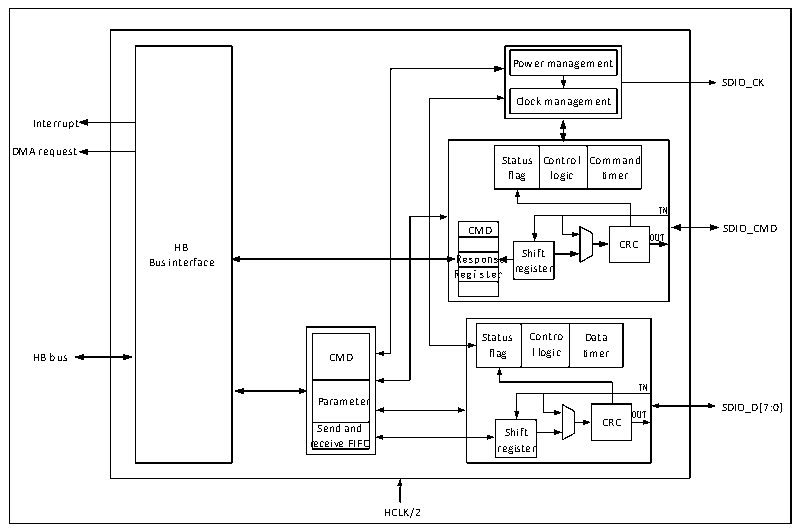

<!-- source-page: 567 -->

[← p.566](0566.md) · [index](../README.md) · [PDF p.567](https://ch32-riscv-ug.github.io/CH32V20x/datasheet_en/CH32FV2x_V3xRM.PDF#page=567) · [p.568 →](0568.md)

<!-- header: CH32F/V20x_V30x_V31x Series Reference Manual https://wch-ic.com -->

## 28.2 Interface and Clock

SDIO receives the control of the CPU through the HB bus. There is a FIFO interface in the SDIO register.  
The CPU or DMA obtains or generates data by reading and writing the FIFO. SDIO is directly clocked by  
HCLK, and has an interrupt entry that supports multiple interrupt sources. The pins directly controlled by  
SDIO are SDIO_CK, SDIO_CMD, SDIO_D [7:0], which are connected to SDIO devices through several  
pins. SDIO is a host-dominated communication interface, and all transfers must be initiated by the  
microcontroller.  

### 28.2.1 Peripheral Structure

The structure of SDIO is shown in Figure 28-1.  

Figure 28-1 SDIO structure diagram  
 <!-- rendered from the PDF; verify at https://ch32-riscv-ug.github.io/CH32V20x/datasheet_en/CH32FV2x_V3xRM.PDF#page=567 -->

🖼 Text parsed from the figure above

Power management  Clock management  
SDIO_CK  
Interrupt  
Status flag  Contro logic  ol Command timer  
DMA request  
IN  
CMD SDIO_CMD  
OUT  
Bus in H t B erface R R e e g s i p s o t n e s r e re S g h is if t t e r CRC  
CMD  Parameter  Send and receive FIFO  
Statu flag  us Contro g l logic  Data timer  
IN  
Parameter SDIO_D[7:0]  
OUT  
Send and Shift CRC  
receive FIFO register  
HCLK/2  

SDIO is a peripheral that the microcontroller directly operates the SDIO device as a host. It is roughly  
composed of 5 modules: HB interface, clock control part, CMD line control part, data line control part and  
control register part. SDIO is a half-duplex for peripherals, the CPU writes the commands and data to be sent  
to the control register, and the command line and data line control module is responsible for pushing the  
command or data to the IO and adding CRC. The data flow of SDIO is responsible for the transfer from  
RAM to SDIO FIFO by general-purpose DMA. SDIO FIFO has 32 32-bit sizes.  

### 28.2.2 Pins and Configuration

The pins that need to be configured for SDIO and their modes are shown in Table 28-1.  

<!-- p567-table-006 (table-28-1@1) pages 567-568 -->
<table><caption>Table 28-1 SDIO pin configuration</caption><tr><th>GPIO</th><th>SDIO alternate function</th><th>Required pin mode</th><th>Required speed</th></tr><tr><td>PC[8:11]</td><td>SDIO_D[0:3]</td><td>Push-pull alternate output</td><td>50MHz</td></tr><tr><td>PC12</td><td>SDIO_CK</td><td>Push-pull alternate output</td><td>50MHz</td></tr><tr><td>PD2</td><td>SDIO_CMD</td><td>Push-pull alternate output</td><td>50MHz</td></tr><tr><td>PB8</td><td>SDIO_D4</td><td>Push-pull alternate output</td><td>50MHz</td></tr><tr><td>PB9</td><td>SDIO_D5</td><td>Push-pull alternate output</td><td>50MHz</td></tr><tr><td>PC6</td><td>SDIO_D6</td><td>Push-pull alternate output</td><td>50MHz</td></tr><tr><td>PC7</td><td>SDIO_D7</td><td>Push-pull alternate output</td><td>50MHz</td></tr></table>

<!-- image: p567-draw-image-00001 bbox=[508.2, 795.0, 527.28, 805.2] -->
<!-- footer: V2.5 562 -->
