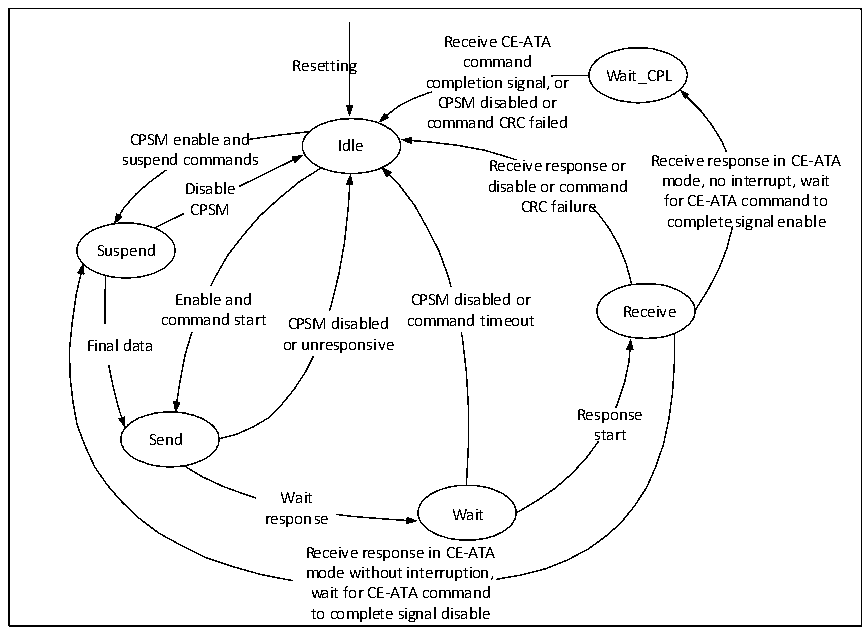

<!-- source-page: 568 -->

[← p.567](0567.md) · [index](../README.md) · [PDF p.568](https://ch32-riscv-ug.github.io/CH32V20x/datasheet_en/CH32FV2x_V3xRM.PDF#page=568) · [p.569 →](0569.md)

<!-- header: CH32F/V20x_V30x_V31x Series Reference Manual https://wch-ic.com -->

> ⬆ **Table continued** — rendered in full at [page 567](0567.md). <!-- p568-table-001 -->

<em>Note: The SDIO_CK pin should be configured as a float input when in slave mode, and slave mode is only</em>  
<em>available for CH32F20x_D8, CH32F20x_D8C, CH32V30x_D8, CH32V30x_D8C, and CH32V31x_D8C</em>  
<em>products where the penultimate sixth digit of the lot number is not 0.</em>  

### 28.2.3 Clock

The clock pin of SDIO is SDIO_CK, and its output clock is obtained by dividing the frequency of HCLK,  
and the frequency dividing coefficient can be configured as any integer value between 2 and 261. SDIO  
devices generally only support a single bus mode with a clock of up to 400kHz during initialization. After  
initialization, the host generally initiates a switch to a low voltage operation, and at the same time increases  
the clock to the maximum clock that both the microcontroller and the SDIO device can accept. Different  
versions and speed grades of SD cards support different clock speeds and switching processes, and users  
need to understand for themselves.  

### 28.2.4 Command Path State Machine

The command workflow of SDIO follows the state machine shown in the figure below.  

Figure 28-2 Command path state machine  
 <!-- rendered from the PDF; verify at https://ch32-riscv-ug.github.io/CH32V20x/datasheet_en/CH32FV2x_V3xRM.PDF#page=568 -->

🖼 Text parsed from the figure above

Receive CE-ATA  
Resetting command  
Wait_CPL  
completion signal, or  
CPSM disabled or  
command CRC failed  
CPSM enable and  
Idle  
suspend commands Receive response or Receive response in CE-ATA  
Disable disable or command mode, no interrupt, wait  
CPSM CRC failure for CE-ATA command to  
complete signal enable  
Suspend  
Enable and CPSM disabled or  
Receive  
command start CPSM disabled command timeout  
Final data or unresponsive  
Response  
Send start  
Wait  
response Wait  
Receive response in CE-ATA  
mode without interruption,  
wait for CE-ATA command  
to complete signal disable  

### 28.2.5 Data Path State Machine

The data workflow of SDIO follows the state machine shown in the figure below.  
<!-- image: p568-draw-image-00001 bbox=[508.2, 795.0, 527.28, 805.2] -->
<!-- footer: V2.5 563 -->
