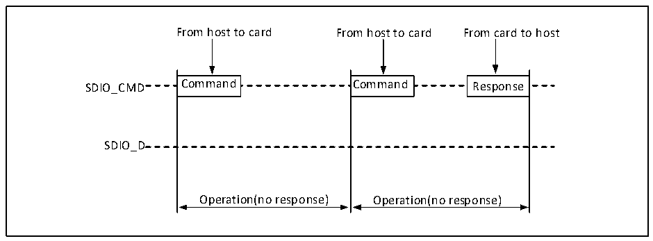
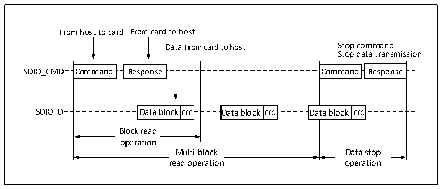
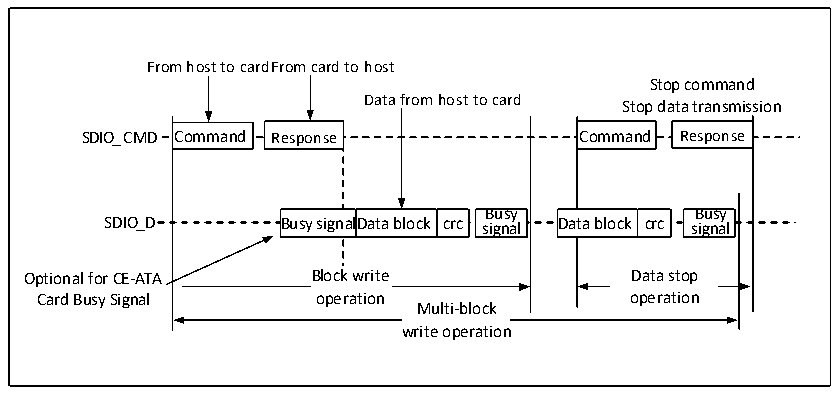

<!-- source-page: 570 -->

[← p.569](0569.md) · [index](../README.md) · [PDF p.570](https://ch32-riscv-ug.github.io/CH32V20x/datasheet_en/CH32FV2x_V3xRM.PDF#page=570) · [p.571 →](0571.md)

<!-- header: CH32F/V20x_V30x_V31x Series Reference Manual https://wch-ic.com -->

Figure 28-4 SDIO no response timing and no data timing (Taking SD card as an example)  
 <!-- rendered from the PDF; verify at https://ch32-riscv-ug.github.io/CH32V20x/datasheet_en/CH32FV2x_V3xRM.PDF#page=570 -->

🖼 Text parsed from the figure above

From host to card From host to card From card to host  
SDIO_CMD Command Command Response  
SDIO_D  
Operation(no response) Operation(no response)  

Figure 28-5 SDIO multi-block read timing (Taking SD card as an example)  
 <!-- rendered from the PDF; verify at https://ch32-riscv-ug.github.io/CH32V20x/datasheet_en/CH32FV2x_V3xRM.PDF#page=570 -->

🖼 Text parsed from the figure above

From host to card From card to host  
Data From card to host Stop command  
Stop data transmission  
Command  Command  
Response  Response  
Command  Response  Data block crc Da  Command  Response  ata block crc  Da  ata block  crc  Da  ata block  crc  
Data block  crc  Data block  crc  
Data block  crc  Data block  crc  
SDIO_D Data block crc Data block crc Data block crc  
Block read  operation  
Multi-block Data stop  
Multi-block  reMadu oltpi-ebrloatciko n  
Data stop  oDpaetara sttioopn  
read operation operation  

Figure 28-6 SDIO multi-block write timing (Taking SD card as an example)  
 <!-- rendered from the PDF; verify at https://ch32-riscv-ug.github.io/CH32V20x/datasheet_en/CH32FV2x_V3xRM.PDF#page=570 -->

🖼 Text parsed from the figure above

From host to cardFrom card to host  
Stop command  
Data from host to card  
Stop data transmission  
Command  Command  
Response  Command  Response  Busy nalData block crc signal  Dat  Command  Busy sign  nal  lData block  crc  Busy signal  Dat  ta block  crc  Busy sign  nal  lData block  crc  sBigunsayl  Dat  ta block  crc  
Response  Response  
Busy signal  sBigunsayl  
Block write  operation  
Data stop  operation  
Multi-block  write operation  

<!-- image: p570-draw-image-00001 bbox=[508.2, 795.0, 527.28, 805.2] -->
<!-- footer: V2.5 565 -->
