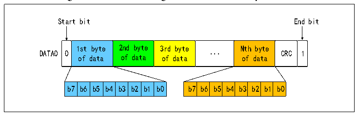
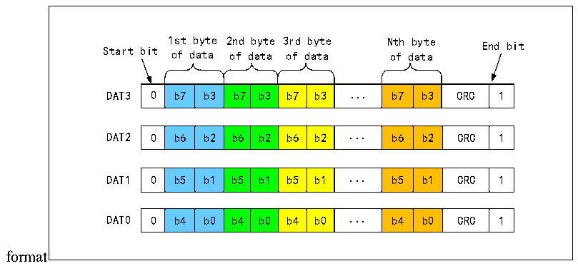
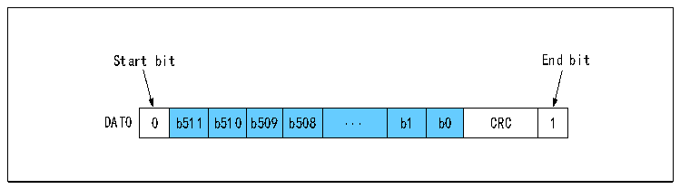
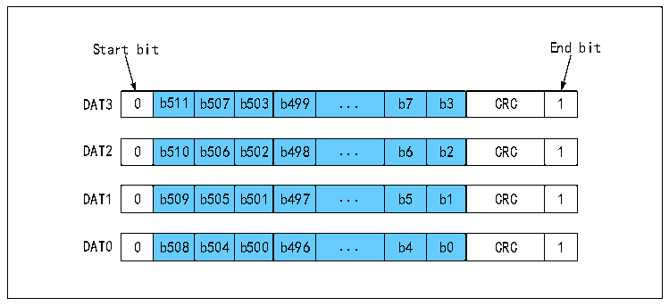

<!-- source-page: 577 -->

[← p.576](0576.md) · [index](../README.md) · [PDF p.577](https://ch32-riscv-ug.github.io/CH32V20x/datasheet_en/CH32FV2x_V3xRM.PDF#page=577) · [p.578 →](0578.md)

<!-- header: CH32F/V20x_V30x_V31x Series Reference Manual https://wch-ic.com -->

Figure 28-9 SD card single bus data transfer byte format  
 <!-- rendered from the PDF; verify at https://ch32-riscv-ug.github.io/CH32V20x/datasheet_en/CH32FV2x_V3xRM.PDF#page=577 -->

🖼 Text parsed from the figure above

Start bit End bit  
0  1st byte of data  2nd byte of data  3rd byte of data  ...  Nth byte of data  CRC  1  b7  b6  b5  b4  b3  b2  b1  b7  b6  b5  b4  b3  b2  b1  b0  

Figure 28-10 SD card 4 bus data transfer byte  
 <!-- rendered from the PDF; verify at https://ch32-riscv-ug.github.io/CH32V20x/datasheet_en/CH32FV2x_V3xRM.PDF#page=577 -->

🖼 Text parsed from the figure above

1st byte 2nd byte 3rd byte Nth byte End bit  
Start bit of data of data of data of data  
0  b7  b3  b7  b3  b7  b3  ...  b7  b3  CRC  1  
0  b6  b2  b6  b2  b6  b2  ...  b6  b2  CRC  1  
0  b5  b1  b5  b1  b5  b1  ...  b5  b1  CRC  1  
0  b4  b0  b4  b0  b4  b0  ...  b4  b0  CRC  1  
format  

Figure 28-11 SD card single bus data transfer in a 512-bit word format  
 <!-- rendered from the PDF; verify at https://ch32-riscv-ug.github.io/CH32V20x/datasheet_en/CH32FV2x_V3xRM.PDF#page=577 -->

🖼 Text parsed from the figure above

Start bit End bit  
0  b511  b510  b509  b508  ...  b1  b0  CRC  1  

Figure 28-12 SD card 4 bus data transfer in a 512-bit word format  
 <!-- rendered from the PDF; verify at https://ch32-riscv-ug.github.io/CH32V20x/datasheet_en/CH32FV2x_V3xRM.PDF#page=577 -->

🖼 Text parsed from the figure above

Start bit End bit  
0  b511  b507  b503  b499  ...  b7  b3  CRC  1  
0  b510  b506  b502  b498  ...  b6  b2  CRC  1  
0  b509  b505  b501  b497  ...  b5  b1  CRC  1  
0  b508  b504  b500  b496  ...  b4  b0  CRC  1  

<!-- image: p577-draw-image-00001 bbox=[508.2, 795.0, 527.28, 805.2] -->
<!-- footer: V2.5 572 -->
