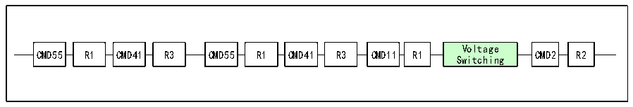

<!-- source-page: 581 -->

[← p.580](0580.md) · [index](../README.md) · [PDF p.581](https://ch32-riscv-ug.github.io/CH32V20x/datasheet_en/CH32FV2x_V3xRM.PDF#page=581) · [p.582 →](0582.md)

<!-- header: CH32F/V20x_V30x_V31x Series Reference Manual https://wch-ic.com -->

### 28.4.2 Voltage Switch

In the later stage of SD card initialization, it is necessary to switch the interface level, and switch the IO level  
of the clock line, data line and command line of the SD card to the 1.8V level. For devices whose slew rate is  
not good enough, using a lower-level standard can help increase the frequency. However, the power supply  
voltage of SD does not necessarily change, and only SD cards with low voltage power supply appear in the  
newer version of the protocol.  
The steps for switching the voltage are shown in the figure below.  

Figure28-13 Voltage switch sequence  
 <!-- rendered from the PDF; verify at https://ch32-riscv-ug.github.io/CH32V20x/datasheet_en/CH32FV2x_V3xRM.PDF#page=581 -->

🖼 Text parsed from the figure above

Voltage  
CMD55 R1 CMD41 R3 CMD55 R1 CMD41 R3 CMD11 R1 CMD2 R2  
Switching  

### 28.4.3 Clock Switch

During initialization, the clock of the SD card is only 400KHz. After the voltage switch is completed, the  
clock can be increased to a higher level. For example, the first speed of the SDHC card UHS-I mode, the bus  
clock can reach 80MHz. In view of the IO output capability of the microcontroller, the clock should be  
limited to 50MHz.  

## 28.5 Interrupt

### 28.5.1 SDIO Interrupt

SDIO supports a variety of interrupt sources. As shown in the interrupt enable register (R32_SDIO_IER),  
there are 24 situations that can trigger interrupts, and users can enable them as appropriate.  

### 28.5.2 SDIO Device Interrupt

It should be noted that not only SDIO peripherals can report interrupts to the CPU, but also external SDIO  
cards and MMC cards can report interrupts to SDIO peripherals. In 4-bit bus mode, the interrupt line is D1,  
and in 8-bit bus mode, the interrupt line is D7, active low. If SDIO detects that D1 or D7 is low level in the  
idle state, it should read the status register or interrupt flag register of the SDIO device to respond to the  
interrupt in time. The CPU can get whether the SDIO host receives an interrupt through the SDIOIT bit of  
the R32_SDIO_STA register.  

## 28.6 Register Description

<!-- p581-table-001 (table-28-17@1) pages 581-582 -->
<table><caption>Table 28-17 SDIO registers</caption><tr><th>Name</th><th>Address</th><th>Description</th><th>Reset Value</th></tr><tr><td>R32_SDIO_POWER</td><td>0x40018000</td><td>Power register</td><td>0x00000000</td></tr><tr><td>R32_SDIO_CLKCR</td><td>0x40018004</td><td>Clock register</td><td>0x00000000</td></tr><tr><td>R32_SDIO_ARG</td><td>0x40018008</td><td>Command parameter register</td><td>0x00000000</td></tr><tr><td>R32_SDIO_CMD</td><td>0x4001800C</td><td>Command register</td><td>0x00000000</td></tr><tr><td>R32_SDIO_RESPCMD</td><td>0x40018010</td><td>Response register</td><td>0x00000000</td></tr><tr><td>R128_SDIO_RESPX</td><td>0x40018014</td><td>Response parameter register</td><td>0x00000000</td></tr><tr><td>R32_SDIO_DTIMER</td><td>0x40018024</td><td>Data timing register</td><td>0x00000000</td></tr><tr><td>R32_SDIO_DLEN</td><td>0x40018028</td><td>Data length register</td><td>0x00000000</td></tr><tr><td>R32_SDIO_DCTLR</td><td>0x4001802C</td><td>Data control register</td><td>0x00000000</td></tr><tr><td>R32_SDIO_DCOUNT</td><td>0x40018030</td><td>Data count register</td><td>0x00000000</td></tr><tr><td>R32_SDIO_STA</td><td>0x40018034</td><td>Status register</td><td>0x00000000</td></tr><tr><td>R32_SDIO_ICR</td><td>0x40018038</td><td>Interrupt clear register</td><td>0x00000000</td></tr><tr><td>R32_SDIO_MASK</td><td>0x4001803C</td><td>Interrupt enable register</td><td>0x00000000</td></tr><tr><td>R32_SDIO_ FIFOCNT</td><td>0x40018048</td><td>FIFO counter</td><td>0x00000000</td></tr><tr><td>R32_SDIO_DCTRL2</td><td>0x40018060</td><td>Data control register 2</td><td>0x00000000</td></tr><tr><td>R32_SDIO_FIFO</td><td>0x40018080</td><td>FIFO register</td><td>0x00000000</td></tr></table>

<!-- image: p581-draw-image-00001 bbox=[508.2, 795.0, 527.28, 805.2] -->
<!-- footer: V2.5 576 -->
