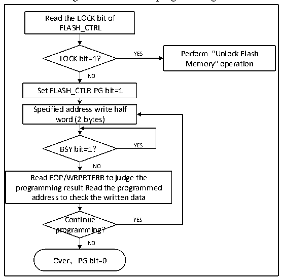

<!-- source-page: 610 -->

[← p.609](0609.md) · [index](../README.md) · [PDF p.610](https://ch32-riscv-ug.github.io/CH32V20x/datasheet_en/CH32FV2x_V3xRM.PDF#page=610) · [p.611 →](0611.md)

<!-- header: CH32FV2x_V3x Reference Manual http://wch-ic.com -->

### 32.5.2 Flash Memory Unlock

After the system reset, the flash memory controller (FPEC) and FLASH_CTLR register will be locked and  
cannot be accessed. The flash memory controller module can be unlocked by writing the sequence to the  
FLASH_KEYR register.  
Unlock sequence:  
1） Write KEY1 = 0x45670123 to the FLASH_KEYR register (Must operate KEY1 first);  
2） Write KEY2 = 0xCDEF89AB to the FLASH_KEYR register (Must operate KEY2 secondly).  
The above operations must be performed sequentially and continuously. Otherwise, it is an error operation,  
which will lock the FPEC module and FLASH_CTLR register and generate a bus error until the next system  
reset.  
The flash memory controller (FPEC) and the FLASH_CTLR register can be locked again by setting the  
&quot;LOCK&quot; bit in the FLASH_CTLR register to 1.  

### 32.5.3 Main Memory Standard Programming

You can write 2 bytes each time through the standard programming. When the PG bit in the FLASH_CTLR  
register is &#x27;1&#x27;, a programming will be started every time a halfword (2 bytes) is written to the flash memory  
address. When any non-halfword data is written, FPEC will generate a bus error. During the programming  
process, the BSY bit is ‘1’. After the programming is completed, the BSY bit is ‘0’ and the EOP bit is ‘1’.  
<em>Note: When the BSY bit is ‘1’, writing to any register will be disabled.</em>  

Figure 32-1 FLASH programming  
 <!-- rendered from the PDF; verify at https://ch32-riscv-ug.github.io/CH32V20x/datasheet_en/CH32FV2x_V3xRM.PDF#page=610 -->

🖼 Text parsed from the figure above

Read the LOCK bit of  
FLASH_CTRL  
YES Perform &quot;Unlock Flash  
LOCK bit=1?  
Memory&quot; operation  
NO  
Set FLASH_CTLR PG bit=1  
Specified address write half  
word (2 bytes)  
BSY bit=1？ YES  
NO  
Read EOP/WRPRTERR to judge the  
programming result Read the programmed  
address to check the written data  
Continue YES  
programming?  
NO  
Over，PG bit=0  

1) Check the LOCK bit in the FLASH_CTLR register. If it is 1, you need to perform the &quot;Release Flash  
Memory Lock&quot; operation.  
2) Set the PG bit in the FLASH_CTLR register to ‘1’ to enable the standard programming mode.  
3) Write the half word to be programmed to the designated flash memory address (Even address).  
4) When the BYS bit changes to &#x27;0&#x27; or the EOP bit in the FLASH_STATR register to be &#x27;1&#x27;, it indicates the  
end of programming. Clear the EOP bit to 0.  
5) Check the FLASH_STATR register to see if there is an error, or read the programming address data for  
<!-- image: p610-draw-image-00001 bbox=[508.2, 795.0, 527.28, 805.2] -->
<!-- footer: V2.5 605 -->
