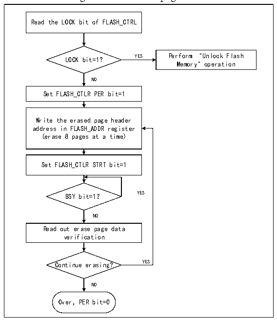

<!-- source-page: 611 -->

[← p.610](0610.md) · [index](../README.md) · [PDF p.611](https://ch32-riscv-ug.github.io/CH32V20x/datasheet_en/CH32FV2x_V3xRM.PDF#page=611) · [p.612 →](0612.md)

<!-- header: CH32FV2x_V3x Reference Manual http://wch-ic.com -->
verification.  
6) To continue programming, you can repeat steps 3-5, end programming and clear the PG bit to 0.  

### 32.5.4 Main Memory Standard Erase

The flash memory can be erased in the sector (4K bytes) or in whole chips.  

Figure 32-2 FLASH page erase  
 <!-- rendered from the PDF; verify at https://ch32-riscv-ug.github.io/CH32V20x/datasheet_en/CH32FV2x_V3xRM.PDF#page=611 -->

🖼 Text parsed from the figure above

Read the LOCK bit of FLASH_CTRL  
LOCK bit=1? YES Perform &quot;Unlock Flash  
Memory&quot; operation  
NO  
Set FLASH_CTLR PER bit=1  
Write the erased page header  
address in FLASH_ADDR register  
(erase 8 pages at a time)  
Set FLASH_CTLR STRT bit=1  
BSY bit=1？ YES  
NO  
Read out erase page data  
verification  
Continue erasing? YES  
NO  
Over，PER bit=0  

1) Check the LOCK bit in the FLASH_CTLR register. If it is 1, you need to perform the &quot;Release Flash  
Memory Lock&quot; operation.  
2) Set the PEG bit in the FLASH_CTLR register to ‘1’ to enable the sector erasure mode.  
3) Write the page heading address of the page to be erased to the FLASH_ADDR register.  
4) Set the STRT bit in the FLASH_CTLR register to ‘1’ to start an erase action.  
5) When the BSY bit changes to &#x27;0&#x27; or the EOP bit in the FLASH_STATR register to be &#x27;1&#x27;, it indicates the  
end of erasure. Clear the EOP bit to 0.  
6) Read the page of erasure page for verification.  
7) To erase the sector continuously, you can repeat steps 3-5 to end erasing and clear the PER bit to 0.  
<em>Note: After erasing is successful, word read - 0xe339e339, half word read - 0xe339, even address byte read -</em>  
<em>0x39, odd address read 0xe3.</em>  
<!-- image: p611-draw-image-00001 bbox=[508.2, 795.0, 527.28, 805.2] -->
<!-- footer: V2.5 606 -->
