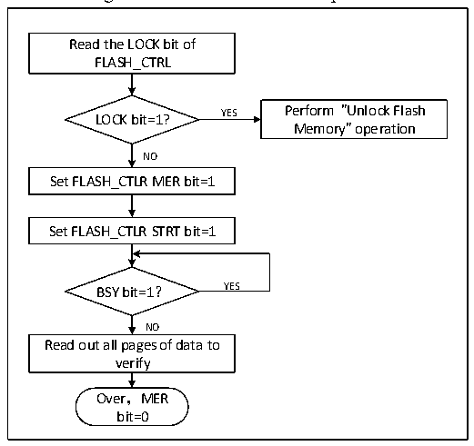

<!-- source-page: 612 -->

[← p.611](0611.md) · [index](../README.md) · [PDF p.612](https://ch32-riscv-ug.github.io/CH32V20x/datasheet_en/CH32FV2x_V3xRM.PDF#page=612) · [p.613 →](0613.md)

<!-- header: CH32FV2x_V3x Reference Manual http://wch-ic.com -->

Figure 32-3 FLASH whole chip erase  
 <!-- rendered from the PDF; verify at https://ch32-riscv-ug.github.io/CH32V20x/datasheet_en/CH32FV2x_V3xRM.PDF#page=612 -->

🖼 Text parsed from the figure above

Read the LOCK bit of  
FLASH_CTRL  
LOCK bit=1? YES Perform &quot;Unlock Flash  
Memory&quot; operation  
NO  
Set FLASH_CTLR MER bit=1  
Set FLASH_CTLR STRT bit=1  
BSY bit=1？ YES  
NO  
Read out all pages of data to  
verify  
Over，MER  
bit=0  

1) Check the LOCK bit in the FLASH_CTLR register. If it is 1, you need to perform the &quot;Release Flash  
Memory Lock&quot; operation.  
2) Set the MEG bit in the FLASH_CTLR register to ‘1’ to enable the whole chip erasure mode.  
3) Set the STRT bit in the FLASH_CTLR register to ‘1’ to start an erasure action.  
4) When the BSY bit changes to &#x27;0&#x27; or the EOP bit in the FLASH_STATR register to be &#x27;1&#x27;, it indicates the  
end of erasure. Clear the EOP bit to 0.  
5) Read the data of the erasure page for verification.  
6) Clear the MER bit to 0.  

### 32.5.5 Fast Programming Mode Unlock

The quick programming mode operation can be unlocked by writing the sequence to the  
FLASH_MODEKEYR register. After unlocking, the FLOCK bit of the FLASH_CTLR register will be  
cleared to 0, indicating that quick erasure and programming operations can be made. Set 1 by the software  
through the “FLOCK” bit of FLASH_CTLR register.  
Unlock sequence:  
1) Write KEY1 = 0x45670123 to the FLASH_MODEKEYR register;  
2) Write KEY2 = 0xCDEF89AB to the FLASH_MODEKEYR register.  
The above operations must be continuously made in sequence. Otherwise, it will be locked in case of wrong  
operation, and will be re-unlocked until the next system reset.  
<em>Note: For the quick programming operation, it needs to release the 2 layers of &quot;LOCK&quot; and &quot;FLOCK&quot;.</em>  

### 32.5.6 Main Memory Fast Programming

The fast programming (256 bytes) is made according to the page.  
1) Check the LOCK bit in the FLASH_CTLR register, if it is &#x27;1&#x27;, you need to perform the &quot;Release Flash  
memory lock&quot; operation.  
2) Check the FLOCK bit in the FLASH_CTLR register, if it is &#x27;1&#x27;, you need to perform the &quot;fast  
programming mode unlock&quot; operation.  
3) Check the BSY bit in the FLASH_STATR register to confirm that there are no other programming  
<!-- image: p612-draw-image-00001 bbox=[508.2, 795.0, 527.28, 805.2] -->
<!-- footer: V2.5 607 -->
