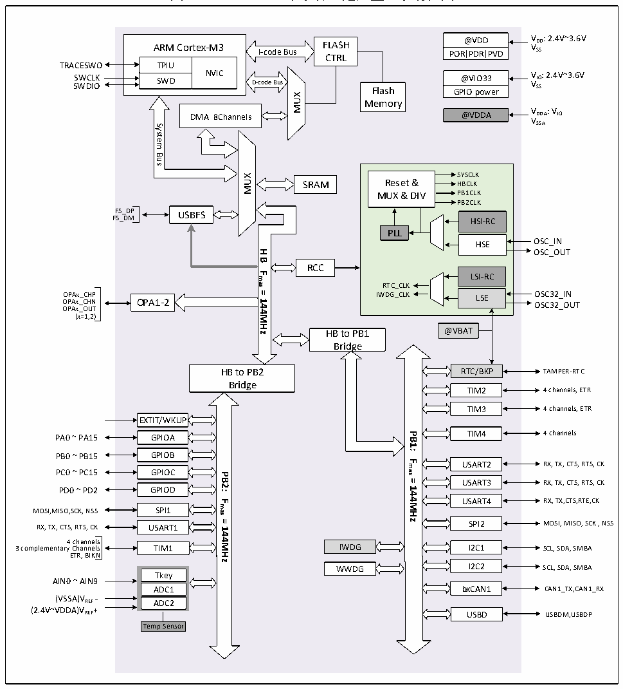

<!-- source-page: 4 -->

[← p.3](0003.md) · [index](../README.md) · [PDF p.4](https://ch32-riscv-ug.github.io/CH32V20x/datasheet_zh/CH32FV2x_V3xRM.PDF#page=4) · [p.5 →](0005.md)

<!-- header: CH32F/V20x_V30x_V31x系列应用手册 https://wch.cn -->

# 第 1 章 存储器和总线架构

## 1.1 总线架构

CH32F20x 系列是基于 ARM○RCortexTM-M3 内核设计的微控制器，其构架中的内核、仲裁单元、DMA  
模块和SRAM存储等部分通过多组总线实现交互。  
CH32V20x、CH32V30x 和 CH32V31x 系列产品是基于 RISC-V 指令集设计的通用微控制器，其架构  
中的内核、仲裁单元、DMA模块、SRAM存储等部分通过多组总线实现交互。  

图1-1 CH32F203（中小容量通用型）系统框图  
 <!-- rendered from the PDF; verify at https://ch32-riscv-ug.github.io/CH32V20x/datasheet_zh/CH32FV2x_V3xRM.PDF#page=4 -->

🖼 Text parsed from the figure above

@VDD VDD: 2.4V~3.6V  
ARM Cortex-M3  TPIUSWD  NVIC  
I-code Bus  FLASHCTRL  
VSS  
PORPDRPVD  
TRACESWO  
NVIC SWD D-code Bus Flash  
SWCLK @VIO33 VIO: 2.4V~3.6V SWDIO VSS GPIO power  
MUX  
Memory  
@VDDA VDDA: VIO VSSA  
DMA 8Channels  
System  
Bus  
SYSCLK Reset &amp; HBCLK MUX &amp; DIV PB1CLKPB2CLKHSI-RCPLLHSELSI-RCRTC_CLK IWDG_CLK LSE  LSI-RC  LSE  
MUX  
SRAM  
FS_DP USBFS  
FS_DM  
OSC_OUT  
<strong>HB</strong>  
RCC  
<strong>Fmax</strong>  
<strong>=144MHz</strong>  
O O P P A A x x _ _ C C H H N P OPA1-2 IWDG_CLK LSE O O S S C C 3 3 2 2 _ _ I O N UT  
OPAx_OUT  
(x=1,2)  
HB to PB1 @VBAT  
Bridge  
RTC/BKP TAMPER-RTC  
HB to PB2  
Bridge  
TIM2 4 channels, ETR  
TIM3 4 channels, ETR  
EXTIT/WKUPGPIOAGPIOB  
TIM4 4 channels  
<strong>PB1:</strong>  
<strong>Fmax</strong>  
USART2 RX, TX, CTS, RTS, CK  
PC0 ~ PC15 GPIOC  
<strong>PB2:</strong>  
<strong>=</strong>  
USART3 RX, TX, CTS, RTS, CK  
<strong>144MHz</strong>  
PD0 ~ PD2 GPIOD  
USART4 RX, TX,CTS,RTE,CK  
<strong>Fmax</strong>  
MOSI,MISO,SCK, NSS SPI1  
<strong>=144MHz</strong>  
RX, TX, CTS, RTS, CK USART1 SPI2 MOSI, MISO, SCK , NSS  
4 channels  
3 complementary Channels TIM1 IWDG I2C1 SCL, SDA, SMBA  
ETR, BIKN  
WWDG I2C2 SCL, SDA, SMBA  
Tkey ADC1ADC2  
AIN0 ~ AIN9  
ADC1 bxCAN1 CAN1_TX,CAN1_RX  
(VSSA)VREF -  
(2.4V~VDDA)VREF+  
USBD USBDM,USBDP  
Temp Sensor  

<!-- image: p4-draw-image-00001 bbox=[507.6, 786.0, 527.52, 797.04] -->
<!-- footer: V2.5 1 -->
