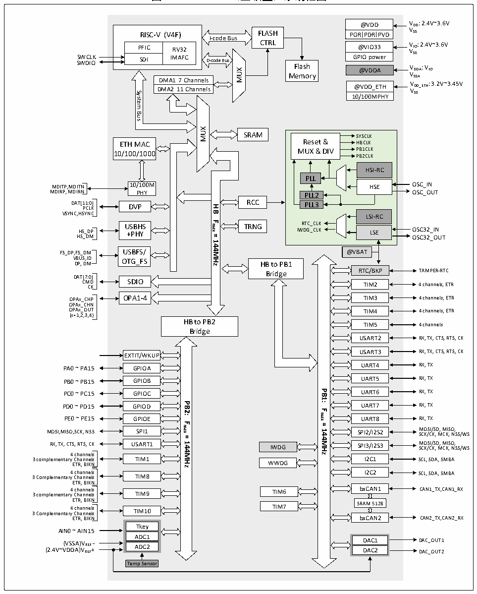

<!-- source-page: 10 -->

[← p.9](0009.md) · [index](../README.md) · [PDF p.10](https://ch32-riscv-ug.github.io/CH32V20x/datasheet_zh/CH32FV2x_V3xRM.PDF#page=10) · [p.11 →](0011.md)

<!-- header: CH32F/V20x_V30x_V31x系列应用手册 https://wch.cn -->

图1-7 CH32V317（互联型）系统框图  
 <!-- rendered from the PDF; verify at https://ch32-riscv-ug.github.io/CH32V20x/datasheet_zh/CH32FV2x_V3xRM.PDF#page=10 -->

🖼 Text parsed from the figure above

@VDD  @VDDPORPDRPVD  @VIO33 GPIO power  
@VDD VDD: 2.4V~3.6V  
RISC-V (V4F)  PFICSDI  RV32IMAFC  
I-code Bus  FLASHCTRL  
CTRL PFIC RV32  
@VIO33 VIO: 2.4V~3.6V  
VSS  
SWCLK GPIO power  
SDI IMAFC D-code Bus Flash  
SWDIO @VDDA VDDA: VIO  
MUX  
VSSA  
Memory  
DMA1 7 Channels  DMA1 7 Channels DMA2 11 Channels  
@VDD_ETH VDD_ETH: 3.2V~3.45V  
@VDD_ETH  10/100MPHY  
VSS  
System  
Bus  
MUX  
SRAM  
Reset &amp; MUX &amp; DIV  
SYSCLK  
ETH MAC Reset &amp; HBCLK  
10/100/1000 MUX &amp; DIV PB1CLK  
PB2CLK  
HSI-RC  
PLL  
HSE OSC_IN  
MDITP,MDITN 10/100M  
MDIRP, MDIRN PHY PLL2  
OSC_OUT  
DAT[1 P 1 C : L 0 K ] DVP RCC  
PLL3  
<strong>HB</strong>  
VSYNC,HSYNC LSI-RC  
<strong>Fmax</strong>  
USBHS TRNG RTC_CLK  
HS_DP +PHY IWDG_=CLK LSE OSC32_IN HS_DM OSC32_OUT  
<strong>144MHz</strong>  
FS_DP,FS_DM USBFS/  
@VBAT  
VBUS,ID OTG_FS DP, DM  
HB to PB1  
RTC/BKP TAMPER-RTC  
Bridge  
DAT[7:0]  
CM C D K SDIO TIM2 4 channels, ETR  
OPAx_CHP OPA1-4 TIM3 4 channels, ETR  
OPAx_CHN  
OPAx_OUT TIM4 4 channels, ETR  
(x=1,2,3,4)  
HB to PB2  
TIM5 4 channels  
Bridge  
USART2 RX, TX, CTS, RTS, CK  
USART3 RX, TX, CTS, RTS, CK  
EXTIT/WKUP  
PA0 ~ PA15 GPIOA UART4 RX, TX  
PB0 ~ PB15 UART5 RX, TX  
GPIOB  
<strong>PB1:</strong>  
PC0 ~ PC15 UART6 RX, TX  
GPIOC  
PD0 ~ PD15PB2: UART7 RX, TX  
GPIOD  
<strong>Fmax</strong>  
PE0 ~ PE15 GPIOE UART8 RX, TX  
<strong>Fmax</strong>  
<strong>=</strong>  
MOSI,MISO,SCK, NSS SPI1 SPI2/I2S2 M SC O K S /C I/ K S , D M , M CK IS , O N , S S/WS  
<strong>144MHz</strong>  
<strong>=</strong>  
RX, TX, CTS, RTS, CK USART1 IWDG SPI3/I2S3 M SC O K S /C I/ K S , D M , M CK IS , O N , S S/WS  
<strong>144MHz</strong>  
4 channels  
3 complementary E C T h R a , n B n IK el N s TIM1 WWDG I2C1 SCL, SDA, SMBA  
3 Complementary 4 C c h h a an n n n e el l s s TIM8 I2C2 SCL, SDA, SMBA  
ETR, BIKN  
3 complementary 4 C c h h a an n n n e el l s s TIM9 TIM6 bxCAN1 CAN1_TX,CAN1_RX  
ETR, BIKN  
3 Complementary 4 C c h h a an n n n e el l s s TIM10 TIM7 SRAM 512B  
ETR, BIKN bxCAN2 CAN2_TX,CAN2_RX  
Tkey  
AIN0 ~ AIN15  
ADC1  
(2.4V~V (V D S D S A A ) ) V V R R E E F F + - ADC2 D DA A C C 2 1 D D A A C C _ _ O O U U T T 1 2  
Temp Sensor  

系统中设有：通用DMA控制器用以减轻CPU负担、提高效率；时钟树分级管理用以降低了外设总  
的运行功耗，同时还兼有数据保护机制，时钟安全系统保护机制等措施来增加系统稳定性。  
● 指令总线（I-Code）将内核和FLASH指令接口相连，预取指在此总线上完成。  
● 数据总线（D-Code）将内核和FLASH数据接口相连，用于常量加载和调试。  
● 系统总线将内核和总线矩阵相连，用于协调内核、DMA、SRAM和外设的访问。  
● DMA总线负责DMA的HB主控接口与总线矩阵相连，该总线访问对象是FLASH数据、SRAM和外  
设。  
● 总线矩阵负责的是系统总线、数据总线、DMA总线、SRAM和HB/PB桥之间的访问协调。  
<!-- image: p10-draw-image-00001 bbox=[507.6, 786.0, 527.52, 797.04] -->
<!-- footer: V2.5 7 -->
