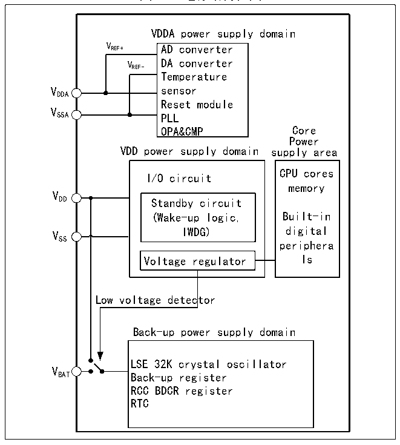

<!-- source-page: 19 -->

[← p.18](0018.md) · [index](../README.md) · [PDF p.19](https://ch32-riscv-ug.github.io/CH32V20x/datasheet_zh/CH32FV2x_V3xRM.PDF#page=19) · [p.20 →](0020.md)

<!-- header: CH32F/V20x_V30x_V31x系列应用手册 https://wch.cn -->

# 第 2 章 电源控制（PWR）

本章模块描述适用于CH32F20x、CH32V20x、CH32V30x和CH32V31x微控制器全系列产品。  

## 2.1 概述

CH32F20x、CH32V20x、CH32V30x产品系统工作电压VDD 范围为2.4（1）～3.6V，CH32V31x产品系统  
工作电压 VDD 范围为 2.4（1）～3.6V，内置电压调节器提供内核所需的工作电源。当主电源 VDD 掉电后，  
电池等后备电源可通过VBAT 引脚为实时时钟（RTC）和后备寄存器提供电源，如果无需后备电源，建议  
将VDD 直接连接到VBAT 引脚上。  
注：（1）对于FEATURE_SIGN寄存器VLEVEL位为1的芯片，系统工作电压VDD 支持最低供电电压为  
2.4V；对于VLEVEL位为0的芯片，系统工作电压VDD 支持最低供电电压为1.8V。  
对于CH32V31x产品还包括了以下参数（具体数据参考CH32V307DS0手册）：  
（1）VDD_ETH：为内置的以太网10/100M PHY供电。  
（2）VDDK：内部电源LDO退耦端，需外接退耦电容。  
VDDA 和VSSA 引脚专门为系统中模拟相关电路供电，包括ADC、DAC、温度传感器等。VREF+ 和VREF- 作为  
一些模拟电路的参考点，在芯片内部等于VDDA 及VSSA。  

图2-1 电源结构框图  
 <!-- rendered from the PDF; verify at https://ch32-riscv-ug.github.io/CH32V20x/datasheet_zh/CH32FV2x_V3xRM.PDF#page=19 -->

🖼 Text parsed from the figure above

VDDA power supply domain  
V REF+ AD converter  
VREF-  
VREF- DA converter  
Temperature  
Reset module  
V  
SSA PLL  
OPA&amp;CMP Core  
Power  
VDD power supply domain supply area  
CPU cores  
I/O circuit  
memory  
V  
DD Standby circuit  
(Wake-up logic, Built-in  
V IWDG) digital  
SS  
periphera  
Voltage regulator ls  
Low voltage detector  
Back-up power supply domain  
LSE 32K crystal oscillator  
V  
BAT Back-up register  
RCC BDCR register  
RTC  

在主电源 VDD 掉电后，模拟开关切换至 VBAT，后备区域由 VBAT 引脚供电，此时 PC13～15 无法作为  
GPIO，仅可使用如下功能：  
● PC13可以作为TAMPER引脚、RTC闹钟或秒输出。  
● PC14和PC15只能用作LSE引脚。  
当主电源VDD 上电稳定后，系统自动切换后备区域由VDD 供电，PC13～15可以用作GPIO功能。  
当PC13～15引脚作为GPIO输出时，速度必须限制在2MHz以下，最大负载电容为30pF，并且禁  
<!-- image: p19-draw-image-00001 bbox=[507.6, 786.0, 527.52, 797.04] -->
<!-- footer: V2.5 16 -->
