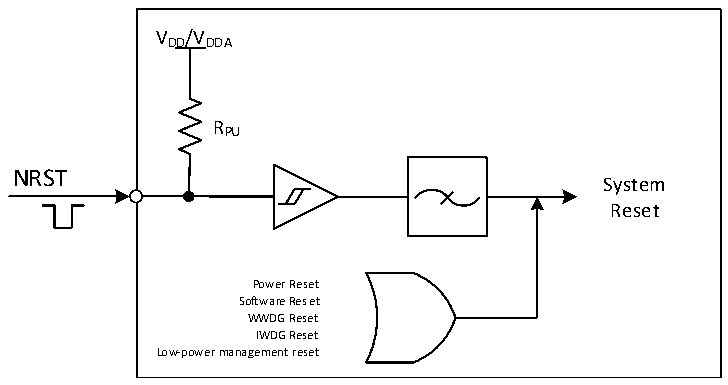

<!-- source-page: 27 -->

[← p.26](0026.md) · [index](../README.md) · [PDF p.27](https://ch32-riscv-ug.github.io/CH32V20x/datasheet_zh/CH32FV2x_V3xRM.PDF#page=27) · [p.28 →](0028.md)

<!-- header: CH32F/V20x_V30x_V31x系列应用手册 https://wch.cn -->

图3-1系统复位结构  
 <!-- rendered from the PDF; verify at https://ch32-riscv-ug.github.io/CH32V20x/datasheet_zh/CH32FV2x_V3xRM.PDF#page=27 -->

🖼 Text parsed from the figure above

VDD/VDDA  
RPU  
NRST  
System  
Reset  
Power Reset  
Software Reset  
WWDG Reset  
IWDG Reset  
Low-power management reset  

### 3.2.3 后备区域复位

后备区域复位发生时，只会复位后备区域寄存器，包括后备寄存器、RCC_BDCTLR寄存器（RTC使  
能和LSE振荡器）。其产生条件包括：  
● 在VDD 和VBAT 都掉电的前提下，由VDD 或VBAT 上电引起  
● RCC_BDCTLR寄存器的BDRST位置1  
<!-- image: p27-draw-image-00001 bbox=[507.6, 786.0, 527.52, 797.04] -->
<!-- footer: V2.5 24 -->
