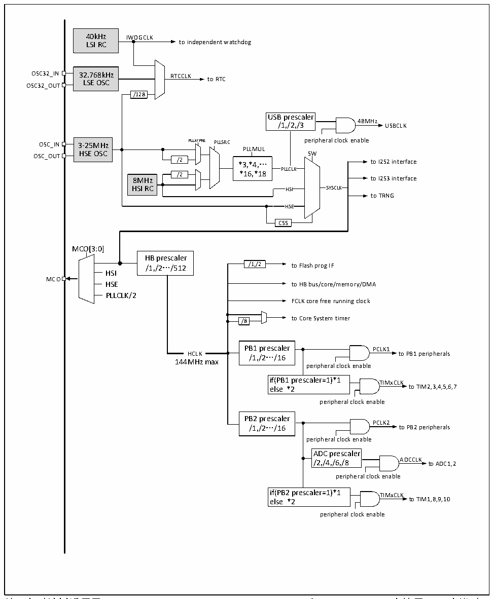

<!-- source-page: 29 -->

[← p.28](0028.md) · [index](../README.md) · [PDF p.29](https://ch32-riscv-ug.github.io/CH32V20x/datasheet_zh/CH32FV2x_V3xRM.PDF#page=29) · [p.30 →](0030.md)

<!-- header: CH32F/V20x_V30x_V31x系列应用手册 https://wch.cn -->

图3-3 CH32F203/V203/V303时钟树框图  
 <!-- rendered from the PDF; verify at https://ch32-riscv-ug.github.io/CH32V20x/datasheet_zh/CH32FV2x_V3xRM.PDF#page=29 -->

🖼 Text parsed from the figure above

40kHz IWDGCLK  
LSI RC to independent watchdog  
OSC32_IN 32.768kHz RTCCLK  
LSE OSC to RTC  
OSC32_OUT  
/128  
USB prescaler  
48MHz  
/1,/2,/3 USBCLK  
3-25MHz HSE OSC  
OSC_IN 3-25MHz PLLXTPRE PLLSRC peripheral clock enable  
PLLMUL  
OSC_OUT HSE OSC SW  
/2 *3,*4,… to I2S2 interface  
PLLCLK  
/2 *16,*18  
8MHz to I2S3 interface  
HSI RC HSI SYSCLK  
to TRNG  
HSE  
CSS  
MCO[3:0]  
HB prescaler  
/1,/2…/512 /1,/2 to Flash prog IF  
HSI  
MCO  
HSE to HB bus/core/memory/DMA  
PLLCLK/2  
FCLK core free running clock  
/8 to Core System timer  
/8  
PB1 prescaler PCLK1  
HCLK /1,/2…/16 to PB1 peripherals  
144MHz max  
peripheral clock enable  
if(PB1 prescaler=1)*1 TIMxCLK  
else *2 to TIM2,3,4,5,6,7  
peripheral clock enable  
PB2 prescaler  
PCLK2  
/1,/2…/16 to PB2 peripherals  
peripheral clock enable  
ADC prescaler  
/2,/4,/6,/8 ADCCLK to ADC1,2  
peripheral clock enable  
if(PB2 prescaler=1)*1 TIMxCLK  
else *2 to TIM1,8,9,10  
peripheral clock enable  

注：本时钟树适用于CH32F20x_D6、CH32F20x_D8、CH32V20x_D6和CH32V30x_D8。当使用USB功能时，  
CPU的频率必须是48MHz、96MHz或144MHz。使用USB高速功能时，USBHSPLL的时钟源只能为HSE。  
当系统从停止或待机模式唤醒时系统会自动切换为HSI做主频。  
<!-- image: p29-draw-image-00001 bbox=[507.6, 786.0, 527.52, 797.04] -->
<!-- footer: V2.5 26 -->
