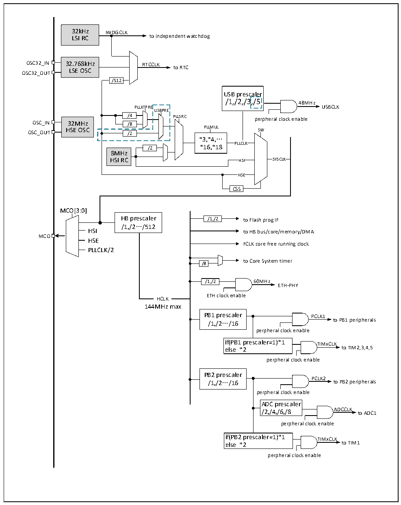

<!-- source-page: 30 -->

[← p.29](0029.md) · [index](../README.md) · [PDF p.30](https://ch32-riscv-ug.github.io/CH32V20x/datasheet_zh/CH32FV2x_V3xRM.PDF#page=30) · [p.31 →](0031.md)

<!-- header: CH32F/V20x_V30x_V31x系列应用手册 https://wch.cn -->

图3-4 CH32V203RB时钟树结构  
 <!-- rendered from the PDF; verify at https://ch32-riscv-ug.github.io/CH32V20x/datasheet_zh/CH32FV2x_V3xRM.PDF#page=30 -->

🖼 Text parsed from the figure above

32kHz IWDGCLK  
LSI RC to independent watchdog  
OSC32_IN 32.768kHz RTCCLK  
LSE OSC to RTC  
OSC32_OUT  
/512  
USB prescaler /1,/2,/3,/5  a,/l5er  
/1,/2,/3,/5 48MHz  
PLLXTPRE USBCLK  
USBPRE  
/4 PLLSRC perpheral clock enable  
OSC_IN 32MHz /8  
OSC_OUT HSE OSC /2 PLLMUL SW  
*3,*4,…  
PLLCLK  
/2 *16,*18  
8MHz  
HSI RC HSI SYSCLK  
HSE  HSE  
CSS  
MCO[3:0]  
HB prescaler /1,/2 to Flash prog IF  
/1,/2…/512  
HSI to HB bus/core/memory/DMA  
MCO  
HSE  
FCLK core free running clock  
PLLCLK/2  
to Core System timer  
/8  
/1,/2 60MHz  
ETH-PHY  
ETH clock enable  
HCLK  HCLK  
144MHz max  
PB1 prescaler PCLK1  
/1,/2…/16 to PB1 peripherals  
perpheral clock enable  
if(PB1 prescaler=1)*1 TIMxCLK  
else *2 to TIM2,3,4,5  
perpheral clock enable  
PB2 prescaler  
PCLK2  
/1,/2…/16 to PB2 peripherals  
perpheral clock enable  
ADC prescaler  
/2,/4,/6,/8 ADCCLK to ADC1  
perpheral clock enable  
if(PB2 prescaler=1)*1 TIMxCLK  
else *2 to TIM1  
perpheral clock enable  

注：（1）CH32V203RB（CH32V20x_D8）产品外接晶体或时钟（HSE）为32M，使用外置晶体时无需负  
载电容已内置。  
（2）上图3-4中蓝色虚线框出来的部分仅适用于批号倒数第五位大于0的CH32V203RB芯片。  
<!-- image: p30-draw-image-00001 bbox=[507.6, 786.0, 527.52, 797.04] -->
<!-- footer: V2.5 27 -->
