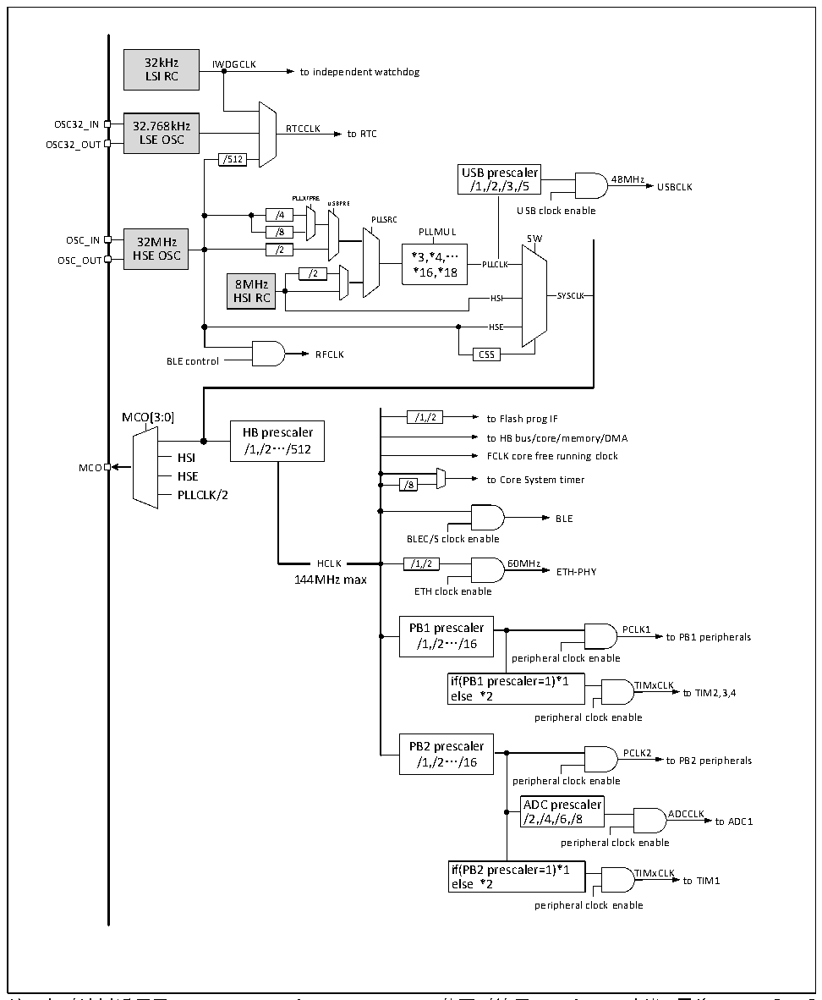

<!-- source-page: 31 -->

[← p.30](0030.md) · [index](../README.md) · [PDF p.31](https://ch32-riscv-ug.github.io/CH32V20x/datasheet_zh/CH32FV2x_V3xRM.PDF#page=31) · [p.32 →](0032.md)

<!-- header: CH32F/V20x_V30x_V31x系列应用手册 https://wch.cn -->

图3-5 CH32FV208时钟树结构  
 <!-- rendered from the PDF; verify at https://ch32-riscv-ug.github.io/CH32V20x/datasheet_zh/CH32FV2x_V3xRM.PDF#page=31 -->

🖼 Text parsed from the figure above

32kHz IWDGCLK  
LSI RC to independent watchdog  
OSC32_IN 32.768kHz RTCCLK  
LSE OSC to RTC  
OSC32_OUT  
/512  
USB prescaler  
48MHz  
/1,/2,/3,/5 USBCLK  
PLLXTPRE  
USBPRE  
/4 PLLSRC USB clock enable  
/4 /8  
/8 PLLMUL  
32MHz HSE OSC  
HSE OSC /2 *3,*4,…  
OSC_OUT  
PLLCLK  
/2 *16,*18  
8MHz  
HSI RC HSI SYSCLK  
HSE  
RFCLK CSS  
BLE control  
MCO[3:0] /1,/2 to Flash prog IF  
HB prescaler  
to HB bus/core/memory/DMA  
/1,/2…/512  
HSI FCLK core free running clock  
MCO  
HSE /8 to Core System timer  
PLLCLK/2  
BLE  
BLEC/S clock enable  
HCLK  HCLK  
HCLK /1,/2 60MHz  
ETH-PHY  
144MHz max  
ETH clock enable  
PB1 prescaler PCLK1  
/1,/2…/16 to PB1 peripherals  
peripheral clock enable  
if(PB1 prescaler=1)*1 TIMxCLK  
else *2 to TIM2,3,4  
peripheral clock enable  
PB2 prescaler  
PCLK2  
/1,/2…/16 to PB2 peripherals  
peripheral clock enable  
ADC prescaler  
/2,/4,/6,/8 ADCCLK to ADC1  
peripheral clock enable  
if(PB2 prescaler=1)*1 TIMxCLK  
else *2 to TIM1  
peripheral clock enable  

注：本时钟树适用于CH32F20x_D8W和CH32V20x_D8W。若同时使用USB和ETH功能，需将USBPRE[1:0]  
置为11b。产品外接晶体或时钟（HSE）为32M，使用外置晶体时无需负载电容已内置。  

### 3.3.2 高速时钟（HSI/HSE）

HSI是系统内部8MHz的RC振荡器产生的高速时钟信号。HSI RC振荡器能够在不需要任何外部器  
件的条件下提供系统时钟。它的启动时间很短但时钟频率精度较差。HSI 通过设置 RCC_CTLR 寄存器  
中的HSION位被启动和关闭，HSIRDY位指示HSI RC振荡器是否稳定。系统默认HSION和HSIRDY置1  
（建议不要关闭）。如果设置了RCC_INTR寄存器的HSIRDYIE位，将产生相应中断。  
● 出厂校准：制造工艺的差异会导致每个芯片的 RC 振荡频率不同，所以在芯片出厂前，会为每颗  
芯片进行HSI校准。系统复位后，工厂校准值被装载到RCC_CTLR寄存器的HSICAL[7:0]中。  
<!-- image: p31-draw-image-00001 bbox=[507.6, 786.0, 527.52, 797.04] -->
<!-- footer: V2.5 28 -->
