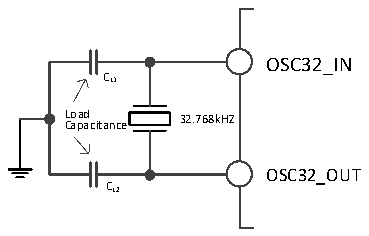
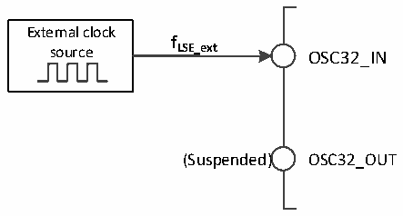

<!-- source-page: 33 -->

[← p.32](0032.md) · [index](../README.md) · [PDF p.33](https://ch32-riscv-ug.github.io/CH32V20x/datasheet_zh/CH32FV2x_V3xRM.PDF#page=33) · [p.34 →](0034.md)

<!-- header: CH32F/V20x_V30x_V31x系列应用手册 https://wch.cn -->

图3-8 低速外部晶体电路  
 <!-- rendered from the PDF; verify at https://ch32-riscv-ug.github.io/CH32V20x/datasheet_zh/CH32FV2x_V3xRM.PDF#page=33 -->

🖼 Text parsed from the figure above

OSC32_IN  
CL1  
L C o a a p d a citance 32.768kHZ  
OSC32_OUT  
CL2  

● 外部低速时钟源（LSE旁路）：此模式从外部直接送入时钟源到OSC32_IN引脚，OSC32_OUT引脚  
悬空。应用程序需在 LSEON 位为 0 情况下，置位 LSEBYP 位，打开 LSE 旁路功能，然后再置位 LSEON  
位。  

图3-9 低速时钟源电路  
 <!-- rendered from the PDF; verify at https://ch32-riscv-ug.github.io/CH32V20x/datasheet_zh/CH32FV2x_V3xRM.PDF#page=33 -->

🖼 Text parsed from the figure above

External clock  
<strong>f</strong>  
source LSE_ext OSC32_IN  
(Suspended) OSC32_OUT  

### 3.3.4 PLL 时钟

通过配置RCC_CFGR0寄存器和扩展寄存器EXTEN_CTR，内部PLL时钟可以选择3种时钟来源和倍  
频系数，这些设置必须在每个 PLL 被开启前完成，一旦 PLL 被启动，这些参数就不能被改动。设置  
RCC_CTLR寄存器中的PLLON位被启动和关闭，PLLRDY位指示PLL时钟是否稳定，硬件在PLLRDY位置  
1后才将时钟送入系统。设置RCC_CTLR寄存器中的PLLON2位被启动和关闭，PLLRDY2位指示PLL2时  
钟是否稳定，硬件在PLLRDY2位置1后才将时钟送入系统。设置RCC_CTLR寄存器中的PLLON3位被启  
动和关闭，PLLRDY3位指示PLL3时钟是否稳定，硬件在PLLRDY3位置1后才将时钟送入系统。如果设  
置了RCC_INTR寄存器的PLLRDYIE位、PLL2RDYIE位或PLL3RDYIE位，将产生相应中断。  
PLL时钟来源：  
● HSI时钟送入  
● HSI经过2分频送入  
● HSE时钟或通过一个可配置的分频器的PLL2时钟  
● PLL2和PLL3由HSE通过一个可配置的分频器（PREDIV2）2提供时钟  

### 3.3.5 总线/外设时钟

#### 3.3.5.1 系统时钟（SYSCLK）

通过配置RCC_CFGR0寄存器SW[1:0]位配置系统时钟来源，SWS[1:0]指示当前的系统时钟源。  
● HSI作为系统时钟  
● HSE作为系统时钟  
● PLL时钟作为系统时钟  
控制器复位后，默认HSI时钟被选为系统时钟源。时钟源之间的切换必须在目标时钟源准备就绪  
后才会发生。  

#### 3.3.5.2 HB/PB1/PB2 总线外设时钟（HCLK/PCLK1/PCLK2）

通过配置RCC_CFGR0寄存器的HPRE[3:0]、PPRE1[2:0]、PPRE2[2:0]位，可以分别配置HB、PB1、  
PB2总线的时钟。这些总线时钟决定了挂载在其下面的外设接口访问时钟基准。应用程序可以调整不  
<!-- image: p33-draw-image-00001 bbox=[507.6, 786.0, 527.52, 797.04] -->
<!-- footer: V2.5 30 -->
