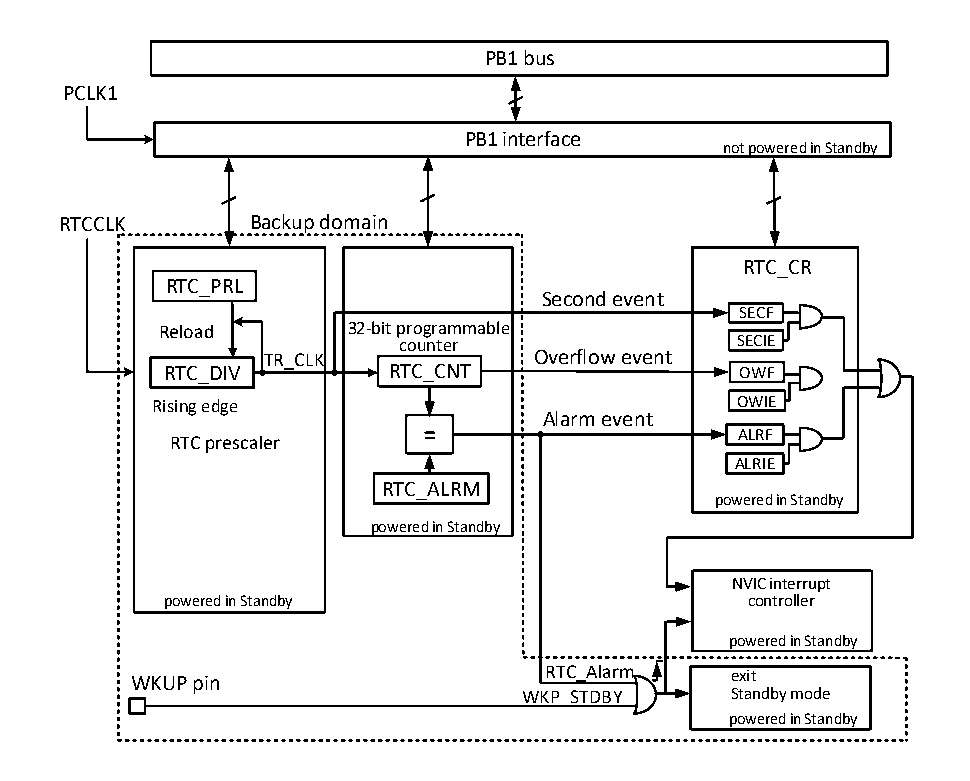

<!-- source-page: 65 -->

[← p.64](0064.md) · [index](../README.md) · [PDF p.65](https://ch32-riscv-ug.github.io/CH32V20x/datasheet_zh/CH32FV2x_V3xRM.PDF#page=65) · [p.66 →](0066.md)

<!-- header: CH32F/V20x_V30x_V31x系列应用手册 https://wch.cn -->

# 第 6 章 实时时钟（RTC）

本章模块描述适用于CH32F20x、CH32V20x、CH32V30x和CH32V31x微控制器全系列产品。  
实时时钟（RTC）是一个独立的定时器模块，其可编程计数器最大可达到32位，配合软件即可以  
实现实时时钟功能，并且可以修改计数器的值来重新配置系统的当前时间和日期。RTC模块在后备供  
电区域，系统复位和待机模式唤醒对其不造成影响。  

## 6.1 主要特征

● 最高为220的预分频系数  
● 32位可编程计数器  
● 多种时钟源，中断  
● 独立复位  

## 6.2 功能描述

### 6.2.1 概述

图6-1 RTC结构框图  
 <!-- rendered from the PDF; verify at https://ch32-riscv-ug.github.io/CH32V20x/datasheet_zh/CH32FV2x_V3xRM.PDF#page=65 -->

🖼 Text parsed from the figure above

PB1 bus  
PCLK1  
PB1 interface  
not powered in Standby  
RTCCLK Backup domain  
RTC_CR  
RTC_PRL  
Second event  
SECF  
Reload 32-bit programmable  
counter SECIE  
TR_CLK Overflow event  
RTC_DIV RTC_CNT OWF  
Rising edge OWIE  
Alarm event  
ALRF  
RTC prescaler  
ALRIE  
RTC_ALRM  
powered in Standby  
powered in Standby  
NVIC interrupt  
powered in Standby controller  
powered in Standby  
WKUP pin RTC_Alarm exit  
WKP_STDBY Standby mode  
powered in Standby  

由图6-1所示，RTC模块主要是PB1总线接口、分频器和计数器、控制和状态寄存器三部分组成，  
其中分频器和计数器部分在后备区域，可由VBAT 供电。RTCCLK输入分频器（RTC_DIV）之后，被分频成  
TR_CLK。值得注意的是，分频器（RTC_DIV）的内部是一个自减计数器，自减到溢出就会输出一个TR_CLK，  
然后从重装值寄存器（RTC_PSCR）里取出预设值重装到分频器里，读分频器实际上是读取它的实时值  
<!-- image: p65-draw-image-00001 bbox=[507.6, 786.0, 527.52, 797.04] -->
<!-- footer: V2.5 62 -->
