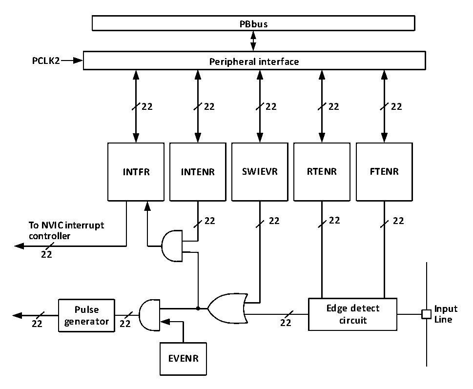

<!-- source-page: 90 -->

[← p.89](0089.md) · [index](../README.md) · [PDF p.90](https://ch32-riscv-ug.github.io/CH32V20x/datasheet_zh/CH32FV2x_V3xRM.PDF#page=90) · [p.91 →](0091.md)

<!-- header: CH32F/V20x_V30x_V31x系列应用手册 https://wch.cn -->

## 9.4 外部中断和事件控制器（EXTI）

### 9.4.1 概述

图9-1 外部中断（EXTI）接口框图  
 <!-- rendered from the PDF; verify at https://ch32-riscv-ug.github.io/CH32V20x/datasheet_zh/CH32FV2x_V3xRM.PDF#page=90 -->

🖼 Text parsed from the figure above

<strong>PBbus</strong>  
<strong>PCLK2 Peripheral interface</strong>  
<strong>22 22 22 22 22</strong>  
<strong>INTFR INTENR SWIEVR RTENR FTENR</strong>  
<strong>22 22 22 22</strong>  
<strong>To NVIC interrupt</strong>  
<strong>controller</strong>  
<strong>22</strong>  
<strong>Pulse Edge detect Input</strong>  
<strong>22 generator 22 22 circuit Line</strong>  
<strong>EVENR</strong>  

由图9-1可以看出，外部中断的触发源既可以是软件中断（SWIEVR）也可以是实际的外部中断通  
道，外部中断通道的信号会先经过边沿检测电路（edge detect circuit）的筛选。只要产生软件中  
断或外部中断信号其一，就会通过图中的或门电路输出给事件使能和中断使能两个与门电路，只要有  
中断被使能或事件被使能，就会产生中断或事件。EXTI的六个寄存器由处理器通过PB2接口访问。  

### 9.4.2 唤醒事件说明

系统可以通过唤醒事件来唤醒由WFE指令引起的睡眠模式。唤醒事件通过以下两种配置产生：  
● 在外设的寄存器里使能一个中断，但不在内核的NVIC或PFIC里使能这个中断，同时在内核里使  
能SEVONPEND位。体现在EXTI中，就是使能EXTI中断，但不在NVIC或PFIC中使能EXTI中断，  
同时使能 SEVONPEND 位。当 CPU 从 WFE 中唤醒后，需要清除 EXTI 的中断标志位和 NVIC 或 PFIC  
挂起位。  
● 使能一个 EXTI 通道为事件通道，CPU 从 WFE 唤醒后无需清除中断标志位和 NVIC 或 PFIC 挂起位  
的操作。  

### 9.4.3 说明

使用外部中断需要配置相应外部中断通道，即选择相应触发沿，使能相应中断。当外部中断通道  
上出现了设定的触发沿时，将产生一个中断请求，对应的中断标志位也会被置位。对标志位写1可以  
<!-- image: p90-draw-image-00001 bbox=[507.6, 786.0, 527.52, 797.04] -->
<!-- footer: V2.5 87 -->
