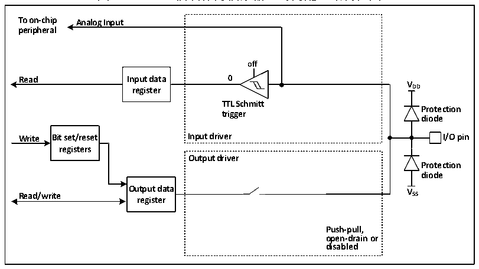

<!-- source-page: 121 -->

[← p.120](0120.md) · [index](../README.md) · [PDF p.121](https://ch32-riscv-ug.github.io/CH32V20x/datasheet_zh/CH32FV2x_V3xRM.PDF#page=121) · [p.122 →](0122.md)

<!-- header: CH32F/V20x_V30x_V31x系列应用手册 https://wch.cn -->

### 10.2.9 模拟输入配置

图10-5 GPIO模块作为模拟输入时的配置结构框图  
 <!-- rendered from the PDF; verify at https://ch32-riscv-ug.github.io/CH32V20x/datasheet_zh/CH32FV2x_V3xRM.PDF#page=121 -->

🖼 Text parsed from the figure above

<strong>To on-chip Analog Input</strong>  
<strong>peripheral</strong>  
<strong>off</strong>  
<strong>Read Input data 0</strong>  
<strong>V</strong>  
<strong>register DD</strong>  
<strong>TTL Schmitt</strong>  
<strong>Protection</strong>  
<strong>trigger</strong>  
<strong>diode</strong>  
<strong>Write Bit set/reset Input driver I/O pin</strong>  
<strong>registers</strong>  
<strong>Output driver</strong>  
<strong>Protection</strong>  
<strong>diode</strong>  
<strong>Output data V</strong>  
<strong>Read/write SS</strong>  
<strong>register</strong>  
<strong>Push-pull,</strong>  
<strong>open-drain or</strong>  
<strong>disabled</strong>  

在启用模拟输入时，输出缓冲器被断开，输入驱动中施密特触发器的输入被禁止以防止产生 IO  
口上的消耗，上下拉电阻被禁止，读取输入数据寄存器将一直为0。  

### 10.2.10 外设的 GPIO 设置

下列表格推荐了各个外设的引脚相应的GPIO口配置。  

<!-- p121-table-001 (table-10-1@1) -->
<table><caption>表10-1 高级定时器（TIM1/8/9/10）</caption><tr><th>TIM1/8/9/10</th><th>配置</th><th>GPIO配置</th></tr><tr><td rowspan="2">TIM1/8/9/10_CHx</td><td>输入捕获通道x</td><td>浮空输入</td></tr><tr><td>输出比较通道x</td><td>推挽复用输出</td></tr><tr><td>TIM1/8/9/10_CHxN</td><td>互补输出通道x</td><td>推挽复用输出</td></tr><tr><td>TIM1/8/9/10_BKIN</td><td>刹车输入</td><td>浮空输入</td></tr><tr><td>TIM1/8/9/10_ETR</td><td>外部触发时钟输入</td><td>浮空输入</td></tr></table>

<!-- p121-table-002 (table-10-2@1) -->
<table><caption>表10-2 通用定时器（TIM2/3/4/5）</caption><tr><th>TIM2/3/4/5引脚</th><th>配置</th><th>GPIO配置</th></tr><tr><td rowspan="2">TIM2/3/4/5_CHx</td><td>输入捕获通道x</td><td>浮空输入</td></tr><tr><td>输出比较通道x</td><td>推挽复用输出</td></tr><tr><td>TIM2/3/4/5_ETR</td><td>外部触发时钟输入</td><td>浮空输入</td></tr></table>

<!-- p121-table-003 (table-10-3@1) -->
<table><caption>表10-3 通用同步异步串行收发器（USART）</caption><tr><th>USART引脚</th><th>配置</th><th>GPIO配置</th></tr><tr><td rowspan="2">USARTx_TX</td><td>全双工模式</td><td>推挽复用输出</td></tr><tr><td>半双工同步模式</td><td>开漏复用输出</td></tr><tr><td rowspan="2">USARTx_RX</td><td>全双工模式</td><td>浮空输入或带上拉输入</td></tr><tr><td>半双工同步模式</td><td>未使用</td></tr><tr><td>USARTx_CK</td><td>同步模式</td><td>推挽复用输出</td></tr><tr><td>USARTx_RTS</td><td>硬件流量控制</td><td>推挽复用输出</td></tr><tr><td>USARTx_CTS</td><td>硬件流量控制</td><td>浮空输入或带上拉输入</td></tr></table>

<!-- image: p121-draw-image-00001 bbox=[507.6, 786.0, 527.52, 797.04] -->
<!-- footer: V2.5 118 -->
