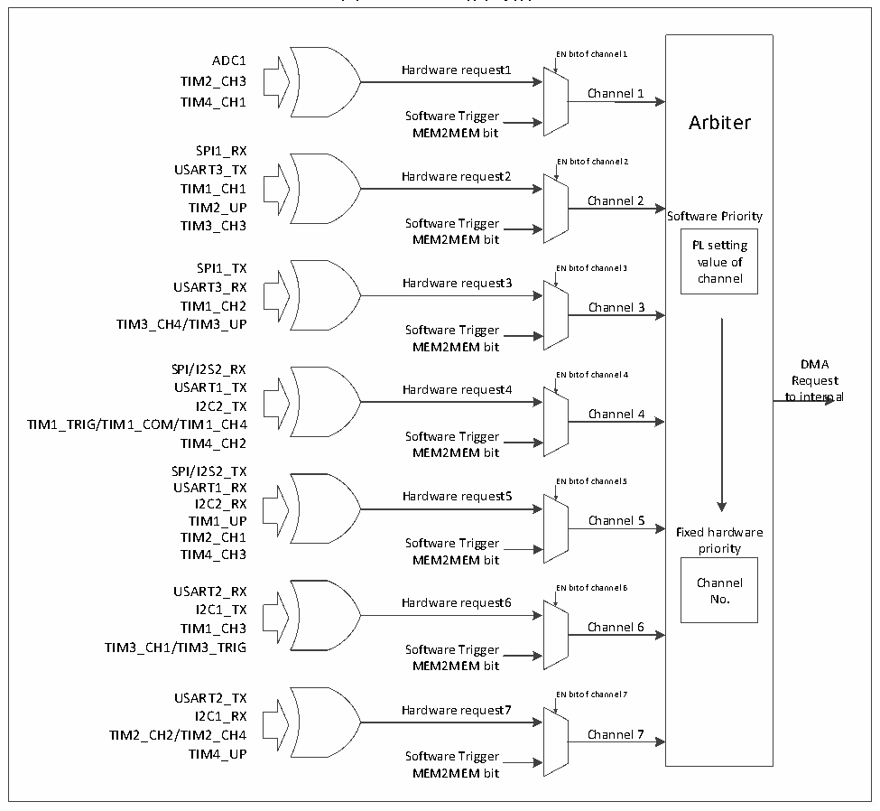

<!-- source-page: 149 -->

[← p.148](0148.md) · [index](../README.md) · [PDF p.149](https://ch32-riscv-ug.github.io/CH32V20x/datasheet_zh/CH32FV2x_V3xRM.PDF#page=149) · [p.150 →](0150.md)

<!-- header: CH32F/V20x_V30x_V31x系列应用手册 https://wch.cn -->

> ⬆ **Table continued** — rendered in full at [page 148](0148.md). <!-- p149-table-001 -->

图11-1 DMA1请求映像  
 <!-- rendered from the PDF; verify at https://ch32-riscv-ug.github.io/CH32V20x/datasheet_zh/CH32FV2x_V3xRM.PDF#page=149 -->

🖼 Text parsed from the figure above

Arbiter  Software Priority PL setting value of channel  Fixed hardware priority Channel No.  
ADC1 EN bit of channel 1  
Hardware request1  
TIM2_CH3  
Channel 1  
TIM4_CH1  
Software Trigger Arbiter  
MEM2MEM bit  
SPI1_RX  
EN bit of channel 2  
USART3_TX  
Hardware request2  
TIM1_CH1  
Channel 2  
TIM2_UP  
TIM3_CH3 Software Trigger  
MEM2MEM bit PL setting  
SPI1_TX EN bit of channel 3  
USART3_RX Hardware request3 channel  
TIM1_CH2 Channel 3  
TIM3_CH4/TIM3_UP  
Software Trigger  
MEM2MEM bit  
SPI/I2S2_RXENbitofchannel4Request DMA  
USART1_TX Hardware request4  
to internal  
I2C2_TX  
Channel 4  
TIM1_TRIG/TIM1_COM/TIM1_CH4  
Software Trigger  
TIM4_CH2  
MEM2MEM bit  
SPI/I2S2_TX  
USART1_RX EN bit of channel 5  
Hardware request5  
I2C2_RX  
TIM1_UP Channel 5  
TIM2_CH1 Fixed hardware  
TIM4_CH3 Software Trigger priority  
MEM2MEM bit  
USART2_RX EN bit of channel 6  
Hardware request6 No.  
I2C1_TX  
TIM1_CH3 Channel 6  
TIM3_CH1/TIM3_TRIG Software Trigger  
MEM2MEM bit  
USART2_TX EN bit of channel 7  
Hardware request7  
I2C1_RX  
TIM2_CH2/TIM2_CH4 Channel 7  
TIM4_UP Software Trigger  
MEM2MEM bit  

<!-- image: p149-draw-image-00001 bbox=[507.6, 786.0, 527.52, 797.04] -->
<!-- footer: V2.5 146 -->
