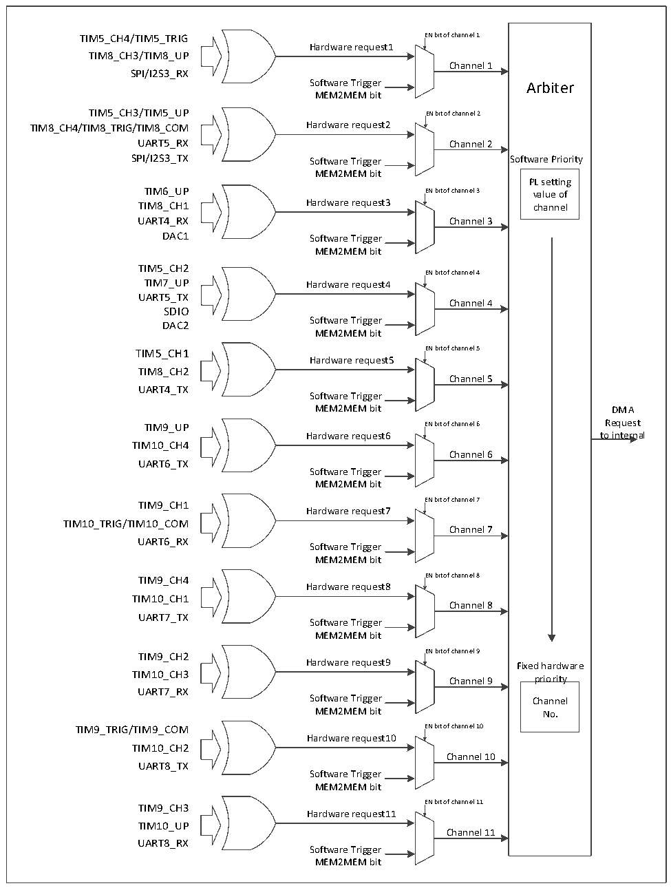

<!-- source-page: 150 -->

[← p.149](0149.md) · [index](../README.md) · [PDF p.150](https://ch32-riscv-ug.github.io/CH32V20x/datasheet_zh/CH32FV2x_V3xRM.PDF#page=150) · [p.151 →](0151.md)

<!-- header: CH32F/V20x_V30x_V31x系列应用手册 https://wch.cn -->

图11-2 DMA2请求映像  
 <!-- rendered from the PDF; verify at https://ch32-riscv-ug.github.io/CH32V20x/datasheet_zh/CH32FV2x_V3xRM.PDF#page=150 -->

🖼 Text parsed from the figure above

TIM5_CH4/TIM5_TRIG EN bit of channel 1  
Hardware request1  
TIM8_CH3/TIM8_UP  
Channel 1  
SPI/I2S3_RX  
Software Trigger Arbiter  
MEM2MEM bit  
TIM5_CH3/TIM5_UP EN bit of channel 2  
TIM8_CH4/TIM8_TRIG/TIM8_COM Hardware request2  
UART5_RX Channel 2  
SPI/I2S3_TX Software Trigger Software Priority  
MEM2MEM bit  
PL setting  
TIM6_UP EN bit of channel 3 value of  
TIM8_CH1 Hardware request3 channel  
UART4_RX Channel 3  
DAC1 Software Trigger  
MEM2MEM bit  
TIM5_CH2  
EN bit of channel 4  
TIM7_UP Hardware request4  
UART5_TX  
Channel 4  
SDIO  
Software Trigger  
DAC2  
MEM2MEM bit  
TIM5_CH1 EN bit of channel 5  
Hardware request5  
TIM8_CH2  
Channel 5  
UART4_TX  
Software Trigger  
MEM2MEM bit DMA  
TIM9_UP EN bit of channel 6 Request  
Hardware request6 to internal  
TIM10_CH4  
Channel 6  
UART6_TX  
Software Trigger  
MEM2MEM bit  
TIM9_CH1 EN bit of channel 7  
Hardware request7  
TIM10_TRIG/TIM10_COM  
Channel 7  
UART6_RX  
Software Trigger  
MEM2MEM bit  
TIM9_CH4 EN bit of channel 8  
Hardware request8  
TIM10_CH1  
Channel 8  
UART7_TX  
Software Trigger  
MEM2MEM bit  
TIM9_CH2 EN bit of channel 9  
Hardware request9 Fixed hardware  
TIM10_CH3  
Channel 9 priority  
UART7_RX  
Software Trigger Channel  
MEM2MEM bit No.  
TIM9_TRIG/TIM9_COM EN bit of channel 10  
Hardware request10  
TIM10_CH2  
Channel 10  
UART8_TX  
Software Trigger  
MEM2MEM bit  
EN bit of channel 11  
TIM9_CH3  
Hardware request11  
TIM10_UP  
Channel 11  
UART8_RX  
Software Trigger  
MEM2MEM bit  

<!-- p150-table-001 (table-11-2@1) pages 150-151 -->
<table><caption>表11-2 DMA1各通道外设映射表</caption><tr><th>外设</th><th>通道1</th><th>通道2</th><th>通道3</th><th>通道4</th><th>通道5</th><th>通道6</th><th>通道7</th></tr><tr><td>ADC1</td><td>ADC1</td><td></td><td></td><td></td><td></td><td></td><td></td></tr><tr><td>SPI1</td><td></td><td>SPI1_RX</td><td>SPI1_TX</td><td></td><td></td><td></td><td></td></tr><tr><td>SPI/I2S2</td><td></td><td></td><td></td><td>SPI/I2S2_RX</td><td>SPI/I2S2_TX</td><td></td><td></td></tr><tr><td>USART1</td><td></td><td></td><td></td><td>USART1_TX</td><td>USART1_RX</td><td></td><td></td></tr><tr><td>USART2</td><td></td><td></td><td></td><td></td><td></td><td>USART2_RX</td><td>USART2_TX</td></tr><tr><td>USART3</td><td></td><td>USART3_TX</td><td>USART3_RX</td><td></td><td></td><td></td><td></td></tr><tr><td>I2C1</td><td></td><td></td><td></td><td></td><td></td><td>I2C1_TX</td><td>I2C1_RX</td></tr><tr><td>I2C2</td><td></td><td></td><td></td><td>I2C2_TX</td><td>I2C2_RX</td><td></td><td></td></tr><tr><td>TIM1</td><td></td><td>TIM1_CH1</td><td>TIM1_CH2</td><td style="text-align:left">TIM1_CH4TIM1_TRIGTIM1_COM</td><td>TIM1_UP</td><td>TIM1_CH3</td><td></td></tr><tr><td>TIM2</td><td>TIM2_CH3</td><td>TIM2_UP</td><td></td><td></td><td>TIM2_CH1</td><td></td><td style="text-align:left">TIM2_CH2TIM2_CH4</td></tr><tr><td>TIM3</td><td></td><td>TIM3_CH3</td><td style="text-align:left">TIM3_CH4TIM3_UP</td><td></td><td></td><td style="text-align:left">TIM3_CH1TIM3_TRIG</td><td></td></tr><tr><td>TIM4</td><td>TIM4_CH1</td><td></td><td></td><td>TIM4_CH2</td><td>TIM4_CH3</td><td></td><td>TIM4_UP</td></tr></table>

<!-- image: p150-draw-image-00001 bbox=[507.6, 786.0, 527.52, 797.04] -->
<!-- footer: V2.5 147 -->
