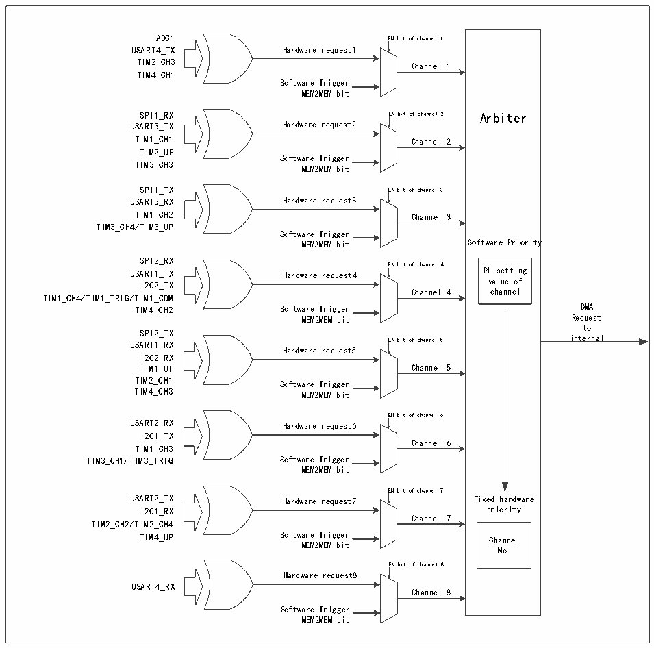

<!-- source-page: 153 -->

[← p.152](0152.md) · [index](../README.md) · [PDF p.153](https://ch32-riscv-ug.github.io/CH32V20x/datasheet_zh/CH32FV2x_V3xRM.PDF#page=153) · [p.154 →](0154.md)

<!-- header: CH32F/V20x_V30x_V31x系列应用手册 https://wch.cn -->

图11-3 DMA请求映像  
 <!-- rendered from the PDF; verify at https://ch32-riscv-ug.github.io/CH32V20x/datasheet_zh/CH32FV2x_V3xRM.PDF#page=153 -->

🖼 Text parsed from the figure above

Arbiter  Software Priority PL setting value of  vcahlaunen eolf  Fixed hardware priority  priority Channel No.  
ADC1 EN bit of channel 1  
USART4_TX Hardware request1  
TIM2_CH3  
Channel 1  
TIM4_CH1  
Software Trigger  
MEM2MEM bit  
SPI1_RX EN bit of channel 2 Arbiter  
USART3_TX Hardware request2  
TIM1_CH1 Channel 2  
TIM2_UP  
Software Trigger  
TIM3_CH3 MEM2MEM bit  
SPI1_TX EN bit of channel 3  
USART3_RX Hardware request3  
TIM1_CH2 Channel 3  
TIM3_CH4/TIM3_UP  
Software Trigger  
MEM2MEM bit Software Priority  
SPI2_RX  
EN bit of channel 4  
USART1_TX Hardware request4 PL setting  
I2C2_TX value of  
TIM1_CH4/TIM1_TRIG/TIM1_COM  
TIM4_CH2 Software Trigger DMA  
MEM2MEM bit Request  
to  
SPI2_TX  
USART1_RX EN bit of channel 5 internal  
Hardware request5  
I2C2_RX  
TIM1_UP Channel 5  
TIM2_CH1  
Software Trigger  
TIM4_CH3 MEM2MEM bit  
EN bit of channel 6  
USART2_RX Hardware request6  
I2C1_TX  
Channel 6  
TIM1_CH3  
TIM3_CH1/TIM3_TRIG Software Trigger  
MEM2MEM bit  
EN bit of channel 7  
USART2_TX Hardware request7 Fixed hardware  
I2C1_RX priority  
Channel 7  
TIM2_CH2/TIM2_CH4  
TIM4_UP Software Trigger Channel  
MEM2MEM bit  
EN bit of channel 8  
Hardware request8  
USART4_RX  
Channel 8  
Software Trigger  
MEM2MEM bit  

青稞V4C MCU（包括CH32V20x_D8W、CH32V20x_D8）以及ARM○RCortexTM-M3 MCU（包括CH32F20x_D8W），  
DMA控制器提供8个通道，每个通道对应多个外设请求，通过设置相应外设寄存器中对应DMA控制位，  
可以独立的开启或关闭各个外设的DMA功能，具体对应关系如下。  

<!-- p153-table-002 (table-11-6@1) pages 153-154 -->
<table><caption>表11-6 DMA各通道外设映射表</caption><tr><th>外设</th><th>通道1</th><th>通道2</th><th>通道3</th><th>通道4</th><th>通道5</th><th>通道6</th><th>通道7</th><th>通道8</th></tr><tr><td>ADC1</td><td>ADC1</td><td></td><td></td><td></td><td></td><td></td><td></td><td></td></tr><tr><td>SPI1</td><td></td><td>SPI1_RX</td><td>SPI1_TX</td><td></td><td></td><td></td><td></td><td></td></tr><tr><td>SPI2</td><td></td><td></td><td></td><td>SPI2_RX</td><td>SPI2_TX</td><td></td><td></td><td></td></tr><tr><td>USART1</td><td></td><td></td><td></td><td>USART1_TX</td><td>USART1_RX</td><td></td><td></td><td></td></tr><tr><td>USART2</td><td></td><td></td><td></td><td></td><td></td><td>USART2_RX</td><td>USART2_TX</td><td></td></tr><tr><td>USART3</td><td></td><td>USART3_TX</td><td>USART3_RX</td><td></td><td></td><td></td><td></td><td></td></tr><tr><td>USART4</td><td>USART4_TX</td><td></td><td></td><td></td><td></td><td></td><td></td><td>USART4_RX</td></tr><tr><td>I2C1</td><td></td><td></td><td></td><td></td><td></td><td>I2C1_TX</td><td>I2C1_RX</td><td></td></tr><tr><td>I2C2</td><td></td><td></td><td></td><td>I2C2_TX</td><td>I2C2_RX</td><td></td><td></td><td></td></tr><tr><td>TIM1</td><td></td><td>TIM1_CH1</td><td>TIM1_CH2</td><td style="text-align:left">TIM1_CH4TIM1_TRIGTIM1_COM</td><td>TIM1_UP</td><td>TIM1_CH3</td><td></td><td></td></tr><tr><td>TIM2</td><td>TIM2_CH3</td><td>TIM2_UP</td><td></td><td></td><td>TIM2_CH1</td><td></td><td style="text-align:left">TIM2_CH2TIM2_CH4</td><td></td></tr><tr><td>TIM3</td><td></td><td>TIM3_CH3</td><td style="text-align:left">TIM3_CH4TIM3_UP</td><td></td><td></td><td style="text-align:left">TIM3_CH1TIM3_TRIG</td><td></td><td></td></tr><tr><td>TIM4</td><td>TIM4_CH1</td><td></td><td></td><td>TIM4_CH2</td><td>TIM4_CH3</td><td></td><td>TIM4_UP</td><td></td></tr><tr><td>TIM5</td><td>TIM5_CH2</td><td></td><td>TIM5_CH3</td><td></td><td></td><td>TIM5_CH4</td><td style="text-align:left">TIM5_CH1TIM5_TRIG</td><td>TIM5_UP</td></tr></table>

<!-- image: p153-draw-image-00001 bbox=[507.6, 786.0, 527.52, 797.04] -->
<!-- footer: V2.5 150 -->
