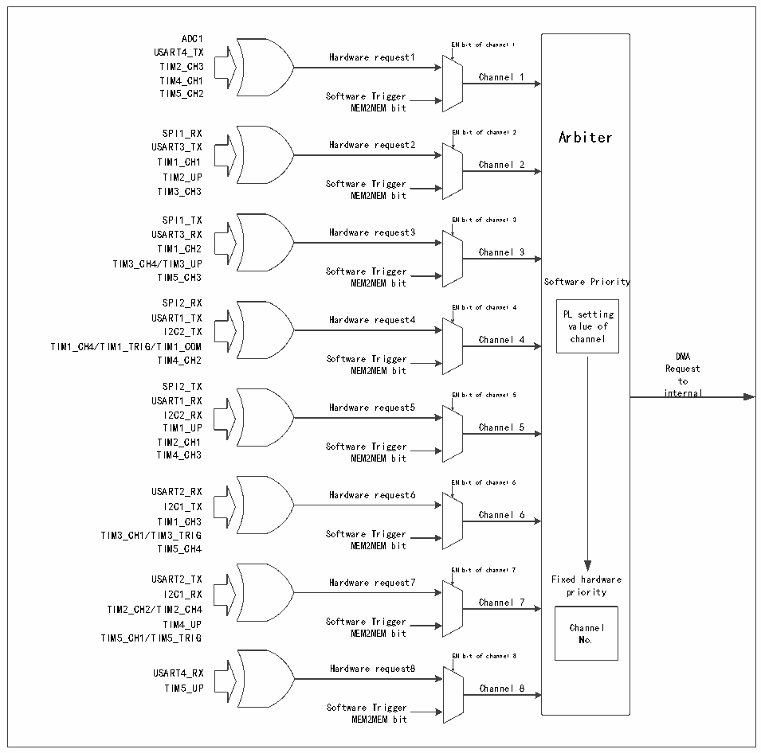

<!-- source-page: 154 -->

[← p.153](0153.md) · [index](../README.md) · [PDF p.154](https://ch32-riscv-ug.github.io/CH32V20x/datasheet_zh/CH32FV2x_V3xRM.PDF#page=154) · [p.155 →](0155.md)

<!-- header: CH32F/V20x_V30x_V31x系列应用手册 https://wch.cn -->

> ⬆ **Table continued** — rendered in full at [page 153](0153.md). <!-- p154-table-001 -->

图11-4 DMA请求映像  
 <!-- rendered from the PDF; verify at https://ch32-riscv-ug.github.io/CH32V20x/datasheet_zh/CH32FV2x_V3xRM.PDF#page=154 -->

🖼 Text parsed from the figure above

ADC1  
Arbiter  Software Priority PL setting value of  vcahlaunen eolf  Fixed hardware priority  priority Channel No.  
EN bit of channel 1  
USART4_TX  
Hardware request1  
TIM2_CH3  
TIM4_CH1 Channel 1  
TIM5_CH2 Software Trigger  
MEM2MEM bit  
SPI1_RX EN bit of channel 2 Arbiter  
USART3_TX Hardware request2  
TIM1_CH1 Channel 2  
TIM2_UP  
Software Trigger  
TIM3_CH3 MEM2MEM bit  
SPI1_TX EN bit of channel 3  
USART3_RX Hardware request3  
TIM1_CH2 Channel 3  
TIM3_CH4/TIM3_UP  
Software Trigger  
TIM5_CH3 MEM2MEM bit Software Priority  
SPI2_RX  
EN bit of channel 4  
USART1_TX Hardware request4 PL setting  
I2C2_TX value of  
TIM1_CH4/TIM1_TRIG/TIM1_COM  
TIM4_CH2 Software Trigger DMA  
MEM2MEM bit Request  
to  
SPI2_TX  
USART1_RX EN bit of channel 5 internal  
Hardware request5  
I2C2_RX  
TIM1_UP Channel 5  
TIM2_CH1  
Software Trigger  
TIM4_CH3 MEM2MEM bit  
EN bit of channel 6  
USART2_RX Hardware request6  
I2C1_TX  
Channel 6  
TIM1_CH3  
TIM3_CH1/TIM3_TRIG Software Trigger  
TIM5_CH4 MEM2MEM bit  
EN bit of channel 7  
USART2_TX Hardware request7 Fixed hardware  
I2C1_RX priority  
Channel 7  
TIM2_CH2/TIM2_CH4  
TIM4_UP Software Trigger Channel  
TIM5_CH1/TIM5_TRIG MEM2MEM bit No.  
EN bit of channel 8  
USART4_RX Hardware request8  
TIM5_UP Channel 8  
Software Trigger  
MEM2MEM bit  

## 11.3 寄存器描述

<!-- p154-table-003 (table-11-7@1) pages 154-155 -->
<table><caption>表11-7 DMA1相关寄存器列表</caption><tr><th>名称</th><th>访问地址</th><th>描述</th><th>复位值</th></tr><tr><td>R32_DMA1_INTFR</td><td>0x40020000</td><td>DMA1中断状态寄存器</td><td>0x00000000</td></tr><tr><td>R32_DMA1_INTFCR</td><td>0x40020004</td><td>DMA1中断标志清除寄存器</td><td>0x00000000</td></tr><tr><td>R32_DMA1_CFGR1</td><td>0x40020008</td><td>DMA1通道1配置寄存器</td><td>0x00000000</td></tr><tr><td>R32_DMA1_CNTR1</td><td>0x4002000C</td><td>DMA1通道1传输数据数目寄存器</td><td>0x00000000</td></tr><tr><td>R32_DMA1_PADDR1</td><td>0x40020010</td><td>DMA1通道1外设地址寄存器</td><td>0x00000000</td></tr><tr><td>R32_DMA1_MADDR1</td><td>0x40020014</td><td>DMA1通道1存储器地址寄存器</td><td>0x00000000</td></tr><tr><td>R32_DMA1_CFGR2</td><td>0x4002001C</td><td>DMA1通道2配置寄存器</td><td>0x00000000</td></tr><tr><td>R32_DMA1_CNTR2</td><td>0x40020020</td><td>DMA1通道2传输数据数目寄存器</td><td>0x00000000</td></tr><tr><td>R32_DMA1_PADDR2</td><td>0x40020024</td><td>DMA1通道2外设地址寄存器</td><td>0x00000000</td></tr><tr><td>R32_DMA1_MADDR2</td><td>0x40020028</td><td>DMA1通道2存储器地址寄存器</td><td>0x00000000</td></tr><tr><td>R32_DMA1_CFGR3</td><td>0x40020030</td><td>DMA1通道3配置寄存器</td><td>0x00000000</td></tr><tr><td>R32_DMA1_CNTR3</td><td>0x40020034</td><td>DMA1通道3传输数据数目寄存器</td><td>0x00000000</td></tr><tr><td>R32_DMA1_PADDR3</td><td>0x40020038</td><td>DMA1通道3外设地址寄存器</td><td>0x00000000</td></tr><tr><td>R32_DMA1_MADDR3</td><td>0x4002003C</td><td>DMA1通道3存储器地址寄存器</td><td>0x00000000</td></tr><tr><td>R32_DMA1_CFGR4</td><td>0x40020044</td><td>DMA1通道4配置寄存器</td><td>0x00000000</td></tr><tr><td>R32_DMA1_CNTR4</td><td>0x40020048</td><td>DMA1通道4传输数据数目寄存器</td><td>0x00000000</td></tr><tr><td>R32_DMA1_PADDR4</td><td>0x4002004C</td><td>DMA1通道4外设地址寄存器</td><td>0x00000000</td></tr><tr><td>R32_DMA1_MADDR4</td><td>0x40020050</td><td>DMA1通道4存储器地址寄存器</td><td>0x00000000</td></tr><tr><td>R32_DMA1_CFGR5</td><td>0x40020058</td><td>DMA1通道5配置寄存器</td><td>0x00000000</td></tr><tr><td>R32_DMA1_CNTR5</td><td>0x4002005C</td><td>DMA1通道5传输数据数目寄存器</td><td>0x00000000</td></tr><tr><td>R32_DMA1_PADDR5</td><td>0x40020060</td><td>DMA1通道5外设地址寄存器</td><td>0x00000000</td></tr><tr><td>R32_DMA1_MADDR5</td><td>0x40020064</td><td>DMA1通道5存储器地址寄存器</td><td>0x00000000</td></tr><tr><td>R32_DMA1_CFGR6</td><td>0x4002006C</td><td>DMA1通道6配置寄存器</td><td>0x00000000</td></tr><tr><td>R32_DMA1_CNTR6</td><td>0x40020070</td><td>DMA1通道6传输数据数目寄存器</td><td>0x00000000</td></tr><tr><td>R32_DMA1_PADDR6</td><td>0x40020074</td><td>DMA1通道6外设地址寄存器</td><td>0x00000000</td></tr><tr><td>R32_DMA1_MADDR6</td><td>0x40020078</td><td>DMA1通道6存储器地址寄存器</td><td>0x00000000</td></tr><tr><td>R32_DMA1_CFGR7</td><td>0x40020080</td><td>DMA1通道7配置寄存器</td><td>0x00000000</td></tr><tr><td>R32_DMA1_CNTR7</td><td>0x40020084</td><td>DMA1通道7传输数据数目寄存器</td><td>0x00000000</td></tr><tr><td>R32_DMA1_PADDR7</td><td>0x40020088</td><td>DMA1通道7外设地址寄存器</td><td>0x00000000</td></tr><tr><td>R32_DMA1_MADDR7</td><td>0x4002008C</td><td>DMA1通道7存储器地址寄存器</td><td>0x00000000</td></tr><tr><td>R32_DMA1_CFGR8</td><td>0x40020094</td><td>DMA1通道8配置寄存器</td><td>0x00000000</td></tr><tr><td>R32_DMA1_CNTR8</td><td>0x40020098</td><td>DMA1通道8传输数据数目寄存器</td><td>0x00000000</td></tr><tr><td>R32_DMA1_PADDR8</td><td>0x4002009C</td><td>DMA1通道8外设地址寄存器</td><td>0x00000000</td></tr><tr><td>R32_DMA1_MADDR8</td><td>0x400200A0</td><td>DMA1通道8存储器地址寄存器</td><td>0x00000000</td></tr></table>

<!-- image: p154-draw-image-00001 bbox=[507.6, 786.0, 527.52, 797.04] -->
<!-- footer: V2.5 151 -->
