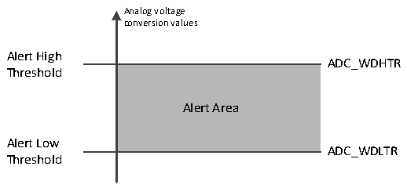

<!-- source-page: 170 -->

[← p.169](0169.md) · [index](../README.md) · [PDF p.170](https://ch32-riscv-ug.github.io/CH32V20x/datasheet_zh/CH32FV2x_V3xRM.PDF#page=170) · [p.171 →](0171.md)

<!-- header: CH32F/V20x_V30x_V31x系列应用手册 https://wch.cn -->

### 12.2.5 模拟看门狗

如果被ADC转换的模拟电压低于低阈值或高于高阈值，AWD模拟看门狗状态位被设置。阈值设  
置位于ADC_WDHTR和ADC_WDLTR寄存器的最低12个有效位中。通过设置ADC_CTLR1寄存器的AWDIE  
位以允许产生相应中断。  

图12-4 模拟看门狗阈值区  
 <!-- rendered from the PDF; verify at https://ch32-riscv-ug.github.io/CH32V20x/datasheet_zh/CH32FV2x_V3xRM.PDF#page=170 -->

🖼 Text parsed from the figure above

Analog voltage  
conversion values  
Alert High  
ADC_WDHTR  
Alert Area  Alert Area  
Threshold  
Alert Low  
ADC_WDLTR  
Threshold  

配置ADC_CTLR1寄存器的AWDSGL、AWDEN、JAWDEN及AWDCH[4:0]位选择模拟看门狗警戒的通  
道，具体关系见下表：  

<!-- p170-table-002 (table-12-4@1) -->
<table><caption>表12-4 模拟看门狗通道选择</caption><tr><th rowspan="2">模拟看门狗警戒通道</th><th colspan="4">ADC_CTLR1寄存器控制位</th></tr><tr><td>AWDSGL</td><td>AWDEN</td><td>JAWDEN</td><td>AWDCH[4:0]</td></tr><tr><td>不警戒</td><td>忽略</td><td>0</td><td>0</td><td>忽略</td></tr><tr><td>所有注入通道</td><td>0</td><td>0</td><td>1</td><td>忽略</td></tr><tr><td>所有规则通道</td><td>0</td><td>1</td><td>0</td><td>忽略</td></tr><tr><td>所有注入和规则通道</td><td>0</td><td>1</td><td>1</td><td>忽略</td></tr><tr><td>单一注入通道</td><td>1</td><td>0</td><td>1</td><td>决定通道编号</td></tr><tr><td>单一规则通道</td><td>1</td><td>1</td><td>0</td><td>决定通道编号</td></tr><tr><td>单一注入和规则通道</td><td>1</td><td>1</td><td>1</td><td>决定通道编号</td></tr></table>

### 12.2.6 温度传感器

芯片内置温度传感器，连接ADC_INT16通道，通过ADC将传感器输出的电压转换成数字值来反  
馈芯片内部温度，推荐设置采样时间是17.1us。温度传感器输出的电压随温度线性变化，由于制造  
离散性，其线性变化的曲线斜率和偏移有所不同，所以内部温度传感器更适合于检测温度的变化，  
而不是测量绝对的温度。如果需要测量精确的温度，应该使用一个外置的温度传感器。  
通过设置ADC_CTLR2寄存器的TSVREFE位置1，唤醒ADC内部采样通道，软件启动或外部触发  
启动ADC的温度传感器通道转换，读取数据结果（mV）。其中，数字值和温度（℃）换算公式如  
下：  
温度（℃） = （（VSENSE-V25）/Avg_Slope）+25  
V25：温度传感器在25℃下的电压值  
Avg_Slope：温度与VSENSE 曲线的平均斜率（mV/℃）  
参考数据手册电气特性章节中V25 和Avg_Slope的实际值。  
注：内部温度传感器上电（TSVREFE位从0改为1）需要一个建立时间，而ADC模块上电也需要一个  
建立时间（ADON位从0改为1），所以为了缩短等待时间，可以同时设置ADON和TSVREFE位。  

### 12.2.7 双 ADC 模式

在有2个的ADC模块产品中，可以使2个ADC配合使用，实现双ADC模式。在双ADC模式中，  
ADC1为主ADC，ADC2为从ADC。通过配置ADC1_CTLR1中DUALMODE[3:0]以选择模式，实现ADC1和  
ADC2交替触发或同步触发转换。  
<!-- image: p170-draw-image-00001 bbox=[507.6, 786.0, 527.52, 797.04] -->
<!-- footer: V2.5 167 -->
