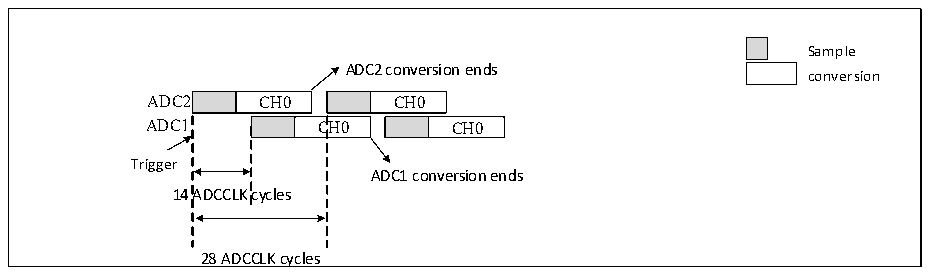
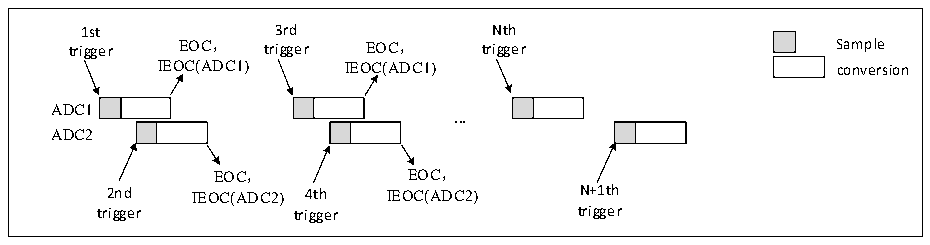

<!-- source-page: 174 -->

[← p.173](0173.md) · [index](../README.md) · [PDF p.174](https://ch32-riscv-ug.github.io/CH32V20x/datasheet_zh/CH32FV2x_V3xRM.PDF#page=174) · [p.175 →](0175.md)

<!-- header: CH32F/V20x_V30x_V31x系列应用手册 https://wch.cn -->
注：采样时间应小于7个ADC时钟周期，以避免ADC1和ADC2在采样同一个通道时，出现采样周期重  
合的问题。  
5）慢速交替模式  
此模式仅适用于规则通道且只能一个通道。设置ADC1_CTLR2中EXTSEL[2:0]，以选择触发源，  
当触发产生后ADC2将立即启动转换，ADC1在延迟14个ADC时钟周期后启动转换，再次延时14个  
ADC时钟周期后ADC2再次启动，如此往复循环。若使能中断，ADC1将产生EOC中断，若同时使能  
DMA，则将产生一个32位的DMA传输请求，将数据寄存器ADC1_RDATAR的内容传输到SRAM中，高  
16位包含ADC2转换数据，低16位包含ADC1转换数据。  

图12-9 单通道慢速交替转换  
 <!-- rendered from the PDF; verify at https://ch32-riscv-ug.github.io/CH32V20x/datasheet_zh/CH32FV2x_V3xRM.PDF#page=174 -->

🖼 Text parsed from the figure above

Sample  
ADC2 conversion ends  
conversion  
CH0  
CH0  C  CH0  
CH0  
Trigger  
ADC1 conversion ends  
14 ADCCLK cycles  
28 ADCCLK cycles  

注：1.采样时间应小于14个ADC时钟周期，以避免和下一次采样周期重合；  
2.28个ADC时钟周期后自动启动新的ADC2转换；  
3.不需要设置CONT位。  
6）交替触发模式  
此模式仅适用于注入通道组，设置ADC1_CTLR2中JEXTSEL[2:0]，以选择触发源。当第一次触  
发事件发生时，ADC1上所有的注入通道被转换，当第二次触发事件发生时，ADC2上所有的注入通道  
被转换。依次循环往复，若使能中断，则当ADC1所有注入通道转换完成后产生JEOC中断，ADC2所  
有注入通道转换完成后产生JEOC中断。  

图12-10 每个ADC注入通道组交替触发转换  
 <!-- rendered from the PDF; verify at https://ch32-riscv-ug.github.io/CH32V20x/datasheet_zh/CH32FV2x_V3xRM.PDF#page=174 -->

🖼 Text parsed from the figure above

1st 3rd Nth  
trigger EOC， trigger EOC， trigger Sample  
IEOC(ADC1) IEOC(ADC1) conversion  
ADC1  
<strong>...</strong>  
ADC2  
EOC， EOC，  
2nd IEOC(ADC2) 4th IEOC(ADC2) N+1th  
trigger trigger trigger  

若同时使用注入间断模式，则当第一次触发事件发生时，ADC1上的第一个注入通道被转换，当  
第二次触发事件发生时，ADC2上第一个注入通道被转换。以此类推，往复循环。同时若使能中断，  
则当ADC1所有注入通道转换完成后，产生JEOC中断，当ADC2所有注入通道转换完成后产生JEOC  
中断。  
<!-- image: p174-draw-image-00001 bbox=[507.6, 786.0, 527.52, 797.04] -->
<!-- footer: V2.5 171 -->
