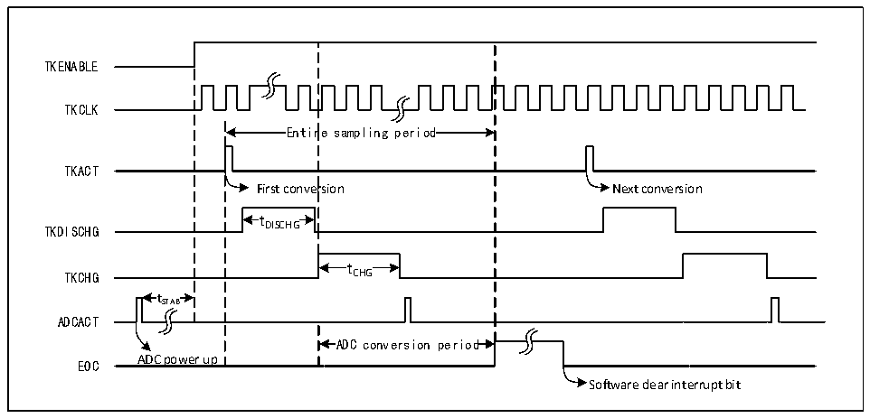

<!-- source-page: 187 -->

[← p.186](0186.md) · [index](../README.md) · [PDF p.187](https://ch32-riscv-ug.github.io/CH32V20x/datasheet_zh/CH32FV2x_V3xRM.PDF#page=187) · [p.188 →](0188.md)

<!-- header: CH32F/V20x_V30x_V31x系列应用手册 https://wch.cn -->

# 第 13 章 触摸按键检测（TKEY）

本章模块描述适用于CH32F20x、CH32V20x、CH32V30x和CH32V31x微控制器全系列产品。  
触摸检测控制（TKEY）单元，借助ADC模块的电压转换功能，通过将电容量转换为电压量进行采  
样，实现触摸按键检测功能。检测通道复用 ADC 的 16 个外部通道，通过 ADC模块的单次转换模式实  
现触摸按键检测。  

## 13.1 TKEY 功能描述

● TKEY开启  
TKEY检测过程需要ADC模块配合进行，所以使用TKEY功能时，需要保证ADC模块处于上电状  
态（ADON=1），然后将ADC_CTLR1寄存器的TKENABLE位置1，打开TKEY单元功能，且可以通过  
TKITUNE位调整TKEY模块的充电电流。  
TKEY只支持单次单通道转换模式，将待转换的通道配置到ADC模块的规则组序列第一个，软件  
启动转换（写TKEY_ACT_DCG寄存器）。  
注：不进行TKEY转换时，仍然可以保留ADC通道配置转换功能。  

图13-1 TKEY工作时序图  
 <!-- rendered from the PDF; verify at https://ch32-riscv-ug.github.io/CH32V20x/datasheet_zh/CH32FV2x_V3xRM.PDF#page=187 -->

🖼 Text parsed from the figure above

TKENABLE  
TKCLK  
Entir  re sampling period  Entir  re sampling period  
TKACT  
First conversion Next conversion  
t DISCHG  tDISCHG  
TKDISCHG DISCHG  
t CHG  tCHG  
TKCHG CHG  
t  tSTAB  
ADCACT  
ADC conversion period  
EOC ADC power up  
Software clear interrupt bit  

● 可编程采样时间  
TKEY 单元转换需要先使用若干个 ADCCLK 时钟周期（tDISCHG）进行放电，然后再通过若干个  
ADCCLK 周期（tCHG）对通道进行充电进行电压采样，充电周期数为 TKEY_CHARGE1 和 TKEY_CHARGE2  
寄存器中的TKCGx[2:0]配置值加上TKEY_CHGOFFSET偏移量之和，每个通道可以分别用不同的充电周  
期来调整采样电压。  

## 13.2 TKEY 操作步骤

TKEY检测属于ADC模块下的扩展功能，其工作原理是通过“触摸”和“非触摸”方式让硬件通道  
感知的电容量发生变化，进而通过可设置的充放电周期数将电容量的变化转换为电压的变化，最后通  
过ADC模块转换为数字值。  
采样时，需要将 ADC 配置为单次单通道工作模式，由 TKEY_ACT 寄存器的“写操作”启动一次转  
换，具体流程如下：  
1） 初始化ADC功能，配置ADC模块为单次转换模块，置ACON位为1，唤醒ADC模块。将ADC_CTLR1  
寄存器的TKENABLE位置1，打开TKEY单元。  
<!-- image: p187-draw-image-00001 bbox=[507.6, 786.0, 527.52, 797.04] -->
<!-- footer: V2.5 184 -->
