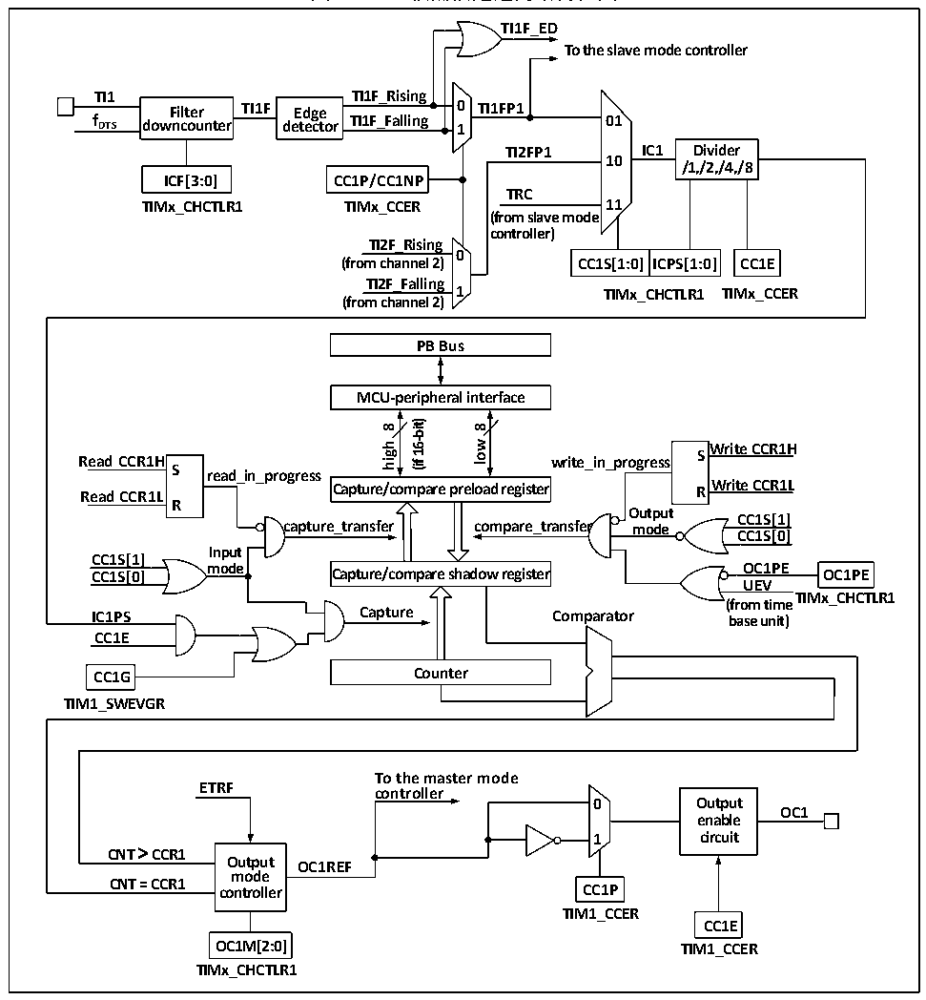

<!-- source-page: 224 -->

[← p.223](0223.md) · [index](../README.md) · [PDF p.224](https://ch32-riscv-ug.github.io/CH32V20x/datasheet_zh/CH32FV2x_V3xRM.PDF#page=224) · [p.225 →](0225.md)

<!-- header: CH32F/V20x_V30x_V31x系列应用手册 https://wch.cn -->

图15-3 比较捕获通道的结构框图  
 <!-- rendered from the PDF; verify at https://ch32-riscv-ug.github.io/CH32V20x/datasheet_zh/CH32FV2x_V3xRM.PDF#page=224 -->

🖼 Text parsed from the figure above

<strong>TI1F_ED</strong>  
<strong>To the slave mode controller</strong>  
<strong>TI1 TI1F_Rising</strong>  
<strong>Filter TI1F Edge 0 TI1FP1</strong>  
<strong>f DTS downcounter detector TI1F_Falling 1 01</strong>  
<strong>TI2FP1 IC1 Divider</strong>  
<strong>10</strong>  
<strong>/1,/2,/4,/8</strong>  
<strong>ICF[3:0] CC1P/CC1NP</strong>  
<strong>TRC</strong>  
<strong>TIMx_CHCTLR1 TIMx_CCER 11</strong>  
<strong>(from slave mode</strong>  
<strong>controller)</strong>  
<strong>TI2F_Rising</strong>  
<strong>0</strong>  
CC1S[1:0]  ICPS[1:0]  
<strong>(from channel 2) CC1S[1:0] ICPS[1:0] CC1E</strong>  
<strong>TI2F_Falling</strong>  
<strong>1 TIMx_CCER</strong>  
<strong>TIMx_CHCTLR1</strong>  
<strong>(from channel 2)</strong>  
<strong>PB Bus</strong>  
<strong>MCU-peripheral interface</strong>  
<strong>16-bit)</strong>  
<strong>8</strong>  
<strong>8</strong>  
<strong>low</strong>  
<strong>high</strong>  
<strong>Write CCR1H</strong>  
<strong>Read CCR1H write_in_progress S S</strong>  
<strong>(if</strong>  
<strong>read_in_progress</strong>  
<strong>Write CCR1L Read CCR1L R</strong>  
<strong>Capture/compare preload register</strong>  
<strong>R</strong>  
<strong>Output</strong>  
<strong>CC1S[1]</strong>  
<strong>capture_transfer compare_transfer mode</strong>  
<strong>CC1S[0]</strong>  
<strong>Input</strong>  
<strong>CC1S[1]</strong>  
<strong>mode OC1PE CC1S[0] OC1PE</strong>  
<strong>Capture/compare shadow register</strong>  
<strong>UEV</strong>  
<strong>TIMx_CHCTLR1</strong>  
<strong>(from time</strong>  
<strong>IC1PS Capture Comparator base unit)</strong>  
<strong>CC1E</strong>  
<strong>CC1G Counter</strong>  
<strong>TIM1_SWEVGR</strong>  
<strong>To the master mode</strong>  
<strong>ETRF controller</strong>  
<strong>0 Output</strong>  
<strong>OC1</strong>  
<strong>enable</strong>  
<strong>1 circuit</strong>  
<strong>CNT &gt; CCR1</strong>  
<strong>Output OC1REF</strong>  
<strong>mode</strong>  
<strong>CNT = CCR1 controller CC1P</strong>  
<strong>TIM1_CCER</strong>  
<strong>CC1E</strong>  
<strong>OC1M[2:0] TIM1_CCER</strong>  
<strong>TIMx_CHCTLR1</strong>  

信号从通道 x 引脚输入进来后可选做为 TIx（TI1 的来源可以不只是 CH1，见定时器的框图 14-  
1），以 TI1 举例：TI1 经过滤波器（ICF[3:0]）生成 TI1F，再经过边沿检测器分成 TI1F_Rising 和  
TI1F_Falling，这两个信号经过选择（CC1P）生成TI1FP1，TI1FP1和来自通道2的TI2FP1一起送给  
CC1S选择成为IC1，经过ICPS分频后送给比较捕获寄存器。  
比较捕获寄存器由一个预装载寄存器和一个影子寄存器组成，读写过程仅操作预装载寄存器。在  
捕获模式下，捕获发生在影子寄存器上，然后复制到预装载寄存器；在比较模式下，预装载寄存器的  
内容被复制到影子寄存器中，然后影子寄存器的内容与核心计数器（CNT）进行比较。  

## 15.3 功能和实现

通用定时器复杂功能的实现都是对定时器的比较捕获通道、时钟输入电路和计数器及周边组件进  
行操作实现的。定时器的时钟输入可以来自于包括比较捕获通道的输入在内的多个时钟源。对比较捕  
<!-- image: p224-draw-image-00001 bbox=[507.6, 786.0, 527.52, 797.04] -->
<!-- footer: V2.5 221 -->
