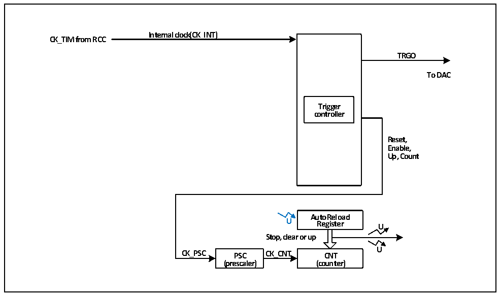

<!-- source-page: 247 -->

[← p.246](0246.md) · [index](../README.md) · [PDF p.247](https://ch32-riscv-ug.github.io/CH32V20x/datasheet_zh/CH32FV2x_V3xRM.PDF#page=247) · [p.248 →](0248.md)

<!-- header: CH32F/V20x_V30x_V31x系列应用手册 https://wch.cn -->

# 第 16 章 基本定时器（BCTM）

本章模块描述适用于CH32F20x、CH32V30x和CH32V31x微控制器全系列产品。  
基本定时器模块包含一个16位可自动重装的定时器（TIM6和TIM7），用于计数和在更新新事件  
产生中断或DMA请求。  

## 16.1 主要特征

基本定时器的主要特征包括：  
● 16位自动重装计数器，支持增计数模式  
● 16位预分频器，分频系数从1～65536之间动态可调  
● 触发DAC同步电路  
● 在更新事件时产生中断或DMA请求  

## 16.2 原理和结构

图16-1 基本定时器的结构框图  
 <!-- rendered from the PDF; verify at https://ch32-riscv-ug.github.io/CH32V20x/datasheet_zh/CH32FV2x_V3xRM.PDF#page=247 -->

🖼 Text parsed from the figure above

<strong>Internal clock(CK_INT)</strong>  
<strong>CK_TIM from RCC</strong>  
<strong>TRGO</strong>  
<strong>To DAC</strong>  
<strong>Trigger</strong>  
<strong>controller</strong>  
<strong>Reset,</strong>  
<strong>Enable,</strong>  
<strong>Up, Count</strong>  
<strong>AutoReload</strong>  
<strong>U Register U</strong>  
<strong>Stop, clear or up</strong>  
<strong>U</strong>  
<strong>CK_PSC PSC CK_CNT CNT</strong>  
<strong>(prescaler) (counter)</strong>  

### 16.2.1 概述

如图16-1所示，基本定时器的结构大致可以分为两部分，即输入时钟部分和核心计数器部分。  
基本定时器的时钟来自于 HB 总线时钟（CK_INT）。这些输入的时钟信号经过各种设定的滤波分  
频等操作后成为CK_PSC时钟，输出给核心计数器部分。另外，这些复杂的时钟来源还可以作为TRGO  
输出至DAC外设。  
基本定时器的核心是一个16位计数器（CNT）。CK_PSC经过预分频器（PSC）分频后，成为CK_CNT  
再最终输给CNT，CNT支持增计数模式，并有一个自动重装值寄存器（ATRLR）在每个计数周期结束后  
为CNT重装载初始化值。  

### 16.2.2 基本定时器和通用定时器的区别

与通用定时器相比，基本定时器缺少以下功能：  
<!-- image: p247-draw-image-00001 bbox=[507.6, 786.0, 527.52, 797.04] -->
<!-- footer: V2.5 244 -->
