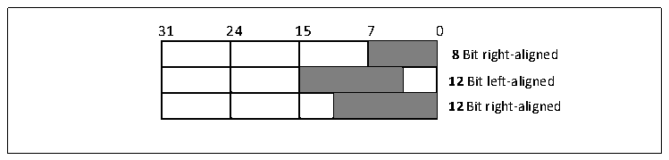
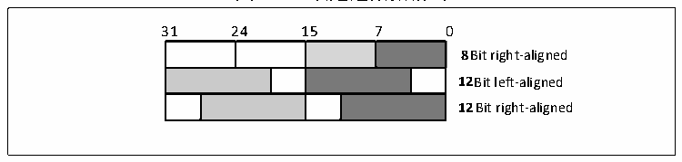

<!-- source-page: 255 -->

[← p.254](0254.md) · [index](../README.md) · [PDF p.255](https://ch32-riscv-ug.github.io/CH32V20x/datasheet_zh/CH32FV2x_V3xRM.PDF#page=255) · [p.256 →](0256.md)

<!-- header: CH32F/V20x_V30x_V31x系列应用手册 https://wch.cn -->
移数据到数据输出寄存器DAC_DORx[11:4]。  
12位数据右对齐时，写入数据到DAC_R12BDHRx[11:0]，模块将加载（1个PB1时钟周期后）右  
对齐数据到数据输出寄存器DAC_DORx[11:0]。  
12数据左对齐时，写入数据到DAC_L12BDHRx[15:4]，模块经过相应的移位后，将加载（1个  
PB1时钟周期后）左对齐数据到数据输出寄存器DAC_DORx[11:0]。  

图17-2 单通道数据格式  
 <!-- rendered from the PDF; verify at https://ch32-riscv-ug.github.io/CH32V20x/datasheet_zh/CH32FV2x_V3xRM.PDF#page=255 -->

🖼 Text parsed from the figure above

31 24 15 7 0  
8 Bit right-aligned  
12Bit left-aligned  
12 Bit right-aligned  

双DAC通道模式下，同样包括8位数据右对齐、12数据左对齐、12位数据右对齐三种方式。  
8位数据右对齐时，写入数据到DAC_RD8BDHR[7:0]，模块将加载（1个PB1时钟周期后）位  
[7:0]移位后到DAC_DOR1[11:4]，位[15:8]移位后到DAC_DOR2[11:4]。  
12数据左对齐时，写入数据到DAC_LD12BDHR[31:0]，模块将加载（1个PB时钟周期后）位  
[15:4]数据移位后到DAC_DOR1[11:0]，位[31:20]数据移位后到DAC_DOR2[11:0]。  
12位数据右对齐，写入数据到DAC_RD12BDHR[31:0]，模块将加载（1个PB时钟周期后）位  
[11:0]数据到DAC_DOR1[11:0]，位[27:16]数据到DAC_DOR2[11:0]。  

图17-3 双通道数据格式  
 <!-- rendered from the PDF; verify at https://ch32-riscv-ug.github.io/CH32V20x/datasheet_zh/CH32FV2x_V3xRM.PDF#page=255 -->

🖼 Text parsed from the figure above

31 24 15 7 0  
8Bit right-aligned  
12Bit left-aligned  
12 Bit right-aligned  

#### 17.2.2.4 DMA 功能：

DAC通道具有DMA功能。设置DAC_CTLR寄存器的DMAENx位为1，开启对应通道的DMA功能。当  
有触发事件（不包括软件触发）发生，则产生一个DMA请求，然后DAC_DORx寄存器的数据将被更  
新。  

#### 17.2.2.5 触发事件选择：

DAC转换可以由以下事件触发进行转换。当配置DAC_CTLR寄存器的TENx位为1，配置  
TSELx[2:0]控制位选择某个触发事件触发DAC转换。  

<!-- p255-table-003 (table-17-1@1) -->
<table><caption>表17-1 触发事件</caption><tr><th>触发源</th><th>类型</th><th>TSELx[2:0]</th></tr><tr><td>定时器6 TRGO事件</td><td rowspan="6">来自片上定时器内部信号</td><td>000</td></tr><tr><td>定时器8 TRGO事件</td><td>001</td></tr><tr><td>定时器7 TRGO事件</td><td>010</td></tr><tr><td>定时器5 TRGO事件</td><td>011</td></tr><tr><td>定时器2 TRGO事件</td><td>100</td></tr><tr><td>定时器4 TRGO事件</td><td>101</td></tr><tr><td>EXTI线路9</td><td>外部引脚</td><td>110</td></tr><tr><td>SWTRIG（软件触发）</td><td>软件控制位</td><td>111</td></tr></table>

<!-- image: p255-draw-image-00001 bbox=[507.6, 786.0, 527.52, 797.04] -->
<!-- footer: V2.5 252 -->
