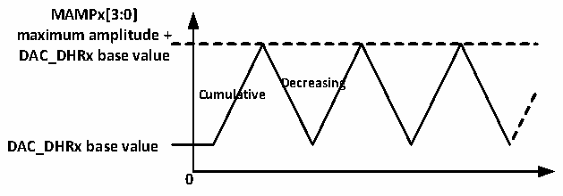

<!-- source-page: 256 -->

[← p.255](0255.md) · [index](../README.md) · [PDF p.256](https://ch32-riscv-ug.github.io/CH32V20x/datasheet_zh/CH32FV2x_V3xRM.PDF#page=256) · [p.257 →](0257.md)

<!-- header: CH32F/V20x_V30x_V31x系列应用手册 https://wch.cn -->
DAC接口会监测到来自选中的定时器TRGO输出或外部中断线9的上升沿，在触发后的3个PB1  
时钟周期后，将寄存器DAC_DORx更新为新值。  
如果配置的是软件触发方式，SWTRIG位一旦置1，将会启动一次转换，在触发后的1个PB1时  
钟周期后，将寄存器DAC_DORx更新为新值，并且硬件对SWTRIG位自动清0。  
注：不能在ENx为1时改变TSELx[2:0]位。  

### 17.2.3 DAC 转换

DAC通道的数据来自DAC_DORx寄存器，但不能直接对寄存器DAC_DORx写入数据，任何输出到  
DAC通道x的数据都必须写入DAC_R12BDHR1、DAC_L12BDHR1、DAC_R12BDHR2、DAC_L12BDHR2、  
DAC_RD12BDHR、DAC_LD12BDHR、DAC_RD8BDHR寄存器中。由系统内部的保持寄存器DAC_DHRx会获取  
上述寄存器值将其经过相应时间送入DAC_DORx寄存器。  
非触发方式下，写入寄存器DAC_xDHRx的数据会在1个PB1时钟周期后移入DAC_DORx寄存器。  
软件触发下，事件触发上升沿后1个PB1时钟周期后自动更新DAC_DORx寄存器。  
硬件触发（定时器TRGO事件或者外部中断线9上升沿）下，触发事件后3个PB1时钟周期后自  
动更新DAC_DORx寄存器。  
装入DAC_DORx寄存器数据，在经过时间tSETTLING 之后，输出即有效，这段时间的长短依电源电压  
和模拟输出负载的不同会有所变化。  
数字输入经过DAC被线性地转换为模拟电压输出，其范围为0到VDDA。任一DAC通道引脚上的输  
出电压满足下面的关系：  
DAC输出电压 = VDDA* （DAC_DORx/ 4096）。  

### 17.2.4 DAC 三角波生成器

模块内置了一个三角波生成器，可以在基准信号上加上一个小幅度的三角波。设置WAVEx[1:0]  
位为‘10’选择DAC的三角波生成功能。设置DAC_CTLR寄存器的MAMPx[3:0]位来选择三角波的幅  
度。  
系统内部包含一个从0开始的三角波计数器，在每次触发事件后3个PB1时钟周期后累加1。  
计数器的值与DAC_DHRx寄存器的数值相加并丢弃溢出位后写入DAC_DORx寄存器。在传入DAC_DORx  
寄存器的数值小于MAMPx[3:0]位定义的最大幅度时，三角波计数器逐步累加，一旦达到设置的最大  
幅度，则计数器开始递减，达到0后再开始累加，周而复始。将WAVEx[1:0]位置‘00’，可以复位  
三角波的生成。  
注：1.为了产生三角波，必须使能DAC触发，即设DAC_CTLR寄存器的TENx位为1。  
2.MAMPx[3:0]位必须在使能DAC之前设置，否则其值不能修改。  

图17-4 三角波生成  
 <!-- rendered from the PDF; verify at https://ch32-riscv-ug.github.io/CH32V20x/datasheet_zh/CH32FV2x_V3xRM.PDF#page=256 -->

🖼 Text parsed from the figure above

<strong>MAMPx[3:0]</strong>  
<strong>maximum amplitude +</strong>  
<strong>DAC_DHRx base value</strong>  
<strong>Decreasing</strong>  
<strong>Cumulative</strong>  
<strong>DAC_DHRx base value</strong>  
<strong>0</strong>  

### 17.2.5 DAC 噪声生成器

模块内置了一个噪声生成器，是利用线性反馈移位寄存器（Linear Feedback Shift Register  
LFSR）产生幅度变化的伪噪声。设置WAVE[1:0]位为‘01’选择DAC噪声生成功能。设置DAC_CTLR  
寄存器的MAMPx[3:0]位来选择屏蔽部分LFSR的数据。  
寄存器LFSR的预装入值为0xAAA。按照特定算法，在每次触发事件后3个PB1时钟周期之后更  
新该寄存器的值。设置DAC_CR寄存器的MAMPx[3:0]位可以屏蔽部分或者全部LFSR的数据，这样的  
<!-- image: p256-draw-image-00001 bbox=[507.6, 786.0, 527.52, 797.04] -->
<!-- footer: V2.5 253 -->
