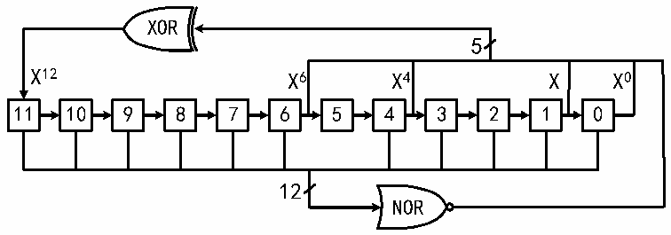

<!-- source-page: 257 -->

[← p.256](0256.md) · [index](../README.md) · [PDF p.257](https://ch32-riscv-ug.github.io/CH32V20x/datasheet_zh/CH32FV2x_V3xRM.PDF#page=257) · [p.258 →](0258.md)

<!-- header: CH32F/V20x_V30x_V31x系列应用手册 https://wch.cn -->
得到的LSFR值与DAC_DHRx的数值相加，去掉溢出位之后即被写入DAC_DORx寄存器。如果寄存器  
LFSR值为0x000，则会注入‘1’（防锁定机制）。将WAVEx[1:0]位置‘00’，可以复位LFSR波形  
的生成算法。  
注：为了产生噪声，必须使能DAC触发，即设DAC_CTLR寄存器的TENx位为1。  

图17-5 LFSR寄存器算法  
 <!-- rendered from the PDF; verify at https://ch32-riscv-ug.github.io/CH32V20x/datasheet_zh/CH32FV2x_V3xRM.PDF#page=257 -->

🖼 Text parsed from the figure above

XOR  
5  
X12 X6 X4 X X0  
11 10 9 8 7 6 5 4 3 2 1 0  
12  
NOR  

## 17.3 双 DAC 转换

当需要2个DAC同时转换的情况下，为了更加便捷和高效的操作DAC模块，模块集成3个双  
DAC模式下的数据寄存器DAC_RD8BDHR、DAC_LD12BDHR、DAC_RD12BDHR。只需操作其中之一寄存器即  
可更新2个DAC的转换值。  
针对双DAC的转换可配合模块的其他寄存器，可实现11种不同组合的转换模式，两个通道待转  
换值需写入上述3个双通道数据寄存器之一。  

### 17.3.1 不同触发下使用相同 LFSR

设置TENx置位，TSELx为不同值，WAVEx为0b01，MAMPx为相同的LFSR屏蔽值。当通道1触发  
事件发生时，将通道1数据寄存器DAC_DHR1值加上带相同屏蔽的LFSR1计数值，延迟3个PB1时钟  
后送给DAC_DOR1，用于转换，并更新LFSR1；当通道2触发事件发生时，将通道2数据寄存器  
DAC_DHR2值加上带相同屏蔽的LFSR2计数值，延迟3个PB1时钟后送给DAC_DOR2，用于转换，并更  
新LFSR2。  

### 17.3.2 不同触发下使用不同 LFSR

设置TENx置位，TSELx为不同值，WAVEx为0b01，MAMPx为不同的LFSR屏蔽值。当通道1触发  
事件发生时，将通道1数据寄存器DAC_DHR1值加上按MAMP1[3:0］所设屏蔽的LFSR1计数值，延迟  
3个PB1时钟后送给DAC_DOR1，用于转换，并更新LFSR1；当通道2触发事件发生时，将通道2数  
据寄存器DAC_DHR2值加上按MAMP2[3:0］所设屏蔽的LFSR2计数值，延迟3个PB1时钟后送给  
DAC_DOR2，用于转换，并更新LFSR2。  

### 17.3.3 不同触发下产生相同三角波

设置TENx置位，TSELx为不同值，WAVEx为0b1x，MAMPx设为相同三角波幅值。当通道1触发  
事件发生时，将通道1数据寄存器DAC_DHR1值加上MAMPx所设的相同幅值的三角波计数器值，延迟  
3个PB1时钟后送给DAC_DOR1，用于转换，并更新通道1三角波计数器；当通道2触发事件发生  
时，将通道2数据寄存器DAC_DHR2值加上MAMPx所设的相同幅值的三角波计数器值，延迟3个PB1  
时钟后送给DAC_DOR2，用于转换，并更新通道2三角波计数器。  

### 17.3.4 不同触发下产生不同三角波

设置TENx置位，TSELx为不同值，WAVEx为0b1x，MAMPx设为不同的三角波幅值。当通道1触  
发事件发生时，将通道1数据寄存器DAC_DHR1值加上MAMP1所设幅值的三角波计数器值，延迟3个  
<!-- image: p257-draw-image-00001 bbox=[507.6, 786.0, 527.52, 797.04] -->
<!-- footer: V2.5 254 -->
