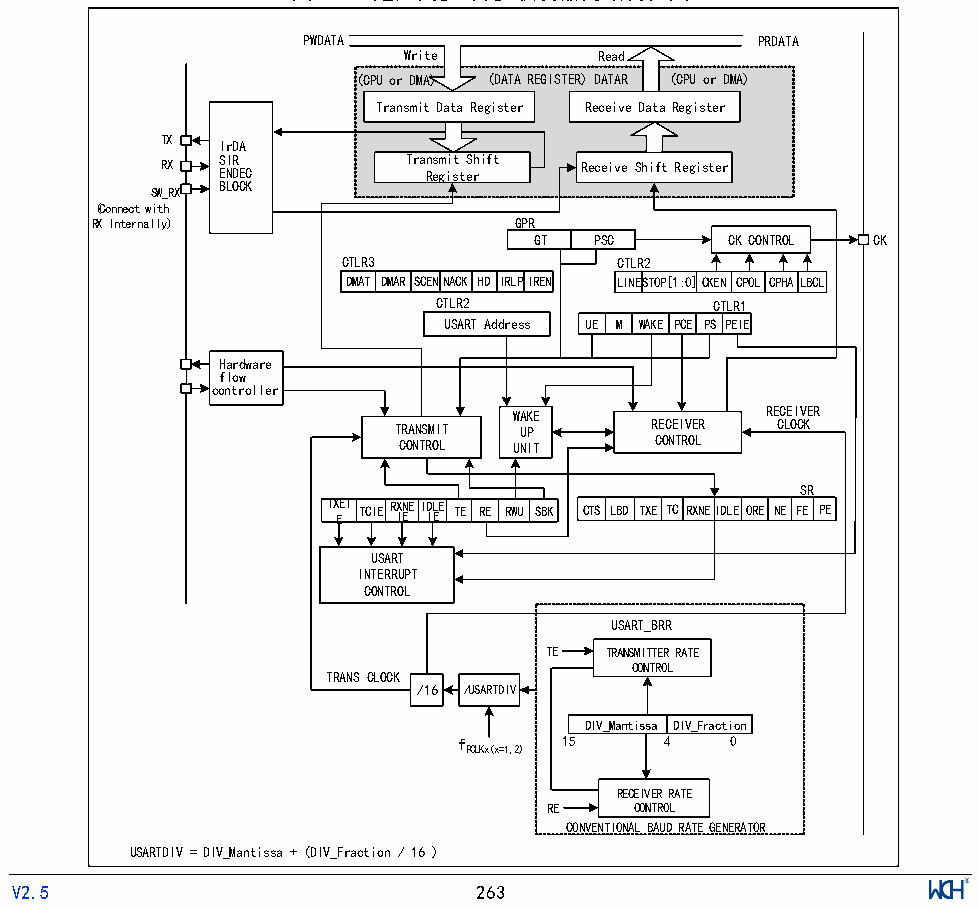

<!-- source-page: 266 -->

[← p.265](0265.md) · [index](../README.md) · [PDF p.266](https://ch32-riscv-ug.github.io/CH32V20x/datasheet_zh/CH32FV2x_V3xRM.PDF#page=266) · [p.267 →](0267.md)

<!-- header: CH32F/V20x_V30x_V31x系列应用手册 https://wch.cn -->

# 第 18 章 通用同步异步收发器（USART）

本章模块描述适用于CH32F20x、CH32V20x、CH32V30x和CH32V31x微控制器全系列产品。  
该模块包含3个通用同步异步收发器（USART1/2/3）和5个通用异步收发器（UART4/5/6/7/8）。  
注：对于CH32V203C8、CH32F203C8，串口4为同步异步收发器（USART4）。  

## 18.1 主要特征

● 全双工或半双工的同步或异步通信  
● NRZ数据格式  
● 分数波特率发生器，最高9Mbps  
● 可编程数据长度  
● 可配置的停止位  
● 支持LIN，IrDA编码器，智能卡  
● 支持DMA  
● 多种中断源  

## 18.2 概述

图18-1 通用同步/异步收发器的结构框图  
 <!-- rendered from the PDF; verify at https://ch32-riscv-ug.github.io/CH32V20x/datasheet_zh/CH32FV2x_V3xRM.PDF#page=266 -->

🖼 Text parsed from the figure above

PWDATA PRDATA  
Write Read  
(CPU or DMA) (DATA REGISTER) DATAR (CPU or DMA)  
Transmit Data Register Receive Data Register  
<!-- image: p266-draw-image-00005 inside the figure -->
<!-- image: p266-draw-image-00004 inside the figure -->
TX IrDA  
RX S E I N R DEC Tra R ns eg m i i s t t S er hift Receive Shift Register  
BLOCK  
SW_RX  
(Connect with  
RX Internally) GPR  
GT PSC CK CONTROL CK  
CTLR3 CTLR2  
DMAT  DMAR  SCENNACK  HD  IRLPI  
LINESTOP  P[1:0]  CKEN  CPOL  CPHA  LBCL  
DMAT DMAR SCENNACK HD IRLPIREN LINESTOP[1:0]CKEN CPOL CPHALBCL  
CTLR2 CTLR1  
WAKE  PCE  PSCT  TPLERI1E  
Hardware  
flow  
<!-- image: p266-draw-image-00002 inside the figure -->
<!-- image: p266-draw-image-00003 inside the figure -->
controller  
WWAAKKEE RECEIVER  
TRANSMIT UUPP RECEIVER CLOCK  
CONTROL UUNNIITT CONTROL  
TXEI TE  TCIE  RXNEID IE I  D I L E E TE  RE  RWU  
SR  
CTS LBD  TXE  TC  RXNEID  DLE ORE  NE  FE  PE  
USART  
INTERRUPT  
CONTROL  
USART_BRR  
TE TRANSMITTER RATE  
CONTROL  
TRANS CLOCK  
/16 /USARTDIV  
DIV_Mantissa  DIV_Fraction  
f 15 4 0  
PCLKx(x=1,2)  
RECEIVER RATE  
RE CONTROL  
CONVENTIONAL BAUD RATE GENERATOR  
USARTDIV = DIV_Mantissa + (DIV_Fraction / 16 )  
<!-- image: p266-draw-image-00001 inside the figure -->
<!-- footer: V2.5 263 -->

