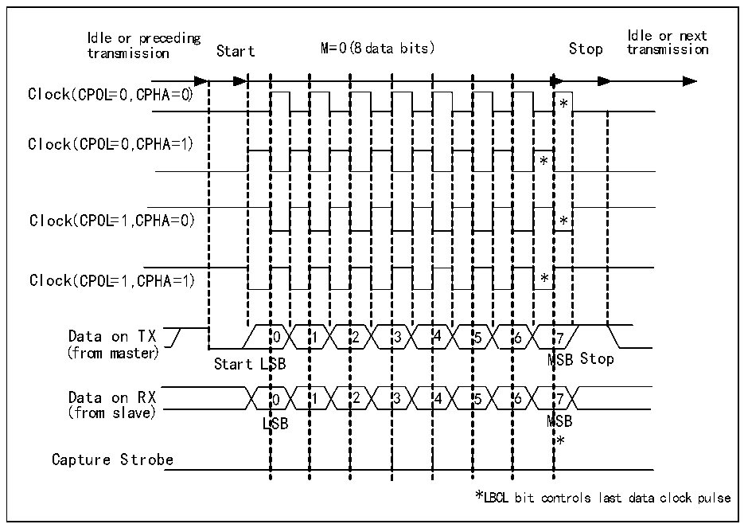
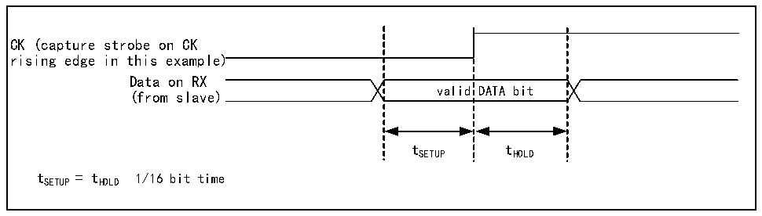

<!-- source-page: 268 -->

[← p.267](0267.md) · [index](../README.md) · [PDF p.268](https://ch32-riscv-ug.github.io/CH32V20x/datasheet_zh/CH32FV2x_V3xRM.PDF#page=268) · [p.269 →](0269.md)

<!-- header: CH32F/V20x_V30x_V31x系列应用手册 https://wch.cn -->

图18-2 USART时钟时序示例（M=0）  
 <!-- rendered from the PDF; verify at https://ch32-riscv-ug.github.io/CH32V20x/datasheet_zh/CH32FV2x_V3xRM.PDF#page=268 -->

🖼 Text parsed from the figure above

Idle or preceding Idle or next  
transmission Start M=0( 8 data bits) Stop transmission  
0SB0LSB  11  22  33  44  55  * * 6M6M  
Clock( CPOL=0 ,C PHA=0)  
*  *  7  
Clock(( CCPPOOLL==00 ,,C PHA=1))  
(from master)  
(from slave)  
*  
Capture Strobe  
*LBCL bit controls last data clock pulse  

图18-3 数据采样保持时间  
 <!-- rendered from the PDF; verify at https://ch32-riscv-ug.github.io/CH32V20x/datasheet_zh/CH32FV2x_V3xRM.PDF#page=268 -->

🖼 Text parsed from the figure above

valid  DATA bit  
CK (capture strobe on CK  
rising edge in this example)  
Data on RX  
(from slave)  
tSETUP tHOLD  
t SETUP = t HOLD 1/16 bit time  

## 18.5 单线半双工模式

半双工模式支持使用单个引脚（只使用TX引脚）来接收和发送，TX引脚和RX引脚在芯片内部连  
接。  
开启半双工模式的方式是对控制寄存器3（R16_USARTx_CTLR3）的HDSEL位置位，但同时需要关  
闭 LIN 模式、智能卡模式、红外模式和同步模式，即保证 SCEN、CLKEN 和 IREN 位处于复位状态，这  
三位在控制寄存器2和3（R16_USARTx_CTLR2和R16_USARTx_CTLR3）中。  
设置成半双工模式之后，需要把 TX的 IO 口设置成开漏输出高模式。在 TE置位的情况下，只要  
将数据写到数据寄存器上，就会发送出去。特别要注意的是，半双工模式可能会出现多设备使用单总  
线收发时的总线冲突，这需要用户用软件自行避免。  

## 18.6 智能卡

智能卡模式支持ISO7816-3协议访问智能卡控制器。  
开启智能卡模式的方式是对控制寄存器3（R16_USARTx_CTLR3）的SCEN位置位，但同时需要关闭  
<!-- image: p268-draw-image-00001 bbox=[507.6, 786.0, 527.52, 797.04] -->
<!-- footer: V2.5 265 -->
